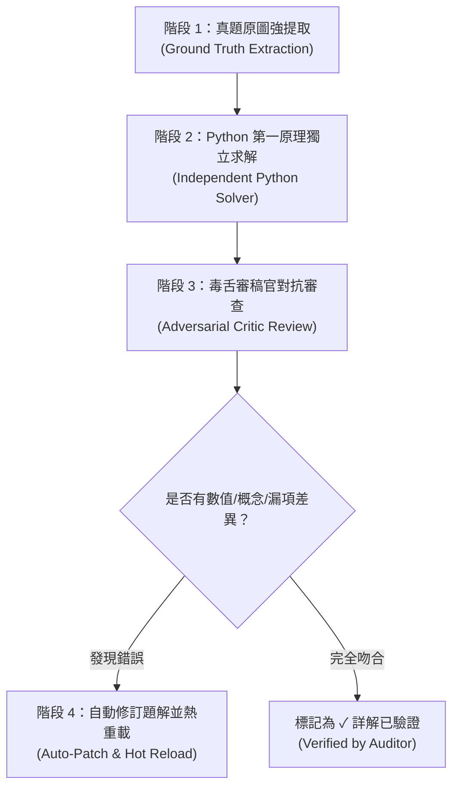

# 🕵️‍♂️ 國考題解雙重對抗批判與數值審計員 (Adversarial Audit Skill)

本技能建立了一套嚴苛的 **「出題者 ➔ 求解者 ➔ 審稿官 ➔ 自動修補」** 四階段對抗審查機制，確保每一題詳解在數值、公式、工程陷阱與題意覆蓋率上達到 $100\%$ 的零失問標準。

---

## 🔄 四階段對抗審查 SOP (4-Phase Protocol)



---

## 📌 階段 1：真題原圖強提取 (Ground Truth Extraction)

在審查任何題解前，**禁止直接相信既有文字筆記或教科書轉載文字**：
1. 調用 `view_file` 檢視對應的試卷原圖（`依考科分類/.../images/`）或官方試卷 PDF。
2. 建立「真題參數清單（Parameter Manifest）」：
   - 基準值：$S_{base}, V_{base}$（如 $1000\text{ MVA}, 500\text{ kV}$）
   - 電壓與開路條件（如 $V_f = 515\text{ kV} \implies 1.03\text{ pu}$）
   - 各元件銘板值與基準容量（如線路以 $1500\text{ MVA}$ 為基準，需換算）
   - 變壓器接線法（Y-Y, Y-$\Delta$, $\Delta$-Y）與中性點接地狀態（直接接地、電阻接地、不接地）
   - 明確列出題目的**每一個子問（Sub-questions）**。

---

## 🐍 階段 2：Python 第一原理獨立求解 (Independent Python Solver)

在未閱讀現有題解步驟的情況下，撰寫獨立的 Python 驗算腳本（利用 `numpy`, `scipy`, `sympy`）：
1. **潮流計算 (Power Flow)**：建立 $Y_{bus}$，列出精確 Jacobian 或 Fast Decoupled 修正方程，計算各次疊代之 $\Delta\theta, \Delta|V|, |V|\angle\theta$。
2. **故障分析 (Fault Analysis)**：
   - 計算各序分支阻抗：$Z_1, Z_2, Z_0$
   - 考慮接地條件：不接地 $\implies Z_0 = \infty$
   - 計算戴維寧等效序阻抗 $Z_{th1}, Z_{th2}, Z_{th0}$
   - 套用故障類型公式（3P, SLG, L-L, 2LG）求解標么電流與實體安培值
3. **Y-$\Delta$ 變壓器相角位移**：
   - 標準規範：高壓（Y）側正序相角超前低壓（$\Delta$）側 $30^\circ$（低壓側正序落後 $30^\circ$；負序則相反）。
4. **旋轉相量運算**：
   - $a = 1\angle 120^\circ = -0.5 + j0.866$
   - $a^2 - a = -j\sqrt{3} \approx -j1.732$
   - $a - a^2 = +j\sqrt{3} \approx +j1.732$

---

## 🧐 階段 3：毒舌審稿官對抗檢驗清單 (Critic Checklist)

審稿官必須以最嚴苛的角度逐項比對：

| 檢驗項目 | 審查要點與常見致命錯誤 |
| :--- | :--- |
| **1. 參數抄錄** | 是否抄錯題目數字？（如把 $515\text{ kV}$ 當 $500\text{ kV}$，把 $1500\text{ MVA}$ 基準當 $1000\text{ MVA}$） |
| **2. 小題覆蓋** | 是否漏解題目所問的任何一個小題？（如只求了線間故障，漏了三相故障 $G_1$ 的 $C$ 相電流） |
| **3. 變壓器接法** | 零序電流路徑是否正確？$\Delta$ 側是否阻隔零序？Y 側中性點不接地是否視為開路？ |
| **4. 相角位移** | 跨越 Y-$\Delta$ 變壓器時，是否有考慮 $\pm 30^\circ$ 相位旋轉？ |
| **5. 故障相別** | 題目問的是 $A$ 相、$B$ 相還是 $C$ 相？（例如三相故障求 $C$ 相電流需帶入 $a I_{a1}$） |
| **6. 物理單位** | 標么值是否乘上正確的基準電流（$I_{base} = \frac{S_{base}}{\sqrt{3} V_{base}}$）輸出實體 $\text{kA}$？ |
| **7. 數值精確度** | 數值是否與 Python 運算結果小數點後 3 位完全一致？ |

---

## 🛠️ 階段 4：自動修補與前端資料庫編譯 (Auto-Patch & Compile)

一旦審稿官發現任何誤差：
1. **立即重寫 Markdown 詳解**：使用標準五段式架構（📌 題目已知 ➔ 💡 核心關鍵 ➔ ✏️ 步驟式推導 ➔ ⚠️ 防坑指南 ➔ 🎯 滿分結論）。
2. **重新編譯資料庫**：
   ```bash
   python3 scripts/compile_dashboard_database.py
   ```
3. **KaTeX 語法巡檢**：
   ```bash
   python3 scripts/katex_linter.py
   ```
4. **狀態標記**：在題庫中將該題標註為 `hasDed: true`（✓ 詳解已驗證）。
