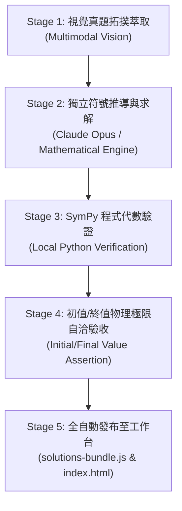

# 🧠 Claude Opus 國考題解深度驗證審查 Skill

## 1. 核心目標
本 Skill 旨在確保題庫內所有題解達到 **100% 官方真題對照、零符號筆誤、零計算偏差**。藉由 Gemini 的視覺高解析讀圖與 Claude Opus 的頂級數理推導能力，實施雙重盲審與物理自洽性驗證。

---

## 2. 雙模型分工審查標準作業流程 (SOP)



### 階段一：視覺真題拓撲萃取 (Vision Extraction)
1. 檢視官方試卷高解析圖檔（`images/*_p1.png`, `images/*_p2.png`）。
2. 若涉及細微標註（如 $v_\phi$ 極性、電感互感點 $\bullet$、開關箭頭），必須執行 Python 局部特寫裁切放大。
3. 嚴格提取拓撲矩陣：
   - 獨立電源（電壓/電流、大小、方向）
   - 相依電源（控制變數為何、受控係數、極性）
   - 電阻/電感/電容數值與連接關係（串聯/並聯/混聯）

### 階段二：Claude Opus 符號推導標準
在切換至 Claude Opus 或由 Opus 進行題解審查時，必須遵循以下規範：
1. **電路分析法選擇**：
   - 直流電路：優先使用**超級節點（Supernode）法**或**重疊定理**。
   - 二階暫態：嚴格判定阻尼比 $\alpha$ 與 $\omega_0$（欠阻尼/臨界阻尼/過阻尼），列出微分方程特徵根與時域通用解。
   - 拉氏轉換：建立標準 $s$ 域阻抗模型（$sL, \frac{1}{sC}$），嚴禁漏掉初始儲能項。
2. **公式輸出格式**：
   - 必須使用標準 LaTeX 格式（行內 `$ ... $`，獨立區塊 `$$ ... $$`）。
   - 每道題目必須條列出：
     - `📌 題目與已知條件`
     - `💡 核心考點與破題關鍵`
     - `✏️ 步驟式詳細數學推導`
     - `🎯 滿分關鍵與結論`

### 階段三：SymPy 數值程式交叉驗算 (Assertion Check)
每次產出題解後，必須在本機執行 SymPy 腳本驗算數值解與行列式，例如：
```bash
python3 -c "
import sympy as sp
s, t = sp.symbols('s t', positive=True)
# 驗算反拉氏轉換
Vo_s = (s + 200) / (s + 100)**2
vo_t = sp.inverse_laplace_transform(Vo_s, s, t)
print('Sympy Inverse Laplace:', vo_t)
"
```

### 階段四：物理自洽性驗證 (Consistency Check)
- **初值定理**： $\lim_{s\to\infty} s V(s) \equiv v(0^+)$（對照 $t=0^+$ 電感開路、電容短路直流等效）。
- **終值定理**： $\lim_{s\to 0} s V(s) \equiv v(\infty)$（對照 $t\to\infty$ 直流穩態電感短路、電容開路）。

---

## 3. 工作台同步指令
驗證通過後，執行以下一鍵指令同步至雙欄工作台與 GitHub Pages：
```bash
python3 scripts/compile_dashboard_database.py
git add .
git commit -m "🔥 [Verified Solution] Update EE-XXX with Claude Opus audit"
git push origin main
```
