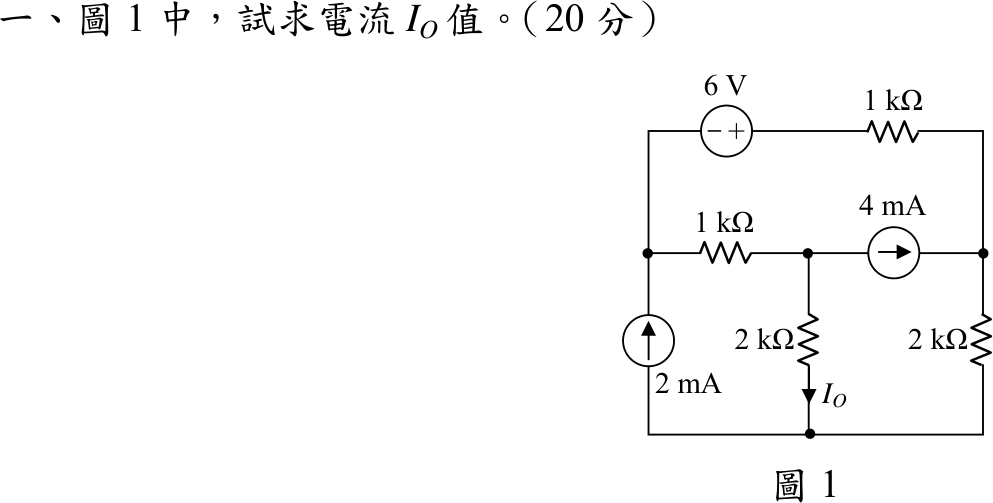
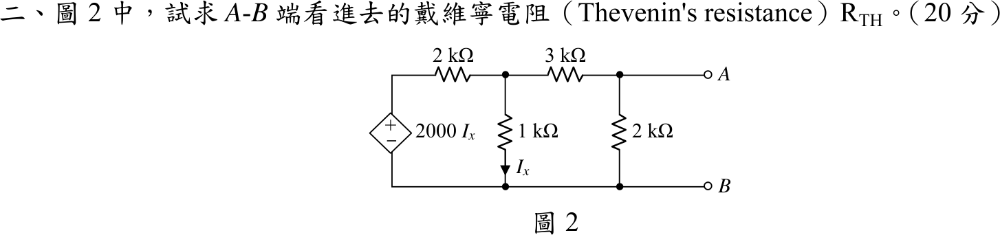
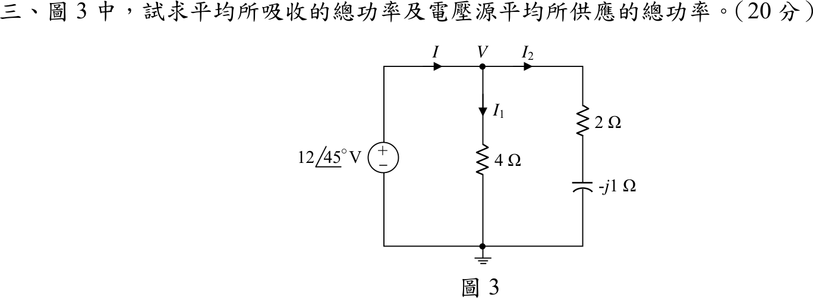
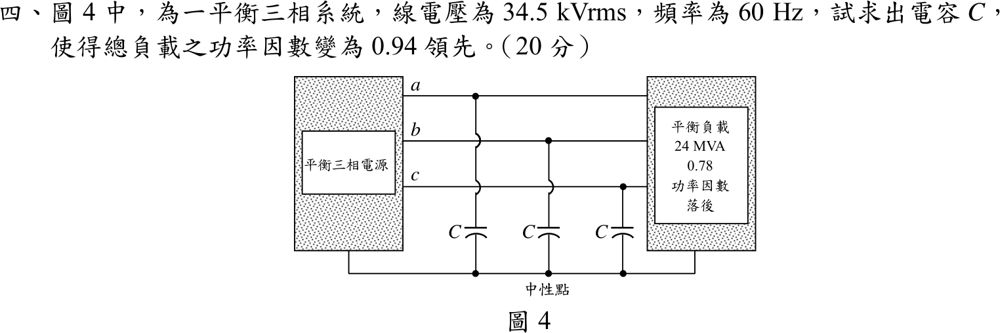

# 📝 105 年電機工程技師｜電路學逐題詳解

> 本頁由題級 canonical 筆記組合；每題保留官方裁切圖、校驗狀態與可追溯的推導。

## 題目導覽
- [[#一、105 年電路學第 1 題｜多網目直流電路節點分析|第 1 題：多網目直流電路節點分析]]
- [[#二、105 年電路學第 2 題｜相依源戴維寧等效電阻|第 2 題：相依源戴維寧等效電阻]]
- [[#三、105 年電路學第 3 題｜交流穩態複數功率|第 3 題：交流穩態複數功率]]
- [[#四、105 年電路學第 4 題｜三相功率因數改善與 Y 接電容|第 4 題：三相功率因數改善與 Y 接電容]]
- [[#五、105 年電路學第 5 題｜串聯 RLC 帶通濾波器設計|第 5 題：串聯 RLC 帶通濾波器設計]]

---

## 一、105 年電路學第 1 題｜多網目直流電路節點分析

> 題級識別：EE-105-01-1
> canonical 來源：[[canonical/EE-105-01-1.md]]
> 題級校驗狀態：verified

### 已知與所求

下方水平導線為參考節點。$2\ \mathrm{mA}$ 電流源由下往上注入左節點 $V_1$；$V_1$ 與中節點 $V_2$ 間為 $1\ \mathrm{k\Omega}$；$V_2$ 經 $2\ \mathrm{k\Omega}$ 接地（$I_O$ 向下）；$4\ \mathrm{mA}$ 電流源由 $V_2$ 指向右節點 $V_3$，$V_3$ 經 $2\ \mathrm{k\Omega}$ 接地；上方支路由 $V_1$ 經 $6\ \mathrm V$（左負右正）與 $1\ \mathrm{k\Omega}$ 接到 $V_3$。求 $I_O$（20 分）。

### 考場標準作答

電壓以 V、電阻以 kΩ、電流以 mA 計。上方支路自 $V_1$ 經電壓源電位升高 $6\ \mathrm V$，向右電流為 $V_1+6-V_3$。

$$
\begin{cases}
V_1\text{ 節點：}\ 2=(V_1-V_2)+(V_1+6-V_3)\\
V_2\text{ 節點：}\ V_1-V_2=\dfrac{V_2}{2}+4\\
V_3\text{ 節點：}\ 4+(V_1+6-V_3)=\dfrac{V_3}{2}
\end{cases}
\Rightarrow\
2V_1-V_2-V_3=-4,\ \ 2V_1-3V_2=8,\ \ 2V_1-3V_3=-20
$$

後兩式相減得 $V_3=V_2+\tfrac{28}{3}$，代入第一式得 $V_1=0$、$V_2=-\tfrac{8}{3}\ \mathrm V$、$V_3=\tfrac{20}{3}\ \mathrm V$。

$$
I_O=\frac{V_2}{2\ \mathrm{k\Omega}}=\boxed{-\frac{4}{3}\ \mathrm{mA}\approx-1.333\ \mathrm{mA}}
$$

負號表示實際電流由地向上流過該 $2\ \mathrm{k\Omega}$。

### 驗算

以支路電流與功率守恆檢查：上方 $1\ \mathrm{k\Omega}$ 電流 $\tfrac23\ \mathrm{mA}$（由右向左，流入 $6\ \mathrm V$ 源正端）、中間 $1\ \mathrm{k\Omega}$ 電流 $\tfrac83\ \mathrm{mA}$、右側 $2\ \mathrm{k\Omega}$ 電流 $\tfrac{10}{3}\ \mathrm{mA}$。

- KCL：$V_2$ 節點 $\tfrac83=-\tfrac43+4$；$V_3$ 節點 $4-\tfrac23=\tfrac{10}{3}$。
- 電阻吸收 $\tfrac49+\tfrac{64}{9}+\tfrac{32}{9}+\tfrac{200}{9}=33.33\ \mathrm{mW}$，加 $6\ \mathrm V$ 源吸收 $4\ \mathrm{mW}$ 共 $37.33\ \mathrm{mW}$；$4\ \mathrm{mA}$ 源供出 $4(V_3-V_2)=37.33\ \mathrm{mW}$，$2\ \mathrm{mA}$ 源端電壓 $V_1=0$ 故供出 $0$，兩側相等。

### 失分點

- $6\ \mathrm V$ 左負右正，上方支路電流是 $(V_1+6-V_3)$；寫成 $V_1-6-V_3$ 會使 $V_2$ 錯誤。
- $I_O$ 箭頭向下，$V_2<0$ 故答案為負，不要為了「好看」取絕對值。

---

## 二、105 年電路學第 2 題｜相依源戴維寧等效電阻

> 題級識別：EE-105-01-2
> canonical 來源：[[canonical/EE-105-01-2.md]]
> 題級校驗狀態：verified

### 已知與所求

左側為相依電壓源 $2000I_x$（上正下負），$I_x$ 為流經 $1\ \mathrm{k\Omega}$ 向下的電流；$2\ \mathrm{k\Omega}$ 接於相依源與中節點 $V_1$ 之間，$1\ \mathrm{k\Omega}$ 自 $V_1$ 接地，$3\ \mathrm{k\Omega}$ 接 $V_1$ 與 $A$，$2\ \mathrm{k\Omega}$ 接 $A$ 與 $B$。電路無獨立源，求 $A$–$B$ 端 $R_{TH}$（20 分）。

### 考場標準作答

無獨立源，相依源保留，在 $A$–$B$ 端加測試電壓 $V_t$（$B$ 為地），求測試電流 $I_t$。單位用 V、kΩ、mA。

$I_x=V_1/1$，故相依源電壓 $2000I_x=2V_1$（V）。對 $V_1$ 節點 KCL：

$$
\frac{2V_1-V_1}{2}=\frac{V_1}{1}+\frac{V_1-V_t}{3}
\ \Rightarrow\ 0=\frac{V_1}{2}+\frac{V_1-V_t}{3}
\ \Rightarrow\ V_1=0.4V_t
$$

$$
I_t=\frac{V_t}{2}+\frac{V_t-V_1}{3}=0.5V_t+0.2V_t=0.7V_t\ \ (\mathrm{mA})
$$

$$
\boxed{R_{TH}=\frac{V_t}{I_t}=\frac{1}{0.7}\ \mathrm{k\Omega}=\frac{10000}{7}\ \Omega\approx1.429\ \mathrm{k\Omega}}
$$

### 驗算

改用測試電流源：自 $A$ 灌入 $I_t=1\ \mathrm{mA}$，令 $V_B=0$。$V_1$ 節點仍給 $V_1=0.4V_A$；$A$ 節點 $1=\dfrac{V_A}{2}+\dfrac{V_A-0.4V_A}{3}=0.7V_A$，得 $V_A=1.4286\ \mathrm V$，故 $R_{TH}=1.4286\ \mathrm{k\Omega}$。另因電路無獨立源，$V_{oc}=0$，不能用 $V_{oc}/I_{sc}$。

### 失分點

- 相依源不可像獨立電壓源那樣短路；它受 $I_x$ 控制，必須保留並用測試源求解。
- $I_x$ 單位：$2000I_x$ 的 $I_x$ 以 A 計；用 mA 代入時須換算成 $2V_1$（V）。

---

## 三、105 年電路學第 3 題｜交流穩態複數功率

> 題級識別：EE-105-01-3
> canonical 來源：[[canonical/EE-105-01-3.md]]
> 題級校驗狀態：needs_manual_review
> [!WARNING] 本題仍有官方資料缺口或事件定義歧義；請以 canonical 條件式解答為準。

### 已知與所求

電壓源 $12\angle45^\circ\ \mathrm V$ 並聯兩支路：$4\ \Omega$（電流 $I_1$）與 $2\ \Omega$ 串 $-j1\ \Omega$（電流 $I_2$），電源電流 $I=I_1+I_2$。求負載平均吸收總功率與電壓源平均供應總功率（20 分）。題目未註明相量為有效值或峰值（見「條件與疑義」）。

### 考場標準作答

裁切圖未說明 $12\angle45^\circ\ \mathrm V$ 是有效值或峰值，以下兩種讀法並列作答。先以有效值相量計算：

$$
I_1=\frac{12\angle45^\circ}{4}=3\angle45^\circ\ \mathrm A,\qquad
I_2=\frac{12\angle45^\circ}{2-j1}=\frac{12}{\sqrt5}\angle71.57^\circ\ \mathrm A
$$

$$
P_{4\Omega}=|I_1|^2\cdot4=36\ \mathrm W,\quad
P_{2\Omega}=|I_2|^2\cdot2=\tfrac{144}{5}\cdot2=57.6\ \mathrm W,\quad P_C=0
$$

電源電流 $I=12\angle45^\circ(0.25+\tfrac{2+j1}{5})=12\angle45^\circ(0.65+j0.2)$，$S=VI^*=144(0.65-j0.2)=93.6-j28.8\ \mathrm{VA}$。

- 有效值相量讀法：$\boxed{P_{\text{吸收}}=P_{\text{供應}}=93.6\ \mathrm W}$
- 峰值（振幅）相量讀法：平均功率為 $\tfrac12\mathrm{Re}\{VI^*\}$，所有功率減半，$\boxed{P_{\text{吸收}}=P_{\text{供應}}=46.8\ \mathrm W}$（$S=46.8-j14.4\ \mathrm{VA}$）

### 驗算

改用輸入導納：$Y_{in}=\tfrac14+\tfrac{1}{2-j1}=0.25+\tfrac{2+j1}{5}=0.65+j0.2\ \mathrm S$，$S=|V|^2Y_{in}^*=144(0.65-j0.2)=93.6-j28.8\ \mathrm{VA}$，實部與支路法 $36+57.6$ 相同，電源供應等於電阻吸收。

### 失分點

- $-j1\ \Omega$ 電容不吸收平均功率；只算 $2\ \Omega$ 的 $|I_2|^2R$。
- $|I_2|=12/\sqrt5$，平方為 $144/5$，不是 $144/\sqrt5$。

### 條件與疑義

同卷第 4 題明確標示 $34.5\ \mathrm{kV_{rms}}$，本題對 $12\angle45^\circ\ \mathrm V$ 則未標示，故有效值與峰值兩種讀法皆可能，答案為 $93.6\ \mathrm W$ 或 $46.8\ \mathrm W$，需依出題者意圖確認。

---

## 四、105 年電路學第 4 題｜三相功率因數改善與 Y 接電容

> 題級識別：EE-105-01-4
> canonical 來源：[[canonical/EE-105-01-4.md]]
> 題級校驗狀態：verified

### 已知與所求

平衡三相，線電壓 $34.5\ \mathrm{kV_{rms}}$、$60\ \mathrm{Hz}$；平衡負載 $24\ \mathrm{MVA}$、功率因數 $0.78$ 落後。三個電容 $C$ 分別由 $a,b,c$ 線接到中性點（Y 接）。求 $C$，使總功率因數成為 $0.94$ 領先（20 分）。

### 考場標準作答

負載：

$$
P=24(0.78)=18.72\ \mathrm{MW},\qquad Q=24\sqrt{1-0.78^2}=15.02\ \mathrm{Mvar}\ (\text{感性})
$$

目標 $0.94$ 領先，$Q_{\text{new}}=-P\tan(\cos^{-1}0.94)=-18.72(0.3629)=-6.794\ \mathrm{Mvar}$，電容組須供應

$$
Q_C=Q-Q_{\text{new}}=15.02+6.794=21.81\ \mathrm{Mvar}
$$

Y 接每相電壓 $V_L/\sqrt3$，三相電容無效功率 $Q_C=3\omega C\left(\dfrac{V_L}{\sqrt3}\right)^2=\omega CV_L^2$：

$$
\boxed{C=\frac{Q_C}{\omega V_L^2}=\frac{21.81\times10^6}{(2\pi\cdot60)(34.5\times10^3)^2}=48.62\ \mu\mathrm F}
$$

### 驗算

回代：$3\omega CV_{ph}^2=21.81\ \mathrm{Mvar}$，淨 $Q=15.02-21.81=-6.79\ \mathrm{Mvar}$，$\mathrm{pf}=\dfrac{18.72}{\sqrt{18.72^2+6.79^2}}=0.940$，$Q<0$ 為領先。

### 失分點

- 電容接中性點是 Y 接，使用 $V_L^2$ 的 $C=Q_C/(\omega V_L^2)$；誤當 $\Delta$ 接須除以 $3V_L^2$，會得 $16.2\ \mu\mathrm F$。
- 「領先 $0.94$」代表 $Q_{\text{new}}$ 為負，不是只補到 $Q=0$ 或 $0.94$ 落後。

---

## 五、105 年電路學第 5 題｜串聯 RLC 帶通濾波器設計

> 題級識別：EE-105-01-5
> canonical 來源：[[canonical/EE-105-01-5.md]]
> 題級校驗狀態：verified

### 已知與所求

$V_S$ 串聯 $C$、$L$，輸出 $V_R$ 取自 $R$ 兩端；$C=1\ \mu\mathrm F$，要求共振頻率 $\omega_0=1000\ \mathrm{rad/s}$、頻寬 $B=100\ \mathrm{rad/s}$。求 $R$、$L$（20 分）。

### 考場標準作答

串聯 RLC，$\omega_0=\dfrac{1}{\sqrt{LC}}$、$B=\dfrac{R}{L}$：

$$
L=\frac{1}{\omega_0^2C}=\frac{1}{(10^3)^2(10^{-6})}=\boxed{1\text{ H}}
$$

$$
R=BL=100(1)=\boxed{100\ \Omega}
$$

### 驗算

轉移函數 $\left|\dfrac{V_R}{V_S}\right|=\dfrac{R}{\sqrt{R^2+(\omega L-1/\omega C)^2}}$。$\omega=1000$ 時電抗 $1000-1000=0$，增益 $1$；半功率點需 $|\omega L-1/\omega C|=R=100$，解 $\omega^2-100\omega-10^6=0$ 與 $\omega^2+100\omega-10^6=0$ 得 $\omega_2=1051.2$、$\omega_1=951.2\ \mathrm{rad/s}$，$\omega_2-\omega_1=100\ \mathrm{rad/s}$。

### 失分點

- 頻寬是 $R/L$（rad/s），不是 $R/(2L)$（那是暫態衰減係數 $\alpha$）。
- $C=1\ \mu\mathrm F$ 須換成 $10^{-6}\ \mathrm F$；漏掉會讓 $L$ 差 $10^6$ 倍。

---
