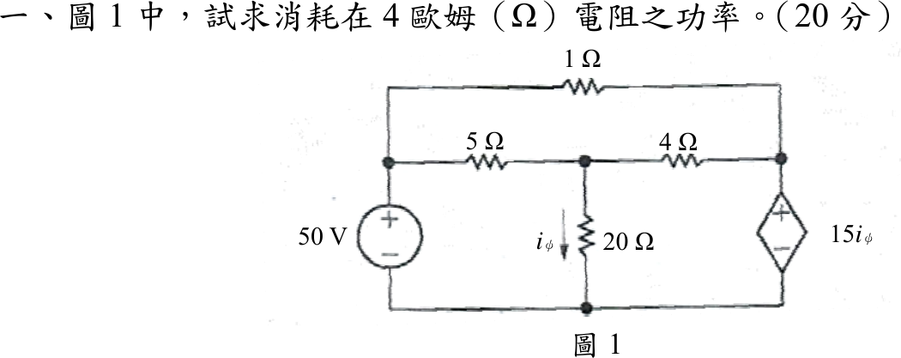
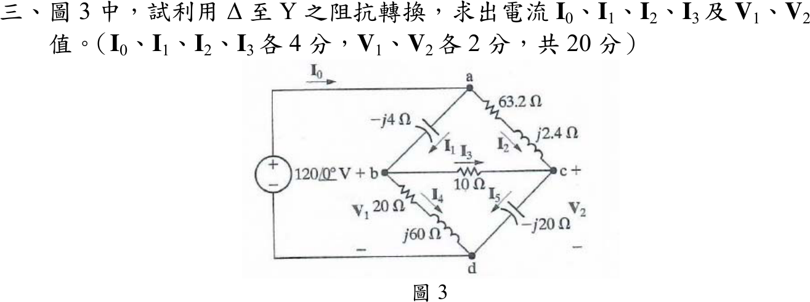
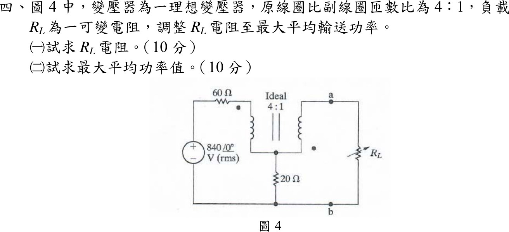
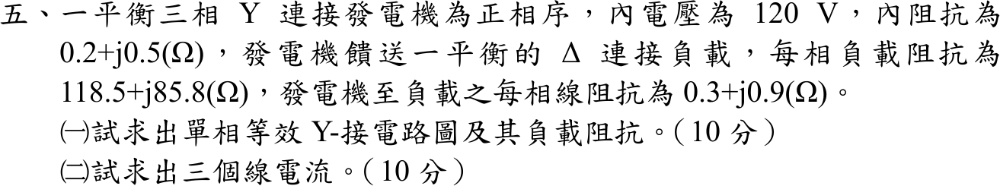

# 107 年電機工程技師｜電路學逐題詳解

> 本頁由題級 canonical 筆記組合；每題保留官方裁切圖、校驗狀態與可追溯的推導。

## 題目導覽
- [[#一、107 年電路學第 1 題｜4 Ω 電阻功率|第 1 題：4 Ω 電阻功率]]
- [[#二、107 年電路學第 2 題｜雙電感並聯暫態|第 2 題：雙電感並聯暫態]]
- [[#三、107 年電路學第 3 題|第 3 題：107 年電路學第 3 題]]
- [[#四、107 年電路學第 4 題｜理想變壓器最大平均功率|第 4 題：理想變壓器最大平均功率]]
- [[#五、107 年電路學第 5 題｜平衡三相 Δ 負載|第 5 題：平衡三相 Δ 負載]]

---

## 一、107 年電路學第 1 題｜4 Ω 電阻功率

> 題級識別：EE-107-01-1
> canonical 來源：[[canonical/EE-107-01-1.md]]
> 題級校驗狀態：verified



### 已知與所求

左側 50 V 獨立電壓源（上正）接左節點；左節點經 \(1\ \Omega\)（上方導線）通右節點，經 \(5\ \Omega\) 通中節點；中節點經 \(4\ \Omega\) 通右節點，經 \(20\ \Omega\) 接地，\(i_\phi\) 向下流過 \(20\ \Omega\)；右節點與地之間為 CCVS \(15i_\phi\)（上正）。求 \(4\ \Omega\) 消耗功率（20 分）。

### 考場標準作答

下方導線為參考地。左節點 \(=50\ \mathrm V\)；中節點 \(V_1\)，右節點 \(V_2\)：
\[
i_\phi=\frac{V_1}{20},\qquad V_2=15i_\phi=0.75V_1
\]
中節點 KCL（\(1\ \Omega\) 只連兩個定壓節點，不影響此式）：
\[
\frac{50-V_1}{5}=\frac{V_1}{20}+\frac{V_1-V_2}{4}
\Rightarrow 10-0.2V_1=0.3125V_1\Rightarrow V_1=32\ \mathrm V,\ V_2=24\ \mathrm V
\]
\[
I_4=\frac{V_1-V_2}{4}=2\ \mathrm A,\qquad
\boxed{P_{4\Omega}=I_4^2(4)=2^2(4)=16\ \mathrm W}
\]

### 驗算

全電路功率守恆。\(I_{1\Omega}=\dfrac{50-24}{1}=26\ \mathrm A\)，\(I_{5\Omega}=\dfrac{50-32}{5}=3.6\ \mathrm A\)：

- 50 V 源供給 \(50(26+3.6)=1480\ \mathrm W\)；CCVS 流入電流 \(26+2=28\ \mathrm A\)，吸收 \(24(28)=672\ \mathrm W\)。
- 電阻吸收：\(26^2(1)+3.6^2(5)+2^2(4)+1.6^2(20)=676+64.8+16+51.2=808\ \mathrm W\)；\(808+672=1480\ \mathrm W\)。

### 失分點

- CCVS 的電壓為 \(V_2=15i_\phi\)；把極性看反（\(V_2=-15i_\phi\)）會得 \(V_1=160/11\ \mathrm V\)、\(P\approx162\ \mathrm W\)。
- \(i_\phi\) 是 \(20\ \Omega\) 的電流 \(V_1/20\)，不是 \(4\ \Omega\) 的電流。

---

## 二、107 年電路學第 2 題｜雙電感並聯暫態

> 題級識別：EE-107-01-2
> canonical 來源：[[canonical/EE-107-01-2.md]]
> 題級校驗狀態：verified


### 已知與所求

\(L_1=5\ \mathrm H\)、\(L_2=20\ \mathrm H\) 並聯，初始電流 \(8\ \mathrm A\)（\(L_1\)）與 \(4\ \mathrm A\)（\(L_2\)），兩個箭頭都**向上**；\(i_1,i_2\) 定義為向下。開關在 \(t=0\) 打開，其右為 \(40\ \Omega\)，以及 \(4\ \Omega\) 串聯 \(15\ \Omega\parallel10\ \Omega\)；\(i_3\) 向下流過 \(10\ \Omega\)。求 \(t\ge0\) 的 \(i_1(t)\)、\(i_3(t)\)（各 10 分）。

### 考場標準作答

初始值（向下為正）：\(i_1(0)=-8\ \mathrm A\)，\(i_2(0)=-4\ \mathrm A\)。

電感所見電阻與時間常數：
\[
R_{eq}=40\parallel\bigl[4+(15\parallel10)\bigr]=40\parallel10=8\ \Omega,\quad
L_{eq}=5\parallel20=4\ \mathrm H,\quad \tau=\frac{4}{8}=0.5\ \mathrm s
\]
總電感電流 \(i_\Sigma=i_1+i_2\)，\(i_\Sigma(0)=-12\ \mathrm A\)，故 \(i_\Sigma=-12e^{-2t}\)，電阻網路向下電流 \(12e^{-2t}\)，端電壓（上正）
\[
v(t)=8(12e^{-2t})=96e^{-2t}\ \mathrm V
\]
\[
i_1(t)=-8+\frac15\int_0^t96e^{-2\lambda}d\lambda
=-8+9.6(1-e^{-2t})
\]
\[
\boxed{i_1(t)=1.6-9.6e^{-2t}\ \mathrm A\quad(t\ge0)}
\]
（\(i_2(t)=-1.6-2.4e^{-2t}\) A；兩電感間留有環流 \(i_1(\infty)=1.6\ \mathrm A\)。）

\(v\) 加在 \(4\ \Omega\) 串 \(15\parallel10=6\ \Omega\) 的分支上：電流 \(v/10\)，\(15\parallel10\) 的電壓 \(0.6v\)，再除以 \(10\ \Omega\)：
\[
\boxed{i_3(t)=\frac{0.6v}{10}=5.76e^{-2t}\ \mathrm A\quad(t\ge0)}
\]

### 驗算

能量守恆：初始儲能 \(\tfrac12(5)(8^2)+\tfrac12(20)(4^2)=160+160=320\ \mathrm J\)；終值儲能 \(\tfrac12(5)(1.6^2)+\tfrac12(20)(1.6^2)=6.4+25.6=32\ \mathrm J\)；電阻消耗
\[
\int_0^\infty\frac{v^2}{8}dt=\int_0^\infty1152e^{-4t}dt=288\ \mathrm J
\]
\(320-32=288\ \mathrm J\) 成立。

### 失分點

- 兩個初始電流箭頭都向上，應同號相加（\(i_\Sigma(0)=-12\ \mathrm A\)）；只把 4 A 當成向下（\(i_2(0)=+4\)）會得 \(i_3=1.92e^{-2t}\)；若再把 \(i_3\) 誤當 15 Ω 支路電流，則得 \(i_1=-4.8-3.2e^{-2t}\)、\(i_3=1.28e^{-2t}\)。
- \(i_1\) 終值不為 0：電流和衰減到 0，但兩電感個別電流停在環流 \(1.6\ \mathrm A\)。
- \(i_3\) 要經兩次分壓：先求 \(v\)，再經 \(4\ \Omega\) 串聯分壓到 \(15\parallel10\)，最後除以 \(10\ \Omega\)。

---

## 三、107 年電路學第 3 題

> 題級識別：EE-107-01-3
> canonical 來源：[[canonical/EE-107-01-3.md]]
> 題級校驗狀態：verified



### 已知與所求

電壓源 \(120\angle0^\circ\ \mathrm V\)（上端「+」接 \(a\)，下端「−」接 \(d\)）；\(\mathbf I_0\) 為進入 \(a\) 的電流。支路：\(a\)–\(b\) 為 \(-j4\ \Omega\)（\(\mathbf I_1\)，\(a\to b\)），\(a\)–\(c\) 為 \(63.2+j2.4\ \Omega\)（\(\mathbf I_2\)，\(a\to c\)），\(b\)–\(c\) 為 \(10\ \Omega\)（\(\mathbf I_3\)，\(b\to c\)），\(b\)–\(d\) 為 \(20+j60\ \Omega\)（\(\mathbf I_4\)，\(b\to d\)），\(c\)–\(d\) 為 \(-j20\ \Omega\)（\(\mathbf I_5\)，\(c\to d\)）。\(\mathbf V_1=\mathbf V_{bd}\)、\(\mathbf V_2=\mathbf V_{cd}\)。求 \(\mathbf I_0\sim\mathbf I_3\)、\(\mathbf V_1\)、\(\mathbf V_2\)（\(\mathbf I_0\sim\mathbf I_3\) 各 4 分，\(\mathbf V_1,\mathbf V_2\) 各 2 分）。

### 考場標準作答

把上方 Δ（\(a,b,c\)）換成 Y（中心 \(n\)），\(Z_\Sigma=-j4+(63.2+j2.4)+10=73.2-j1.6\ \Omega\)：
\[
Z_{an}=\frac{(-j4)(63.2+j2.4)}{Z_\Sigma}=0.2065-j3.4490,\quad
Z_{bn}=\frac{(-j4)(10)}{Z_\Sigma}=0.0119-j0.5462,\quad
Z_{cn}=\frac{(63.2+j2.4)(10)}{Z_\Sigma}=8.6226+j0.5163\ \Omega
\]
\(n\) 到 \(d\) 有兩條並聯路徑：
\[
Z_L=Z_{bn}+(20+j60)=20.0119+j59.4538,\quad
Z_R=Z_{cn}+(-j20)=8.6226-j19.4837\ \Omega
\]
\[
Z_{in}=Z_{an}+Z_L\parallel Z_R=18-j24=30\angle-53.13^\circ\ \Omega
\]
\[
\boxed{\mathbf I_0=\frac{120}{18-j24}=2.4+j3.2=4\angle53.13^\circ\ \mathrm A}
\]
\(\mathbf V_n=120-\mathbf I_0Z_{an}=108.467+j7.617\ \mathrm V\)，分流得 \(\mathbf I_4=\mathbf V_n/Z_L=0.6667-j1.6\)、\(\mathbf I_5=\mathbf V_n/Z_R=1.7333+j4.8\ \mathrm A\)：
\[
\boxed{\mathbf V_1=\mathbf I_4(20+j60)=109.33+j8.00=109.63\angle4.18^\circ\ \mathrm V}
\]
\[
\boxed{\mathbf V_2=\mathbf I_5(-j20)=96.00-j34.67=102.07\angle-19.86^\circ\ \mathrm V}
\]
回原電路以節點電壓差求支路電流（\(\mathbf V_a=120\)，\(\mathbf V_b=\mathbf V_1\)，\(\mathbf V_c=\mathbf V_2\)）：
\[
\boxed{\mathbf I_1=\frac{120-\mathbf V_1}{-j4}=2+j2.667=3.333\angle53.13^\circ\ \mathrm A}
\]
\[
\boxed{\mathbf I_2=\frac{120-\mathbf V_2}{63.2+j2.4}=0.4+j0.533=0.667\angle53.13^\circ\ \mathrm A}
\]
\[
\boxed{\mathbf I_3=\frac{\mathbf V_1-\mathbf V_2}{10}=1.333+j4.267=4.470\angle72.65^\circ\ \mathrm A}
\]

### 驗算

回原電路 KCL：\(\mathbf I_1+\mathbf I_2=2.4+j3.2=\mathbf I_0\)；節點 \(b\)：\(\mathbf I_1-\mathbf I_3-\mathbf I_4=(2+j2.667)-(1.333+j4.267)-(0.667-j1.6)=0\)；節點 \(c\)：\(\mathbf I_2+\mathbf I_3-\mathbf I_5=(0.4+j0.533)+(1.333+j4.267)-(1.733+j4.8)=0\)。

### 失分點

- 轉換的 Δ 是 \(a,b,c\)（\(-j4\)、\(63.2+j2.4\)、\(10\)）；\(Z_{an}\) 取與 \(a\) 相連兩邊的乘積除以 \(Z_\Sigma\)，分子取錯會整個失準。
- \(\mathbf V_1,\mathbf V_2\) 是 \(b\)–\(d\)、\(c\)–\(d\) 阻抗上的電壓，要用 \(\mathbf I_4(20+j60)\) 與 \(\mathbf I_5(-j20)\)，不是 \(Z_{bn}\)、\(Z_{cn}\) 上的壓降。
- \(\mathbf I_1,\mathbf I_2,\mathbf I_3\) 是原 Δ 的支路電流，需用原節點電壓差求，不能直接取 Y 支路電流。

---

## 四、107 年電路學第 4 題｜理想變壓器最大平均功率

> 題級識別：EE-107-01-4
> canonical 來源：[[canonical/EE-107-01-4.md]]
> 題級校驗狀態：verified



### 已知與所求

理想變壓器匝比 4:1（一次：二次），\(840\angle0^\circ\ \mathrm V_{rms}\) 電源（上正）串 \(60\ \Omega\) 接一次側上端（點端）；一次側下端、二次側下端（點端）與 \(20\ \Omega\) 上端共接於節點 \(N\)，\(20\ \Omega\) 下端接地 \(b\)；二次側上端為 \(a\)，可變電阻 \(R_L\) 接於 \(a\)–\(b\)。求（一）\(R_L\)（10 分）；（二）最大平均功率（10 分）。

### 考場標準作答

一次點端在上、二次點端在下（反向）。取 \(\mathbf I_p\) 流入一次點端，\(\mathbf I_c\) 為二次線圈由 \(a\) 流向 \(N\) 的電流（即流出二次點端），\(\mathbf V_p\) 為一次電壓（點端為正）：
\[
\mathbf I_c=4\mathbf I_p,\qquad \mathbf V_p=4(\mathbf V_N-\mathbf V_a)
\]
**開路電壓**（\(\mathbf I_p=\mathbf I_c=0\)）：\(\mathbf V_N=0\)，\(\mathbf V_p=840\)，故 \(\mathbf V_a=-\dfrac{840}{4}=-210\ \mathrm V\)，\(|V_{oc}|=210\ \mathrm V\)。

**等效電阻**（電源短路，在 \(a\) 外加 \(I_t\)，則 \(I_c=I_t\)、\(I_p=I_t/4\)）：
\[
V_N=20(I_p+I_c)=25I_t,\qquad V_p=-(60I_p+V_N)=-40I_t
\]
\[
V_a=V_N-\frac{V_p}{4}=35I_t\Rightarrow R_{th}=35\ \Omega
\]
最大功率傳輸條件 \(R_L=R_{th}\)：
\[
\boxed{R_L = R_{th} = \mathbf{35}\ \Omega}
\]
\[
\boxed{P_{max}=\frac{|V_{oc}|^2}{4R_{th}}=\frac{210^2}{4(35)}=315\text{ W}}
\]

### 驗算

直接令 \(R_L=35\ \Omega\) 解整個電路：\(V_a=-210\cdot\dfrac{35}{35+35}=-105\ \mathrm V\)，\(I_c=-V_a/R_L=3\ \mathrm A\)，\(I_p=0.75\ \mathrm A\)。電源送出 \(840(0.75)=630\ \mathrm W\)；\(60\ \Omega\) 吸收 \(60(0.75)^2=33.75\ \mathrm W\)，\(20\ \Omega\) 吸收 \(20(3.75)^2=281.25\ \mathrm W\)，\(R_L\) 吸收 \(105^2/35=315\ \mathrm W\)；\(33.75+281.25+315=630\ \mathrm W\)。

### 失分點

- 點的位置：一次在上、二次在下，電壓關係含負號；視為同向會得 \(R_L=15\ \Omega\)、\(P=735\ \mathrm W\)。
- 二次電流也流過 \(20\ \Omega\)：該電阻電流是 \(I_p+I_c=5I_p\)，不是 \(I_p\)。
- 最大平均功率用有效值 \(V_{oc}^2/(4R_{th})\)；題給 840 V 為 RMS，不可再除以 2。

---

## 五、107 年電路學第 5 題｜平衡三相 Δ 負載

> 題級識別：EE-107-01-5
> canonical 來源：[[canonical/EE-107-01-5.md]]
> 題級校驗狀態：verified



### 已知與所求

平衡三相 Y 接發電機，正相序，內電壓 120 V（取為每相內電壓）、內阻抗 \(0.2+j0.5\ \Omega\)；每相線阻抗 \(0.3+j0.9\ \Omega\)；Δ 接負載每相 \(118.5+j85.8\ \Omega\)。求（一）單相等效 Y 接電路圖及其負載阻抗；（二）三個線電流（各 10 分）。

### 考場標準作答

#### （一）單相等效

平衡 Δ 負載換成 Y：\(Z_Y=Z_\Delta/3\)。單相電路（Y 中性點等電位，中性線可省略）：
```text
 a ──[0.2+j0.5]──[0.3+j0.9]──┬── a'
 │    (發電機)      (線路)    │
 E_an=120∠0° V          Z_Y=39.5+j28.6 Ω
 │                           │
 n ──────────────────────────┴── n'
```
\[
\boxed{Z_Y=\frac{118.5+j85.8}{3}=39.5 + j28.6\ \Omega}
\]
\[
Z_\mathrm{tot}=(0.2+0.3+39.5)+j(0.5+0.9+28.6)=40+j30=50\angle36.87^\circ\ \Omega
\]

#### （二）線電流

以 \(\mathbf E_{an}=120\angle0^\circ\) 為參考，正相序 b 相落後 \(120^\circ\)、c 相超前 \(120^\circ\)：
\[
\boxed{\mathbf I_a=\frac{120\angle0^\circ}{50\angle36.87^\circ}=2.4\angle -36.87^\circ\ \mathrm A}
\]
\[
\boxed{\mathbf I_b=2.4\angle-156.87^\circ\ \mathrm A},\qquad
\boxed{\mathbf I_c=2.4\angle83.13^\circ\ \mathrm A}
\]

### 驗算

不經 Δ-Y 轉換，直接對 Δ 迴路做線電壓 KVL。發電機線電動勢 \(\mathbf E_{ab}=\sqrt3(120)\angle30^\circ=180+j103.92\ \mathrm V\)；每相串聯阻抗 \(Z_s=(0.2+0.3)+j(0.5+0.9)=0.5+j1.4\ \Omega\)；線電流差 \(\mathbf I_a-\mathbf I_b=\sqrt3(2.4)\angle-6.87^\circ\ \mathrm A\)。負載端線電壓：
\[
\mathbf V_{a'b'}=\mathbf E_{ab}-Z_s(\mathbf I_a-\mathbf I_b)=177.24+j98.39=202.72\angle29.04^\circ\ \mathrm V
\]
另一方面 Δ 支路電流 \(\mathbf I_{ab}=\mathbf I_a/(\sqrt3\angle-30^\circ)=1.386\angle-6.87^\circ\ \mathrm A\)，\(\mathbf I_{ab}Z_\Delta=1.386\times146.30\angle35.91^\circ=202.72\angle29.04^\circ\ \mathrm V\)，兩者相同。

### 失分點

- 「內電壓 120 V」是每相電壓；當成線電壓（\(120/\sqrt3\) 每相）會得 \(|I|=1.386\ \mathrm A\)。
- Δ 負載必須除以 3 才是等效 Y 的每相阻抗；沿用 \(118.5+j85.8\) 會得 \(|I|\approx0.813\ \mathrm A\)。
- 正相序 b 相落後 \(120^\circ\)（\(-156.87^\circ\)），c 相超前（\(83.13^\circ\)），不可對調。

---
