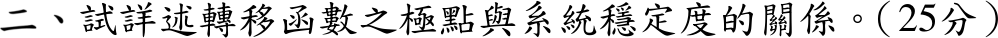

# 📝 109 年電機工程技師｜電路學逐題詳解

> 本頁由題級 canonical 筆記組合；每題保留官方裁切圖、校驗狀態與可追溯的推導。

## 題目導覽
- [[#一、109 年電路學第 1 題|第 1 題：109 年電路學第 1 題]]
- [[#二、109 年第 2 題｜轉移函數極點與系統穩定度|第 2 題：轉移函數極點與系統穩定度]]
- [[#三、109 年電路學第 3 題：節點電壓方程式與對偶網路|第 3 題：109 年電路學第 3 題：節點電壓方程式與對偶網路]]
- [[#四、109 年電路學第 4 題：脈衝與步階激勵的二階暫態|第 4 題：109 年電路學第 4 題：脈衝與步階激勵的二階暫態]]

---

## 一、109 年電路學第 1 題

> 題級識別：EE-109-01-1
> canonical 來源：[[canonical/EE-109-01-1.md]]
> 題級校驗狀態：verified


### 已知與所求

輸入級：上運放 \(+\) 端接 \(v_1\)、下運放 \(+\) 端接 \(v_2\)；兩個 \(-\) 端之間接 \(R_g\)，各自經 \(R_1\) 回授至本身輸出 \(v_{o1}\)（上）、\(v_{o2}\)（下）。差動級：\(v_{o1}\) 經 \(R_2\) 接 \(-\) 端（回授 \(R_0\)），\(v_{o2}\) 經 \(R_2\) 接 \(+\) 端（\(R_0\) 接地）。求 \(v_0\) 與 \(v_1,v_2\) 的關係（25 分）。

### 考場標準作答

**輸入級。** 虛短使兩個 \(-\) 端電位為 \(v_1\)、\(v_2\)；虛斷使 \(R_g\) 電流全數流過兩個 \(R_1\)：
\[
i_g=\frac{v_1-v_2}{R_g},\qquad v_{o1}=v_1+R_1i_g,\qquad v_{o2}=v_2-R_1i_g
\]
\[
v_{o2}-v_{o1}=\left(1+\frac{2R_1}{R_g}\right)(v_2-v_1)
\]

**差動級。** \(v_+=\frac{R_0}{R_2+R_0}v_{o2}\)，\(-\) 端 KCL \(\frac{v_{o1}-v_+}{R_2}=\frac{v_+-v_0}{R_0}\)，整理得 \(v_0=\frac{R_0}{R_2}(v_{o2}-v_{o1})\)。合併：
\[
\boxed{v_0=\frac{R_0}{R_2}\left(1+\frac{2R_1}{R_g}\right)(v_2-v_1)}
\]

### 驗算

- 共模檢查：\(v_1=v_2=v_{cm}\) 時 \(i_g=0\)，\(v_{o1}=v_{o2}=v_{cm}\)，差動級輸出 \(0\)，與公式一致。
- 特例：\(R_g\to\infty\)（輸入級成為兩個電壓隨耦器），公式退化為標準差動放大器 \(v_0=\frac{R_0}{R_2}(v_2-v_1)\)。
- 將七個節點的虛短與 KCL 方程一次聯立求解，得到相同結果。

### 失分點

- 本圖 \(v_1\) 經上方路徑進差動級的反相端，輸出正比於 \(v_2-v_1\)；寫成 \(v_1-v_2\) 會整體差一個負號。
- 增益寫成 \(1+\frac{R_1}{R_g}\)，漏了兩個 \(R_1\) 都由 \(i_g\) 流過。

---

## 二、109 年第 2 題｜轉移函數極點與系統穩定度

> 題級識別：EE-109-01-2
> canonical 來源：[[canonical/EE-109-01-2.md]]
> 題級校驗狀態：verified



### 已知與所求

論述題：說明轉移函數極點與系統穩定度的關係（25 分）。對象取因果、連續時間、集總參數 LTI 系統，\(H(s)=N(s)/D(s)\) 已約分。

### 考場標準作答

**1. 極點決定自然模態。** 極點 \(p_k=\sigma_k+j\omega_k\) 為 \(D(s)=0\) 的根，部分分式後脈衝響應由 \(e^{p_kt}=e^{\sigma_kt}(\cos\omega_kt+j\sin\omega_kt)\) 組成（重數 \(r\) 時另有 \(t^{r-1}e^{p_kt}\)）。實部 \(\sigma_k\) 決定增減，虛部 \(\omega_k\) 決定振盪頻率；實係數系統的複數極點成共軛對。

**2. 依極點位置判定。**

| 極點位置 | 模態 | 結論 |
|---|---|---|
| 全部在左半平面 \(\mathrm{Re}\,p<0\)（含重根） | \(t^{r-1}e^{\sigma t}\to0\) | 漸近穩定、BIBO 穩定 |
| 虛軸上單重極點，其餘在左半平面 | 等幅正弦或常數 | 臨界（邊界）穩定，非 BIBO 穩定 |
| 虛軸上重極點 | \(t\cos\omega t\) 等多項式成長 | 不穩定 |
| 任一右半平面極點 | \(e^{\sigma t}\)，\(\sigma>0\) | 不穩定 |

\[
\boxed{\text{BIBO 穩定}\iff\text{所有極點 }\mathrm{Re}\,p_k<0\iff\int_0^\infty|h(t)|\,dt<\infty}
\]

**3. 臨界穩定不是 BIBO 穩定。** 例：\(H(s)=\frac{1}{s^2+\omega^2}\)，\(h(t)=\frac{\sin\omega t}{\omega}\) 有界但不絕對可積；輸入同頻有界正弦 \(\sin\omega t\) 時輸出含 \(-\frac{t\cos\omega t}{2\omega}\)，隨時間線性成長（共振）。

**4. 二階系統對應。** \(H(s)=\frac{K\omega_n^2}{s^2+2\zeta\omega_ns+\omega_n^2}\) 的極點 \(s=-\zeta\omega_n\pm j\omega_n\sqrt{1-\zeta^2}\)：\(\zeta>0\) 在左半平面（衰減），\(\zeta=0\) 在虛軸（等幅振盪），\(\zeta<0\) 在右半平面（發散）。極點越接近虛軸，衰減越慢、共振峰越尖。

**5. 零極點對消。** \(H(s)=\frac{s-a}{(s-a)(s+b)}\)（\(a,b>0\)）約分後只剩 \(-b\)，輸入輸出為 BIBO 穩定；但被消去的 \(+a\) 模態若存在於系統內部（不可控或不可觀），內部仍不穩定。故穩定度須區分外部（轉移函數）與內部（狀態實現）。

### 驗算

以反拉氏轉換逐例核對上表：
- \(\frac{1}{(s+1)(s+3)}\)、\(\frac{1}{(s+2)^2}\Rightarrow te^{-2t}\)、\(\frac{5}{s^2+2s+5}\)：\(h(t)\to0\) 且絕對可積，左半平面重根仍穩定。
- \(\frac{1}{s^2+4}\Rightarrow\frac12\sin2t\)：有界不衰減；乘上 \(\frac{2}{s^2+4}\)（輸入 \(\sin2t\)）得 \(\frac{\sin2t-2t\cos2t}{8}\)，線性發散。
- \(\frac1{s^2}\Rightarrow t\)、\(\frac1{s-1}\Rightarrow e^{t}\)：皆無界。

### 失分點

- 把虛軸單重極點（臨界穩定）寫成 BIBO 穩定。
- 誤稱「重根即不穩定」；只有虛軸或右半平面的重根才不穩定，左半平面重根仍漸近穩定。
- 未先約分就判斷，或忽略對消模態對內部穩定的影響。

---

## 三、109 年電路學第 3 題：節點電壓方程式與對偶網路

> 題級識別：EE-109-01-3
> canonical 來源：[[canonical/EE-109-01-3.md]]
> 題級校驗狀態：verified


### 已知與所求

中心節點接地；\(V_1,V_2,V_3,V_4\) 分別經 \(1,2,3,4\ \Omega\) 接地。外框支路：\(1\ \mathrm A\) 電流源由 \(V_4\) 流向 \(V_1\)；\(2\ \mathrm V\) 電壓源 \(V_1\) 端為正、\(V_2\) 端為負；\(3\ \mathrm A\) 電流源由 \(V_2\) 流向 \(V_3\)；\(4\ \mathrm V\) 電壓源 \(V_3\) 端為正、\(V_4\) 端為負。寫出節點電壓方程式，轉為對偶方程式並繪出對偶網路（25 分）。

### 考場標準作答

#### 節點電壓方程式

兩個電壓源各成一個超節點，約束為
\[
V_1-V_2=2,\qquad V_3-V_4=4
\]
超節點 \(\{1,2\}\)：注入 \(1\ \mathrm A\)（流進 \(V_1\)）、流出 \(3\ \mathrm A\)（離開 \(V_2\)）：
\[
1\,V_1+\tfrac12V_2=1-3=-2
\]
超節點 \(\{3,4\}\)：注入 \(3\ \mathrm A\)、流出 \(1\ \mathrm A\)：
\[
\tfrac13V_3+\tfrac14V_4=3-1=2
\]
解得
\[
\boxed{V_1=-\tfrac23\ \mathrm V},\quad \boxed{V_2=-\tfrac83\ \mathrm V},\quad \boxed{V_3=\tfrac{36}{7}\ \mathrm V},\quad \boxed{V_4=\tfrac87\ \mathrm V}
\]

#### 對偶方程式

對偶對應：節點電壓 \(V_k\leftrightarrow\) 網目電流 \(i'_k\)、電導 \(G\ (\mathrm S)\leftrightarrow\) 電阻 \(R'=G\ (\Omega)\)、電壓源 \(\leftrightarrow\) 電流源、電流源 \(\leftrightarrow\) 電壓源、接地節點 \(\leftrightarrow\) 外圍網目。四個網目電流皆取順時針：
\[
i'_1-i'_2=2\ \mathrm A,\qquad i'_3-i'_4=4\ \mathrm A
\]
\[
1\,i'_1+0.5\,i'_2=-2\ \mathrm V,\qquad \tfrac13i'_3+\tfrac14i'_4=2\ \mathrm V
\]
解與原電路數值相同：\(i'_1=-\frac23,\ i'_2=-\frac83,\ i'_3=\frac{36}{7},\ i'_4=\frac87\ \mathrm A\)。

#### 對偶網路

原電路四個節點兩兩相鄰成環、且都接地，對偶網路為「田」字形：中心節點 \(O\)，網目 1（左上）、2（右上）、3（右下）、4（左下）。

```
  ┌─────[ 1 Ω ]─────┬─────[ 0.5 Ω ]────┐
  │                 │                  │
  │     i'1 ↻    2 A ↓      i'2 ↻      │
  │                 │                  │
  ├──(+ 1 V −)───── O ─────(− 3 V +)───┤
  │                 │                  │
  │     i'4 ↻    4 A ↑      i'3 ↻      │
  │                 │                  │
  └────[ 1/4 Ω ]────┴────[ 1/3 Ω ]─────┘
```

- 原接地電阻 \(1,2,3,4\ \Omega\)（\(1,\frac12,\frac13,\frac14\ \mathrm S\)）→ 外框電阻 \(1,\ 0.5,\ \frac13,\ \frac14\ \Omega\)，分別只屬網目 1、2、3、4。
- 原 \(2\ \mathrm V\)（節點 1–2 間）→ 網目 1–2 共用支路（上豎線）的 \(2\ \mathrm A\) 電流源，向下流向 \(O\)。
- 原 \(4\ \mathrm V\)（節點 3–4 間）→ 網目 3–4 共用支路（下豎線）的 \(4\ \mathrm A\) 電流源，向上流向 \(O\)。
- 原 \(1\ \mathrm A\)（節點 4–1 間）→ 網目 4–1 共用支路（左橫線）的 \(1\ \mathrm V\) 電壓源，外端為正。
- 原 \(3\ \mathrm A\)（節點 2–3 間）→ 網目 2–3 共用支路（右橫線）的 \(3\ \mathrm V\) 電壓源，外端為正。

### 驗算

- 原電路以 MNA（兩電壓源電流為未知數）完整求解，得同一組 \(V_1\sim V_4\)；回代 \(-\frac23+\frac12(-\frac83)=-2\)、\(\frac13\cdot\frac{36}{7}+\frac14\cdot\frac87=2\)。
- 對偶網路改以節點法求解（\(O\) 接地，左端 \(1\ \mathrm V\)、右端 \(3\ \mathrm V\)）：上節點 \(T\)：\((1-T)-2(T-3)-2=0\Rightarrow T=\frac53\)；下節點 \(B\)：\(3(3-B)-4(B-1)-4=0\Rightarrow B=\frac97\)。網目電流 \(i'_1=1-\frac53=-\frac23\)、\(i'_2=2(\frac53-3)=-\frac83\)、\(i'_3=3(3-\frac97)=\frac{36}{7}\)、\(i'_4=4(\frac97-1)=\frac87\)，與 \(V_1\sim V_4\) 逐一相等，證實圖中元件值與極性正確。

### 失分點

- 對偶時把電阻值直接照抄（\(2\ \Omega\to2\ \Omega\)）；應取電導值 \(0.5\ \Omega\)。
- \(4\ \mathrm V\) 源的正端在 \(V_3\)，寫成 \(V_4-V_3=4\) 會使超節點 \(\{3,4\}\) 的解全錯。
- 對偶電源方向未與順時針網目約定配合，造成網目方程常數項變號。

---

## 四、109 年電路學第 4 題：脈衝與步階激勵的二階暫態

> 題級識別：EE-109-01-4
> canonical 來源：[[canonical/EE-109-01-4.md]]
> 題級校驗狀態：verified


### 已知與所求

左側 \(10u(t)\ \mathrm V\)（上正）；底線 \(4\delta(t)\ \mathrm V\)（左正右負，右端為 \(v_2\) 負端）；上方 \(C_1=1\ \mathrm F\)、\(R_1=1\ \Omega\) 與 \(6\delta(t)\ \mathrm A\) 電流源（箭頭向左）三者並聯於左上節點 \(A\) 與右上節點 \(B\) 之間；右側 \(R_2=1\ \Omega\) 串 \(L_2=1\ \mathrm H\)。\(v_2=v_B\)（以右下端為參考），零初始狀態。以時域法求 \(v_2(t)\)（25 分）。

### 考場標準作答

取 \(v_C=v_A-v_B\)、\(i_L\)（\(B\) 向下流經 \(R_2,L_2\)）。兩電源串在同一迴路，\(v_A=10u(t)+4\delta(t)\)，故
\[
v_2=v_A-v_C=10u(t)+4\delta(t)-v_C,\qquad v_2=R_2i_L+L_2\frac{di_L}{dt}
\]

**脈衝造成的狀態跳變。** 節點 \(B\) KCL：\(C_1\dot v_C+\frac{v_C}{R_1}-6\delta(t)=i_L\)。\(i_L\) 不能含脈衝，\(6\delta\) 必全數流入電容：
\[
C_1[v_C(0^+)-0]=6\Rightarrow v_C(0^+)=6\ \mathrm V
\]
\(v_C\) 無脈衝，\(v_2\) 中的 \(4\delta(t)\) 全落在電感上：
\[
L_2[i_L(0^+)-0]=4\Rightarrow i_L(0^+)=4\ \mathrm A
\]

**\(t>0\) 狀態方程。**
\[
\dot v_C=i_L-v_C,\qquad \dot i_L=10-v_C-i_L
\]
穩態 \(v_C(\infty)=i_L(\infty)=5\)。令 \(x=v_C-5\)、\(y=i_L-5\)，特徵方程 \((s+1)^2+1=0\Rightarrow s=-1\pm j\)；由 \(x(0^+)=1\)、\(y(0^+)=-1\)：
\[
v_C(t)=5+e^{-t}(\cos t-\sin t),\qquad i_L(t)=5-e^{-t}(\cos t+\sin t)
\]
\(t>0\) 時 \(v_2=10-v_C\)；加上 \(t=0\) 的脈衝分量：
\[
\boxed{v_2(t)=4\delta(t)+\left[5-e^{-t}(\cos t-\sin t)\right]u(t)\ \mathrm V}
\]

### 驗算

- 拉氏轉換（零初值）：\(V_A=\frac{10}{s}+4\)，節點 \(B\)：\((V_B-V_A)(1+s)+6+\frac{V_B}{1+s}=0\)，
\[
V_2(s)=\frac{(4s^2+8s+10)(s+1)}{s(s^2+2s+2)}=4+\frac5s-\frac{s}{(s+1)^2+1}
\]
反轉換為 \(4\delta(t)+[5-e^{-t}\cos t+e^{-t}\sin t]u(t)\)，與時域解相同。
- 支路回代：\(\frac{di_L}{dt}=2e^{-t}\sin t\)，\(R_2i_L+L_2\frac{di_L}{dt}=5-e^{-t}(\cos t-\sin t)=v_2\)（\(t>0\)）；\(v_2(0^+)=4\)、\(v_2(\infty)=5\ \mathrm V\)（直流時 \(R_1\)、\(R_2\) 平分 10 V）。

### 失分點

- \(v_2\) 是 \(R_2\)–\(L_2\) 支路電壓，\(4\delta(t)\) 直接出現在其中；只寫 \(t>0\) 的部分會漏掉 \(4\delta(t)\)。
- \(6\delta(t)\) 電流源使 \(v_C\) 跳到 \(6\ \mathrm V\)、\(4\delta(t)\) 電壓源使 \(i_L\) 跳到 \(4\ \mathrm A\)；把脈衝當成 \(4\ \mathrm V\)、\(6\ \mathrm A\) 階躍會得錯誤初值。
- 直流穩態誤判為 \(0\)；\(10u(t)\) 經 \(R_1\)、\(R_2\) 有直流路徑，\(v_2(\infty)=5\ \mathrm V\)。

---
