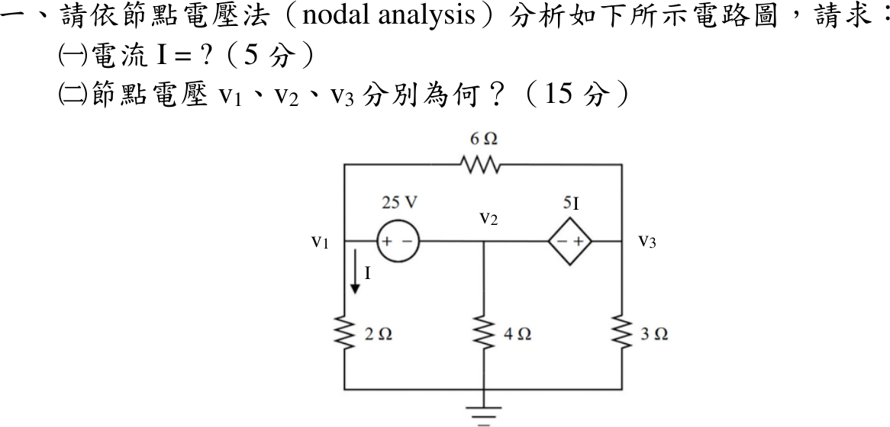

# 114 年電機工程技師｜電路學逐題詳解

> 本頁由題級 canonical 筆記組合；每題保留 QID、官方裁切、校驗狀態與完整得分型解答。

## 題目導覽
- [[#一、114 年電路學第 1 題｜節點電壓法與超節點|第 1 題：節點電壓法與超節點]]
- [[#二、114 年電路學第 2 題｜諾頓等效|第 2 題：諾頓等效]]
- [[#三、114 年電路學第 3 題｜二階 RLC 暫態|第 3 題：二階 RLC 暫態]]
- [[#四、114 年電路學第 4 題｜不同頻率的重疊定理|第 4 題：不同頻率的重疊定理]]
- [[#五、114 年電路學第 5 題｜拉氏轉換與含相依源電路|第 5 題：拉氏轉換與含相依源電路]]

---

## 一、114 年電路學第 1 題｜節點電壓法與超節點

> 題級識別：`EE-114-01-1`
> canonical 來源：`canonical/EE-114-01-1.md`
> 題級校驗狀態：`verified`

![[01_原始試題/依考科/01_電路學/images/questions/PE_114年_電路學_Q01.png]]

> 官方裁切來源：`01_原始試題/依考科/01_電路學/images/questions/PE_114年_電路學_Q01.png`

### 已知與所求

底線接地。25 V 電壓源正端接 \(v_1\)、負端接 \(v_2\)；相依電壓源 \(5I\) 負端接 \(v_2\)、正端接 \(v_3\)；6 Ω 跨接 \(v_1\)–\(v_3\)；2 Ω、4 Ω、3 Ω 分別由 \(v_1\)、\(v_2\)、\(v_3\) 接地，\(I\) 為 2 Ω 向下電流。求（一）\(I\)（5 分）；（二）\(v_1,v_2,v_3\)（15 分）。

### 考場標準作答

兩個電壓源把 \(v_1,v_2,v_3\) 連成同一超節點；6 Ω 連接 \(v_1\) 與 \(v_3\)，屬超節點內部支路，不列入邊界 KCL。

\[
I=\frac{v_1}{2},\qquad v_1-v_2=25,\qquad v_3-v_2=5I=\frac52v_1
\]
超節點邊界 KCL：
\[
\frac{v_1}{2}+\frac{v_2}{4}+\frac{v_3}{3}=0
\]
代入 \(v_2=v_1-25\)、\(v_3=\frac72v_1-25\)，乘 12：\(6v_1+3v_1-75+14v_1-100=0\Rightarrow 23v_1=175\)。

#### （一）電流 \(I\)

\[
\boxed{I=\frac{175}{46}=3.8043\text{ A}}
\]

#### （二）節點電壓

\[
\boxed{v_1=\frac{175}{23}=7.6087\text{ V}},\qquad
\boxed{v_2=-\frac{400}{23}=-17.3913\text{ V}},\qquad
\boxed{v_3=\frac{75}{46}=1.6304\text{ V}}
\]

### 驗算

功率守恆。6 Ω 電流 \((v_1-v_3)/6=275/276\ \mathrm A\)；由 \(v_1\) 節點 KCL，25 V 源由正端流出 \(I+\frac{275}{276}=\frac{1325}{276}\ \mathrm A\)，供給 \(25\times\frac{1325}{276}=120.02\ \mathrm W\)。四個電阻吸收 \(28.95+5.96+75.61+0.89=111.40\ \mathrm W\)；相依源電流 \(\frac{125}{276}\ \mathrm A\) 由正端流入，吸收 \(5I\times\frac{125}{276}=8.61\ \mathrm W\)。\(111.40+8.61=120.02\ \mathrm W\)，收支平衡。

### 失分點

- 把 6 Ω 寫成 \(\frac{v_1-v_3}{6}\) 列入超節點邊界 KCL，等於重複計算內部電流。
- 相依源極性看反寫成 \(v_2-v_3=5I\)，會得 \(3v_1=175\)、\(v_1=58.33\ \mathrm V\)；圖中相依源右端（\(v_3\)）為正。

---

## 二、114 年電路學第 2 題｜諾頓等效

> 題級識別：`EE-114-01-2`
> canonical 來源：`canonical/EE-114-01-2.md`
> 題級校驗狀態：`verified`

![[01_原始試題/依考科/01_電路學/images/questions/PE_114年_電路學_Q02.png]]

> 官方裁切來源：`01_原始試題/依考科/01_電路學/images/questions/PE_114年_電路學_Q02.png`

### 已知與所求

取 \(b\) 為參考點。左上節點 \(n\) 接 6 Ω 至 \(b\) 及 10 A 電流源（箭頭向上流入 \(n\)）；相依電壓源 \(2V_x\) 正端接 \(n\)、負端接 \(a\)；2 Ω 跨接 \(a\)–\(b\)，\(V_x=v_a\)（上正）。求 \(a\)–\(b\) 的諾頓等效電路。

### 考場標準作答

#### 開路電壓

相依源給出 \(v_n-v_a=2v_a\Rightarrow v_n=3v_a\)。開路時相依源支路電流即 2 Ω 電流 \(v_a/2\)，節點 \(n\) 的 KCL：
\[
\frac{v_n}{6}+\frac{v_a}{2}=10\Rightarrow\frac{3v_a}{6}+\frac{v_a}{2}=10\Rightarrow V_{oc}=v_a=10\ \mathrm V
\]

#### 短路電流

\(a\)–\(b\) 短路使 \(V_x=0\)，故 \(v_n=0\)，6 Ω 與 2 Ω 皆無電流，10 A 全部經短路線：\(I_{sc}=10\ \mathrm A\)，外部短路電流 \(a\to b\)。

#### 諾頓等效

\[
\boxed{I_N=10\ \mathrm A},\qquad \boxed{R_N=\frac{V_{oc}}{I_{sc}}=1\ \Omega}
\]
\(a\)、\(b\) 兩端**並聯** 10 A 理想電流源與 1 Ω 電阻；電流源箭頭由 \(b\to a\)，使開路時 \(V_{ab}=+10\,\mathrm V\)。

### 驗算

測試源法：關閉 10 A（開路）、保留相依源，在 \(a\) 加 \(V_t\)，則 \(v_n=3V_t\)，\(i_t=\frac{V_t}{2}+\frac{3V_t}{6}=V_t\Rightarrow R_N=1\ \Omega\)，與 \(V_{oc}/I_{sc}\) 一致。

### 失分點

- 求 \(R_N\) 時把相依源歸零會得 \(6\parallel2=1.5\ \Omega\)；相依源必須保留。
- \(V_x\) 極性看反（\(V_x=-v_a\)）會得 \(v_n=-v_a\)、\(V_{oc}=30\ \mathrm V\)。
- 把外部短路電流 \(a\to b\) 當成電流源本體箭頭；源內箭頭應為 \(b\to a\)。

---

## 三、114 年電路學第 3 題｜二階 RLC 暫態

> 題級識別：`EE-114-01-3`
> canonical 來源：`canonical/EE-114-01-3.md`
> 題級校驗狀態：`verified`

![[01_原始試題/依考科/01_電路學/images/questions/PE_114年_電路學_Q03.png]]

> 官方裁切來源：`01_原始試題/依考科/01_電路學/images/questions/PE_114年_電路學_Q03.png`

### 已知與所求

24 V 電源串 4 Ω、1 H（電流 \(i\) 向右）後接 0.25 F 電容（電壓 \(v\) 上正下負）；1 Ω 經開關與電容並聯。\(t<0\) 開關閉合且已穩態，\(t=0\) 打開。求（一）\(v(0)\)、\(i(0)\)（10 分）；（二）\(v(t>0)\)（10 分）。

### 考場標準作答

#### （一）開關打開瞬間

\(t<0\) 直流穩態：電感短路、電容開路，\(i(0^-)=\dfrac{24}{4+1}=4.8\ \mathrm A\)，\(v(0^-)=1\times4.8=4.8\ \mathrm V\)。電感電流、電容電壓連續：
\[
\boxed{v(0)=4.8\ \mathrm V},\qquad \boxed{i(0)=4.8\ \mathrm A}
\]

#### （二）\(v(t>0)\)

開關打開後為串聯 RLC，\(i=C\dot v=0.25\dot v\)，KVL：
\[
24=4i+\frac{di}{dt}+v\;\Rightarrow\;\ddot v+4\dot v+4v=96
\]
特徵方程 \(s^2+4s+4=(s+2)^2=0\)，臨界阻尼，\(v(\infty)=24\ \mathrm V\)：
\[
v(t)=24+(A+Bt)e^{-2t}
\]
\(v(0)=4.8\Rightarrow A=-19.2\)；\(\dot v(0)=\dfrac{i(0)}{C}=19.2=B-2A\Rightarrow B=-19.2\)。
\[
\boxed{v(t)=24-19.2(1+t)e^{-2t}\ \mathrm V,\quad t>0}
\]

### 驗算

由答案求 \(i=0.25\dot v=4.8(1+2t)e^{-2t}\)、\(\dfrac{di}{dt}=-19.2te^{-2t}\)，代回 KVL：
\[
4i+\frac{di}{dt}+v=19.2(1+2t)e^{-2t}-19.2te^{-2t}+24-19.2(1+t)e^{-2t}=24\ \mathrm V
\]
且 \(i(0)=4.8\ \mathrm A\)、\(i(\infty)=0\)，與初值及電容開路終值一致。

### 失分點

- 只用 \(v(0)=4.8\) 而漏用 \(\dot v(0)=i(0)/C=19.2\ \mathrm V/\mathrm s\)，重根解的 \(B\) 無法決定。
- 開關打開後仍把 1 Ω 留在電路，會誤得 \(s^2+8s+20=0\) 的欠阻尼解且 \(v(\infty)=4.8\ \mathrm V\)。
- 寫成 \(\dot v=iC\)（\(=1.2\)）而非 \(i/C\)。

---

## 四、114 年電路學第 4 題｜不同頻率的重疊定理

> 題級識別：`EE-114-01-4`
> canonical 來源：`canonical/EE-114-01-4.md`
> 題級校驗狀態：`verified`

![[01_原始試題/依考科/01_電路學/images/questions/PE_114年_電路學_Q04.png]]

> 官方裁切來源：`01_原始試題/依考科/01_電路學/images/questions/PE_114年_電路學_Q04.png`

### 已知與所求

\(75\sin(5t)\ \mathrm V\) 電壓源串 8 Ω 至輸出節點；輸出節點對地並接 0.2 F、1 H 與 \(6\cos(10t)\ \mathrm A\) 電流源（箭頭向上注入輸出節點）。以重疊定理求 \(v_o(t)\)（20 分）。

### 考場標準作答

輸出節點的電容、電感並聯導納 \(Y(j\omega)=j\left(0.2\omega-\dfrac1\omega\right)\)。

**5 rad/s 分量**（電流源開路），以正弦為基準：
\[
Y_5=j0.8,\qquad V_{o,5}=\frac{75}{1+8Y_5}=\frac{75}{1+j6.4}=11.5783\angle-81.1193^\circ\ \mathrm V
\]

**10 rad/s 分量**（電壓源短路，8 Ω 仍跨在輸出節點與地之間），以餘弦為基準：
\[
Y_{10}=j1.9,\qquad
\widetilde V_{o,10}=\frac6{1/8+j1.9}=0.206861-j3.144285=3.15108\angle-86.23597^\circ\ \mathrm V
\]
即 \(3.15108\cos(10t-86.23597^\circ)=3.15108\sin(10t+3.76403^\circ)\)。兩分量頻率不同，回到時域相加：
\[
\boxed{v_o(t)=11.5783\sin(5t-81.1193^\circ)+3.15108\sin(10t+3.76403^\circ)\ \mathrm V}
\]

### 驗算

改用阻抗分壓／分流。5 rad/s：\(Z_p=\dfrac{(-j1)(j5)}{j4}=-j1.25\ \Omega\)，\(|V_{o,5}|=\dfrac{75(1.25)}{\sqrt{8^2+1.25^2}}=11.578\)，相角 \(-90^\circ+\tan^{-1}\frac{1.25}{8}=-81.12^\circ\)。
10 rad/s：\(Z_p=\dfrac{(-j0.5)(j10)}{j9.5}=-j0.52632\ \Omega\)，再並 8 Ω：\(|Z|=\dfrac{8(0.52632)}{\sqrt{64+0.277}}=0.52518\ \Omega\)，\(6|Z|=3.1511\ \mathrm V\)，相角 \(-90^\circ+\tan^{-1}\frac{0.52632}{8}=-86.24^\circ\)。

### 失分點

- 短路電壓源時連 8 Ω 一起刪除，誤得 \(6/(j1.9)=3.158\angle-90^\circ\ \mathrm V\)。
- 把 5 rad/s 與 10 rad/s 的相量直接相加。
- 10 rad/s 分量用餘弦求得後，改寫成正弦時漏加 \(90^\circ\)。

---

## 五、114 年電路學第 5 題｜拉氏轉換與含相依源電路

> 題級識別：`EE-114-01-5`
> canonical 來源：`canonical/EE-114-01-5.md`
> 題級校驗狀態：`verified`

![[01_原始試題/依考科/01_電路學/images/questions/PE_114年_電路學_Q05.png]]

> 官方裁切來源：`01_原始試題/依考科/01_電路學/images/questions/PE_114年_電路學_Q05.png`

### 已知與所求

\(i_s=10u(t)\ \mathrm A\) 向上注入上方節點 \(a\)；中間支路為相依電壓源 \(2I_x\)（上正）串 5 Ω 接地，兩者之間節點記為 \(c\)；2 H 電感（\(I_x\) 向右，初始無儲能）串右側 5 Ω 接地，\(v_o\) 為右側 5 Ω 電壓。以拉氏轉換求 \(v_o(t>0)\)（20 分）。

### 考場標準作答

零初始條件，\(Z_L=2s\)，\(I_s=10/s\)。右支路與輸出：
\[
V_a=(2s+5)I_x,\qquad V_o=5I_x
\]
相依源上正下負：\(V_c=V_a-2I_x=(2s+3)I_x\)。節點 \(a\) 的 KCL：
\[
\frac{10}{s}=I_x+\frac{V_c}{5}=I_x\,\frac{2s+8}{5}
\;\Rightarrow\;
I_x=\frac{25}{s(s+4)}
\]
\[
V_o(s)=\frac{125}{s(s+4)}=\frac{125}{4}\left(\frac1s-\frac1{s+4}\right)
\]
\[
\boxed{v_o(t)=31.25(1-e^{-4t})\ \mathrm V,\quad t>0}
\]

### 驗算

時域直接列式。\(i_x=v_o/5\)，電感 \(v_a=v_o+2\dot i_x=v_o+\frac25\dot v_o\)，故 \(v_c=v_a-2i_x=\frac35v_o+\frac25\dot v_o\)。節點 \(a\)：\(i_x+v_c/5=10\)，即
\[
\frac{v_o}{5}+\frac{3v_o}{25}+\frac{2\dot v_o}{25}=10\;\Longleftrightarrow\;\dot v_o+4v_o=125
\]
答案代入：\(125e^{-4t}+125(1-e^{-4t})=125\)，且 \(v_o(0^+)=0\)（電感電流為零）、\(v_o(\infty)=31.25\ \mathrm V\)。

### 失分點

- 相依源極性寫反（\(V_c=V_a+2I_x\)）會得 \(I_x=25/[s(s+6)]\)、終值 \(20.83\ \mathrm V\)。
- 把零初始電感當直流短路只求終值，漏掉 \(e^{-4t}\) 暫態項。
