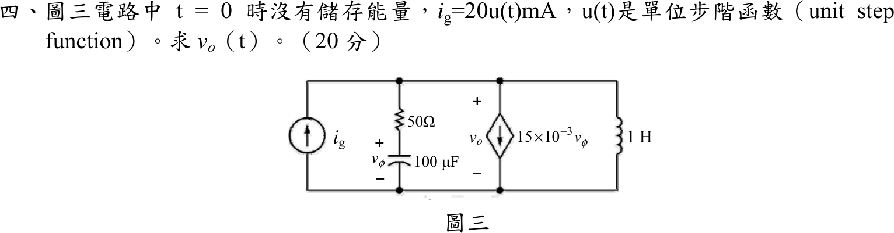

# 104 年電路學第 4 題｜相依源 RLC 二階暫態

## 已知與所求

$t=0$ 無儲能，$i_g=20u(t)\ \mathrm{mA}$（向上注入頂節點）。頂節點對地並聯四支路：$i_g$；$50\ \Omega$ 串 $100\ \mu\mathrm F$（電容電壓 $v_\phi$，上正）；相依電流源 $15\times10^{-3}v_\phi$（向下）；$1\ \mathrm H$ 電感。$v_o$ 為頂節點對地電壓（上正）。求 $v_o(t)$（20 分）。

## 考場標準作答

在 $s$ 域，$I_g=\dfrac{0.02}{s}$。$RC$ 支路導納 $Y_{RC}=\dfrac{1}{50+\frac{1}{sC}}=\dfrac{sC}{1+50sC}$，且 $V_\phi=\dfrac{V_o}{1+50sC}$（分壓），$C=10^{-4}\ \mathrm F$，$50C=0.005$：

$$
Y_{RC}=\frac{0.02s}{s+200},\qquad
\text{相依源電流}=0.015V_\phi=\frac{3}{s+200}V_o,\qquad
Y_L=\frac{1}{s}
$$

頂節點 KCL：

$$
\frac{0.02}{s}=V_o\left[\frac{0.02s+3}{s+200}+\frac1s\right]
=V_o\,\frac{0.02(s+100)^2}{s(s+200)}
$$

$$
V_o(s)=\frac{s+200}{(s+100)^2}=\frac{1}{s+100}+\frac{100}{(s+100)^2}
$$

$$
\boxed{v_o(t)=(1+100t)e^{-100t}\,u(t)\ \mathrm V}
$$

特徵式 $(s+100)^2$ 為重根，屬臨界阻尼。

## 驗算

初值：$t=0^+$ 電容短路，$v_\phi=0$，相依源為 $0$，電感電流為 $0$，$20\ \mathrm{mA}$ 全經 $50\ \Omega$，$v_o(0^+)=1\ \mathrm V$，與 $(1+0)e^0=1$ 一致。終值：$t\to\infty$ 電感短路，$v_o\to0$，與 $e^{-100t}$ 衰減一致。

## 失分點

- 相依源電流 $0.015v_\phi$ 受電容電壓 $v_\phi$ 控制，而非 $v_o$；須先以分壓關係 $V_\phi=V_o/(1+0.005s)$ 換成 $V_o$。
- 分母展開後為 $0.02(s+100)^2$（$s^2+200s+10000$），重根；若誤得兩相異根會寫成雙指數。
