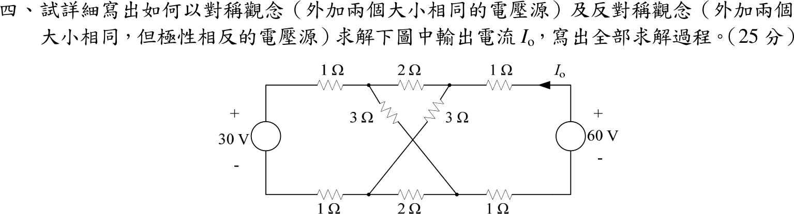

# 106 年電路學第 4 題｜對稱與反對稱分析

## 已知與所求

左源 30 V、右源 60 V（皆上正）。上軌：\(1\ \Omega\)、節點 \(T_1\)、\(2\ \Omega\)、節點 \(T_2\)、\(1\ \Omega\)；下軌相同（節點 \(B_1,B_2\)）；交叉 \(3\ \Omega\) 接 \(T_1\)–\(B_2\) 與 \(T_2\)–\(B_1\)。\(I_o\) 為上軌由右源「+」端向左流出的電流。要求用對稱與反對稱激勵求 \(I_o\) 並寫出完整過程（25 分）。

## 考場標準作答

**分解**：\(30=45-15\)，\(60=45+15\)。對稱激勵：左右兩源皆 45 V（同方向）；反對稱激勵：左源 \(-15\) V、右源 \(+15\) V。電路左右鏡像對稱，疊加後 \(I_o=I_{o,s}+I_{o,a}\)。

**對稱激勵**：鏡像節點電位相同（\(V_{T1}=V_{T2}\)、\(V_{B1}=V_{B2}\)），兩條 \(2\ \Omega\) 無電流。電流只走交叉 \(3\ \Omega\)：右源 \(\to T_2\to B_1\to\) 左下 \(1\ \Omega\to\) 左源 \(\to\) 左上 \(1\ \Omega\to T_1\to B_2\to\) 右下 \(1\ \Omega\to\) 右源，為單一串聯迴路（等於半電路 \(45/(1+3+1)\)）：
\[
I_{o,s}=\frac{45+45}{1+3+1+1+3+1}=9\ \mathrm A
\]

**反對稱激勵**：對稱軸上的點（兩條 \(2\ \Omega\) 的中點）電位為 0，且 \(V_{T1}=-V_{T2}\)、\(V_{B1}=-V_{B2}\)。令 \(V_{T2}=x\)、\(V_{B2}=y\)，則 \(V_{B1}=-y\)，交叉 \(3\ \Omega\)（\(T_2\)–\(B_1\)）電流為 \((x+y)/3\)；\(T_2\)、\(B_2\) 的 KCL 與右源迴路：
\[
\begin{aligned}
T_2:&\ I_{o,a}=x+\frac{x+y}{3}\\
B_2:&\ I_{o,a}=-y-\frac{x+y}{3}\\
\text{右源迴路：}&\ x-y+2I_{o,a}=15
\end{aligned}
\]
前兩式相加得 \(\tfrac53(x+y)=0\Rightarrow y=-x\)，交叉 \(3\ \Omega\) 無電流。此時 \(I_{o,a}=x\)，迴路為 \(1+1+1+1=4\ \Omega\)（兩個 \(2\ \Omega\) 各取一半）：
\[
I_{o,a}=\frac{15}{4}=3.75\ \mathrm A
\]

**疊加**：
\[
\boxed{I_o=9+3.75=12.75\ \mathrm A=\frac{51}{4}\ \mathrm A}
\]

## 驗算

不分解，直接對原電路解節點電壓（以左源「−」端為 0 V）：\(T_1=24.75,\ T_2=32.25,\ B_1=5.25,\ B_2=-2.25\ \mathrm V\)，右源「−」端為 \(-15\ \mathrm V\)、「+」端為 \(45\ \mathrm V\)。故 \(I_o=(45-32.25)/1=12.75\ \mathrm A\)；左源電流 \(30-24.75=5.25\ \mathrm A\)（與 \(9-3.75\) 一致）。功率守恆：電源 \(60(12.75)+30(5.25)=922.5\ \mathrm W\)；4 個 \(1\ \Omega\) 吸收 \(2(5.25^2+12.75^2)=380.25\ \mathrm W\)、兩個 \(2\ \Omega\) 共 \(56.25\ \mathrm W\)、兩個 \(3\ \Omega\) 共 \(2(27^2/3)=486\ \mathrm W\)，合計 \(922.5\ \mathrm W\)。

## 失分點

- 對稱激勵時兩個交叉 \(3\ \Omega\) 屬於同一個串聯迴路（\(T_2\to B_1\)、\(T_1\to B_2\)），總電阻 10 Ω、總電動勢 90 V；不要當成兩個獨立並聯支路。
- 反對稱時對稱軸電位為 0，但交叉 \(3\ \Omega\) 跨越對稱軸，不能直接視為斷路或短路；須證明 \(V_{T2}+V_{B2}=0\) 後才知無電流。
- 反對稱左源是 \(-15\) V（極性反向），不是 \(+15\) V；否則 \(I_o\) 的疊加方向會錯。
