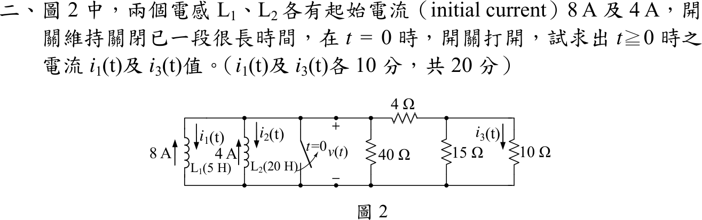

# 107 年電路學第 2 題｜雙電感並聯暫態

## 已知與所求

\(L_1=5\ \mathrm H\)、\(L_2=20\ \mathrm H\) 並聯，初始電流 \(8\ \mathrm A\)（\(L_1\)）與 \(4\ \mathrm A\)（\(L_2\)），兩個箭頭都**向上**；\(i_1,i_2\) 定義為向下。開關在 \(t=0\) 打開，其右為 \(40\ \Omega\)，以及 \(4\ \Omega\) 串聯 \(15\ \Omega\parallel10\ \Omega\)；\(i_3\) 向下流過 \(10\ \Omega\)。求 \(t\ge0\) 的 \(i_1(t)\)、\(i_3(t)\)（各 10 分）。

## 考場標準作答

初始值（向下為正）：\(i_1(0)=-8\ \mathrm A\)，\(i_2(0)=-4\ \mathrm A\)。

電感所見電阻與時間常數：
\[
R_{eq}=40\parallel\bigl[4+(15\parallel10)\bigr]=40\parallel10=8\ \Omega,\quad
L_{eq}=5\parallel20=4\ \mathrm H,\quad \tau=\frac{4}{8}=0.5\ \mathrm s
\]
總電感電流 \(i_\Sigma=i_1+i_2\)，\(i_\Sigma(0)=-12\ \mathrm A\)，故 \(i_\Sigma=-12e^{-2t}\)，電阻網路向下電流 \(12e^{-2t}\)，端電壓（上正）
\[
v(t)=8(12e^{-2t})=96e^{-2t}\ \mathrm V
\]
\[
i_1(t)=-8+\frac15\int_0^t96e^{-2\lambda}d\lambda
=-8+9.6(1-e^{-2t})
\]
\[
\boxed{i_1(t)=1.6-9.6e^{-2t}\ \mathrm A\quad(t\ge0)}
\]
（\(i_2(t)=-1.6-2.4e^{-2t}\) A；兩電感間留有環流 \(i_1(\infty)=1.6\ \mathrm A\)。）

\(v\) 加在 \(4\ \Omega\) 串 \(15\parallel10=6\ \Omega\) 的分支上：電流 \(v/10\)，\(15\parallel10\) 的電壓 \(0.6v\)，再除以 \(10\ \Omega\)：
\[
\boxed{i_3(t)=\frac{0.6v}{10}=5.76e^{-2t}\ \mathrm A\quad(t\ge0)}
\]

## 驗算

能量守恆：初始儲能 \(\tfrac12(5)(8^2)+\tfrac12(20)(4^2)=160+160=320\ \mathrm J\)；終值儲能 \(\tfrac12(5)(1.6^2)+\tfrac12(20)(1.6^2)=6.4+25.6=32\ \mathrm J\)；電阻消耗
\[
\int_0^\infty\frac{v^2}{8}dt=\int_0^\infty1152e^{-4t}dt=288\ \mathrm J
\]
\(320-32=288\ \mathrm J\) 成立。

## 失分點

- 兩個初始電流箭頭都向上，應同號相加（\(i_\Sigma(0)=-12\ \mathrm A\)）；只把 4 A 當成向下（\(i_2(0)=+4\)）會得 \(i_3=1.92e^{-2t}\)；若再把 \(i_3\) 誤當 15 Ω 支路電流，則得 \(i_1=-4.8-3.2e^{-2t}\)、\(i_3=1.28e^{-2t}\)。
- \(i_1\) 終值不為 0：電流和衰減到 0，但兩電感個別電流停在環流 \(1.6\ \mathrm A\)。
- \(i_3\) 要經兩次分壓：先求 \(v\)，再經 \(4\ \Omega\) 串聯分壓到 \(15\parallel10\)，最後除以 \(10\ \Omega\)。
