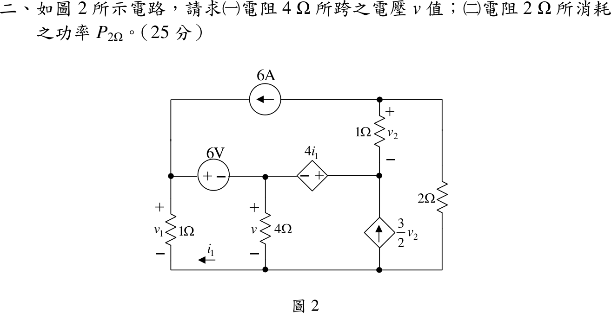

# 108 年電路學第 2 題｜含相依源直流電路

## 已知與所求

左上節點接 6 A 電流源（箭頭向左，電流由最上節點流入左節點）、6 V 電壓源「+」端與 \(1\ \Omega\)（\(v_1\) 上正）；6 V 源「−」端為 4 Ω（\(v\) 上正）頂端；相依電壓源 \(4i_1\)（左負右正）接 4 Ω 頂端與相依電流源 \(\tfrac32v_2\)（向上注入）頂端；最上節點接 \(1\ \Omega\)（\(v_2\) 上正，下端即相依源右端）與 \(2\ \Omega\)。\(i_1\) 箭頭沿底線向左，故電流由地向上穿過左側 \(1\ \Omega\)。求（一）\(4\ \Omega\) 電壓 \(v\)；（二）\(2\ \Omega\) 功率 \(P_{2\Omega}\)（共 25 分）。

## 考場標準作答

底線為參考地；\(V_1\) 為左節點，\(V_3\) 為相依源右端，\(V_4\) 為最上節點，\(v_2=V_4-V_3\)。

**電壓約束**：6 V 源 \(V_1=v+6\)；\(i_1\) 與 \(V_1\) 的被動方向相反，\(i_1=-V_1\)；相依源 \(V_3-v=4i_1\)：
\[
V_3=v-4(v+6)=-3v-24
\]

**最上節點 KCL**（6 A 源把電流帶離此節點）：
\[
6+v_2+\frac{V_4}{2}=0\Rightarrow V_4=-2v-20,\quad v_2=V_4-V_3=v+4
\]

**超節點 \(\{V_1,v,V_3\}\) KCL**（流入：6 A、\(v_2\)、\(\tfrac32v_2\)；流出：\(V_1\)、\(v/4\)）：
\[
(v+6)+\frac v4=6+\frac52(v+4)\Rightarrow 1.25v+6=2.5v+16
\]
\[
\boxed{v=-8\ \mathrm V}
\]
\(V_4=-2(-8)-20=-4\ \mathrm V\)，故
\[
\boxed{P_{2\Omega}=\frac{V_4^2}{2}=\frac{(-4)^2}{2}=8\ \mathrm W}
\]

## 驗算

節點電壓：\(V_1=-2,\ v=-8,\ V_3=0,\ V_4=-4,\ v_2=-4\ \mathrm V,\quad i_1=2\ \mathrm A\)；以功率守恆檢查（與 KCL 解法不同）：

- 電阻吸收：\(1\ \Omega(V_1)\) 4 W、\(4\ \Omega\) 16 W、\(1\ \Omega(v_2)\) 16 W、\(2\ \Omega\) 8 W，共 44 W。
- 電源供給：6 A 源兩端升壓 \(V_1-V_4=2\ \mathrm V\)，供 12 W；6 V 源通過 8 A 由「+」端流入，吸 48 W；\(4i_1=8\ \mathrm V\) 源通過 10 A 由「+」端流出，供 80 W；相依電流源端電壓 \(V_3=0\)，0 W。\(12-48+80=44\ \mathrm W\)。

## 失分點

- \(i_1\) 箭頭向左（由地向上）：誤寫 \(i_1=+V_1\)（或把 \(4i_1\) 的極性看反）會得 \(v=-72/13\ \mathrm V\)、\(P_{2\Omega}\approx20.9\ \mathrm W\)。
- 相依電流源 \(\tfrac32v_2\) 向上注入相依源右端，超節點 KCL 要放在「流入」側。
- 題目要求兩個量，求出 \(v\) 後還需用 \(V_4\)（非 \(v\)）算 \(2\ \Omega\) 功率。
