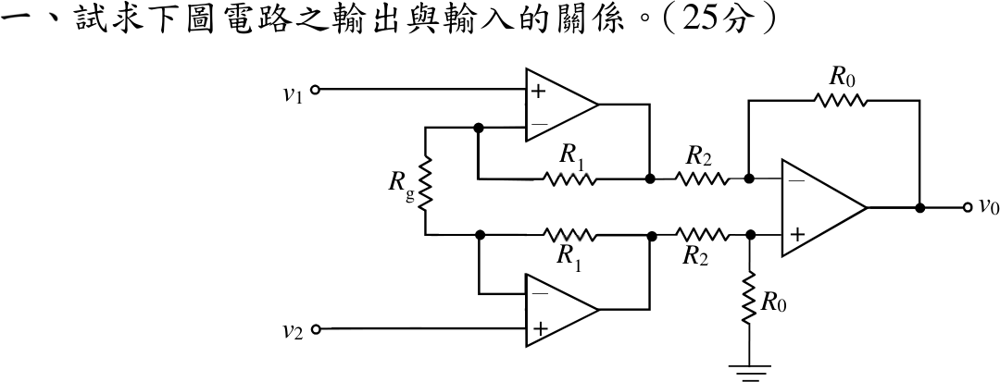

# 109 年電路學第 1 題｜三運算放大器儀表放大器

## 已知與所求

輸入級：上運放 \(+\) 端接 \(v_1\)、下運放 \(+\) 端接 \(v_2\)；兩個 \(-\) 端之間接 \(R_g\)，各自經 \(R_1\) 回授至本身輸出 \(v_{o1}\)（上）、\(v_{o2}\)（下）。差動級：\(v_{o1}\) 經 \(R_2\) 接 \(-\) 端（回授 \(R_0\)），\(v_{o2}\) 經 \(R_2\) 接 \(+\) 端（\(R_0\) 接地）。求 \(v_0\) 與 \(v_1,v_2\) 的關係（25 分）。

## 考場標準作答

**輸入級。** 虛短使兩個 \(-\) 端電位為 \(v_1\)、\(v_2\)；虛斷使 \(R_g\) 電流全數流過兩個 \(R_1\)：
\[
i_g=\frac{v_1-v_2}{R_g},\qquad v_{o1}=v_1+R_1i_g,\qquad v_{o2}=v_2-R_1i_g
\]
\[
v_{o2}-v_{o1}=\left(1+\frac{2R_1}{R_g}\right)(v_2-v_1)
\]

**差動級。** \(v_+=\frac{R_0}{R_2+R_0}v_{o2}\)，\(-\) 端 KCL \(\frac{v_{o1}-v_+}{R_2}=\frac{v_+-v_0}{R_0}\)，整理得 \(v_0=\frac{R_0}{R_2}(v_{o2}-v_{o1})\)。合併：
\[
\boxed{v_0=\frac{R_0}{R_2}\left(1+\frac{2R_1}{R_g}\right)(v_2-v_1)}
\]

## 驗算

- 共模檢查：\(v_1=v_2=v_{cm}\) 時 \(i_g=0\)，\(v_{o1}=v_{o2}=v_{cm}\)，差動級輸出 \(0\)，與公式一致。
- 特例：\(R_g\to\infty\)（輸入級成為兩個電壓隨耦器），公式退化為標準差動放大器 \(v_0=\frac{R_0}{R_2}(v_2-v_1)\)。
- 將七個節點的虛短與 KCL 方程一次聯立求解，得到相同結果。

## 失分點

- 本圖 \(v_1\) 經上方路徑進差動級的反相端，輸出正比於 \(v_2-v_1\)；寫成 \(v_1-v_2\) 會整體差一個負號。
- 增益寫成 \(1+\frac{R_1}{R_g}\)，漏了兩個 \(R_1\) 都由 \(i_g\) 流過。
