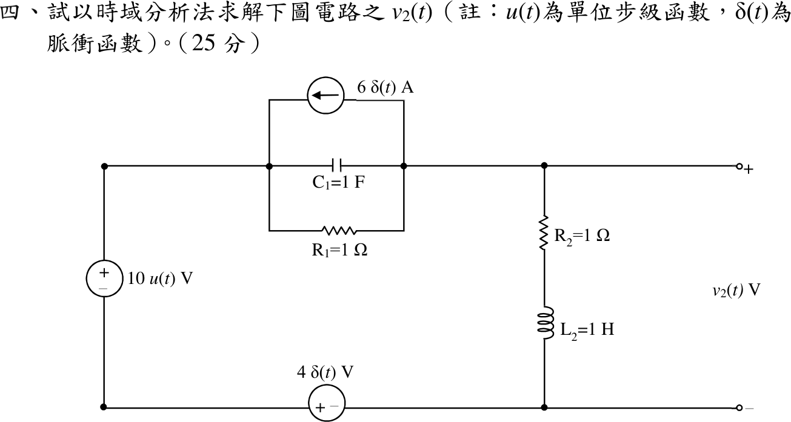

# 109 年電路學第 4 題｜脈衝與步階激勵的二階暫態

## 已知與所求

左側 \(10u(t)\ \mathrm V\)（上正）；底線 \(4\delta(t)\ \mathrm V\)（左正右負，右端為 \(v_2\) 負端）；上方 \(C_1=1\ \mathrm F\)、\(R_1=1\ \Omega\) 與 \(6\delta(t)\ \mathrm A\) 電流源（箭頭向左）三者並聯於左上節點 \(A\) 與右上節點 \(B\) 之間；右側 \(R_2=1\ \Omega\) 串 \(L_2=1\ \mathrm H\)。\(v_2=v_B\)（以右下端為參考），零初始狀態。以時域法求 \(v_2(t)\)（25 分）。

## 考場標準作答

取 \(v_C=v_A-v_B\)、\(i_L\)（\(B\) 向下流經 \(R_2,L_2\)）。兩電源串在同一迴路，\(v_A=10u(t)+4\delta(t)\)，故
\[
v_2=v_A-v_C=10u(t)+4\delta(t)-v_C,\qquad v_2=R_2i_L+L_2\frac{di_L}{dt}
\]

**脈衝造成的狀態跳變。** 節點 \(B\) KCL：\(C_1\dot v_C+\frac{v_C}{R_1}-6\delta(t)=i_L\)。\(i_L\) 不能含脈衝，\(6\delta\) 必全數流入電容：
\[
C_1[v_C(0^+)-0]=6\Rightarrow v_C(0^+)=6\ \mathrm V
\]
\(v_C\) 無脈衝，\(v_2\) 中的 \(4\delta(t)\) 全落在電感上：
\[
L_2[i_L(0^+)-0]=4\Rightarrow i_L(0^+)=4\ \mathrm A
\]

**\(t>0\) 狀態方程。**
\[
\dot v_C=i_L-v_C,\qquad \dot i_L=10-v_C-i_L
\]
穩態 \(v_C(\infty)=i_L(\infty)=5\)。令 \(x=v_C-5\)、\(y=i_L-5\)，特徵方程 \((s+1)^2+1=0\Rightarrow s=-1\pm j\)；由 \(x(0^+)=1\)、\(y(0^+)=-1\)：
\[
v_C(t)=5+e^{-t}(\cos t-\sin t),\qquad i_L(t)=5-e^{-t}(\cos t+\sin t)
\]
\(t>0\) 時 \(v_2=10-v_C\)；加上 \(t=0\) 的脈衝分量：
\[
\boxed{v_2(t)=4\delta(t)+\left[5-e^{-t}(\cos t-\sin t)\right]u(t)\ \mathrm V}
\]

## 驗算

- 拉氏轉換（零初值）：\(V_A=\frac{10}{s}+4\)，節點 \(B\)：\((V_B-V_A)(1+s)+6+\frac{V_B}{1+s}=0\)，
\[
V_2(s)=\frac{(4s^2+8s+10)(s+1)}{s(s^2+2s+2)}=4+\frac5s-\frac{s}{(s+1)^2+1}
\]
反轉換為 \(4\delta(t)+[5-e^{-t}\cos t+e^{-t}\sin t]u(t)\)，與時域解相同。
- 支路回代：\(\frac{di_L}{dt}=2e^{-t}\sin t\)，\(R_2i_L+L_2\frac{di_L}{dt}=5-e^{-t}(\cos t-\sin t)=v_2\)（\(t>0\)）；\(v_2(0^+)=4\)、\(v_2(\infty)=5\ \mathrm V\)（直流時 \(R_1\)、\(R_2\) 平分 10 V）。

## 失分點

- \(v_2\) 是 \(R_2\)–\(L_2\) 支路電壓，\(4\delta(t)\) 直接出現在其中；只寫 \(t>0\) 的部分會漏掉 \(4\delta(t)\)。
- \(6\delta(t)\) 電流源使 \(v_C\) 跳到 \(6\ \mathrm V\)、\(4\delta(t)\) 電壓源使 \(i_L\) 跳到 \(4\ \mathrm A\)；把脈衝當成 \(4\ \mathrm V\)、\(6\ \mathrm A\) 階躍會得錯誤初值。
- 直流穩態誤判為 \(0\)；\(10u(t)\) 經 \(R_1\)、\(R_2\) 有直流路徑，\(v_2(\infty)=5\ \mathrm V\)。
