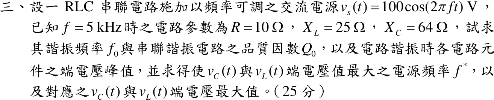

# 110 年電路學第 3 題｜串聯 RLC 諧振與元件端電壓極值

## 已知與所求

串聯 RLC，\(v_s=100\cos(2\pi ft)\ \mathrm V\)；\(f=5\ \mathrm{kHz}\) 時 \(R=10\ \Omega\)、\(X_L=25\ \Omega\)、\(X_C=64\ \Omega\)。求諧振頻率 \(f_0\)、品質因數 \(Q_0\)、諧振時各元件端電壓峰值；再求使 \(v_C\)、\(v_L\) 端電壓最大的電源頻率 \(f^*\) 與對應最大值（25 分）。

## 考場標準作答

\(X_L\propto f\)、\(X_C\propto 1/f\)，令 \(f_0\) 時兩者相等：
\[
25\frac{f_0}{5}=64\frac{5}{f_0}\Rightarrow \boxed{f_0=5\sqrt{\frac{64}{25}}=8\ \mathrm{kHz}}
\]
\(f_0\) 時 \(X_{L0}=X_{C0}=25\times\frac85=40\ \Omega\)：
\[
\boxed{Q_0=\frac{X_{L0}}{R}=\frac{40}{10}=4}
\]
諧振時 \(Z=R\)，\(I_m=100/10=10\ \mathrm A\)：
\[
\boxed{V_{R,m}=100\ \mathrm V},\qquad \boxed{V_{L,m}=V_{C,m}=I_mX_{L0}=400\ \mathrm V}
\]

元件電壓
\[
|V_C|=\frac{V_m/(\omega C)}{\sqrt{R^2+(\omega L-\frac1{\omega C})^2}},\qquad
|V_L|=\frac{V_m\,\omega L}{\sqrt{R^2+(\omega L-\frac1{\omega C})^2}}
\]
平方後對 \(\omega\) 微分令為零（\(Q_0>1/\sqrt2\) 時有極值）：
\[
\omega_C^*=\omega_0\sqrt{1-\frac1{2Q_0^2}},\qquad \omega_L^*=\frac{\omega_0}{\sqrt{1-\frac1{2Q_0^2}}}
\]
\[
\boxed{f_C^*=8\sqrt{\tfrac{31}{32}}=7.874\ \mathrm{kHz}},\qquad
\boxed{f_L^*=8\sqrt{\tfrac{32}{31}}=8.128\ \mathrm{kHz}}
\]
兩者極值相同：
\[
\boxed{V_{C,\max}=V_{L,\max}=\frac{V_mQ_0}{\sqrt{1-\frac1{4Q_0^2}}}=\frac{400}{\sqrt{63/64}}=403.16\ \mathrm V}
\]

## 驗算

- 元件值：\(L=\frac{25}{2\pi(5000)}=0.7958\ \mathrm{mH}\)、\(C=\frac{1}{2\pi(5000)(64)}=0.4974\ \mu\mathrm F\)，\(f_0=\frac{1}{2\pi\sqrt{LC}}=8000\ \mathrm{Hz}\)。
- 直接代 \(f_C^*=7874\ \mathrm{Hz}\)：\(X_L=39.37\ \Omega\)、\(X_C=40.64\ \Omega\)，\(|Z|=\sqrt{10^2+1.27^2}=10.08\ \Omega\)，\(|V_C|=\frac{100}{10.08}(40.64)=403.2\ \mathrm V\)，大於諧振時的 400 V；以 7–9 kHz 細格數值掃描 \(|V_C|\)、\(|V_L|\) 的峰值亦落在 7.874 kHz、8.128 kHz。
- 兩極值頻率滿足 \(f_C^*f_L^*=f_0^2\)。

## 失分點

- 以為 \(v_C\)、\(v_L\) 在 \(f_0\) 達最大；有限 \(Q\) 時 \(v_C\) 峰值低於 \(f_0\)、\(v_L\) 峰值高於 \(f_0\)。
- 題給 \(X_L,X_C\) 是 5 kHz 的值，直接拿 \(25\)、\(64\) 算 \(Q_0=25/10\) 或 \(64/10\)。
- 電源 100 V 為峰值，題目問峰值即不需再乘 \(\sqrt2\)。
