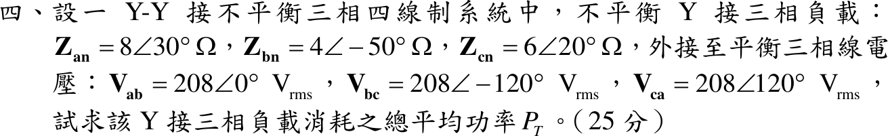

# 110 年電路學第 4 題｜Y–Y 不平衡三相四線制總功率

## 已知與所求

\(Z_{an}=8\angle30^\circ\)、\(Z_{bn}=4\angle-50^\circ\)、\(Z_{cn}=6\angle20^\circ\ \Omega\)；平衡正相序線電壓 \(V_{ab}=208\angle0^\circ\ \mathrm V_{rms}\)；Y–Y 四線制。求總平均功率 \(P_T\)（25 分）。

## 考場標準作答

四線制中性線使負載中性點固定在電源中性點，負載雖不平衡，各相仍承受平衡相電壓：
\[
V_\phi=\frac{208}{\sqrt3}=120.09\ \mathrm V,\quad V_{an}=V_\phi\angle-30^\circ,\ V_{bn}=V_\phi\angle-150^\circ,\ V_{cn}=V_\phi\angle90^\circ
\]
每相 \(P=\frac{V_\phi^2}{|Z|}\cos\theta_Z\)，\(V_\phi^2=\frac{208^2}{3}=14421.33\)：
\[
P_a=\frac{14421.33}{8}\cos30^\circ=1561.16\ \mathrm W,\quad
P_b=\frac{14421.33}{4}\cos50^\circ=2317.46\ \mathrm W,\quad
P_c=\frac{14421.33}{6}\cos20^\circ=2258.60\ \mathrm W
\]
\[
\boxed{P_T=P_a+P_b+P_c=6137.2\ \mathrm W}
\]

## 驗算

改由電流與電阻分量計算：\(I_a=\frac{120.09\angle-30^\circ}{8\angle30^\circ}=15.011\angle-60^\circ\)、\(I_b=30.022\angle-100^\circ\)、\(I_c=20.015\angle70^\circ\ \mathrm A\)；
\[
\sum|I|^2R=15.011^2(6.928)+30.022^2(2.571)+20.015^2(5.638)=1561.2+2317.5+2258.6=6137.2\ \mathrm W
\]

## 失分點

- 把 208 V 線電壓直接當相電壓，功率放大 3 倍。
- \(Z_{bn}\) 的 \(-50^\circ\) 是電容性，\(\cos(-50^\circ)=\cos50^\circ>0\)，仍吸收實功率，不可取負。
