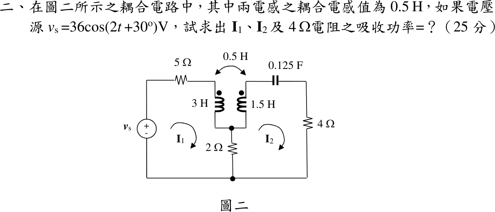

# 111 年電路學第 2 題｜互感耦合電路

## 已知與所求

\(v_s=36\cos(2t+30^\circ)\ \mathrm V\) 串 \(5\ \Omega\) 接 \(L_1=3\ \mathrm H\) 上端（同名端在上）；\(L_2=1.5\ \mathrm H\)（同名端在上）上端串 \(0.125\ \mathrm F\) 與 \(4\ \Omega\)；兩線圈下端共接，經 \(2\ \Omega\) 接地；\(M=0.5\ \mathrm H\)。\(I_1,I_2\) 為順時針網目電流。求 \(I_1\)、\(I_2\) 及 \(4\ \Omega\) 吸收功率（25 分）。

## 考場標準作答

\(\omega=2\)：\(j\omega L_1=j6\)、\(j\omega L_2=j3\)、\(j\omega M=j1\)、\(Z_C=\frac{1}{j(2)(0.125)}=-j4\ \Omega\)；餘弦基準峰值相量 \(V_s=36\angle30^\circ\)。

\(I_1\) 由上而下流入 \(L_1\) 同名端，\(I_2\) 由下而上流經 \(L_2\)、由同名端流出，故互感項取負號。

左網目：
\[
5I_1+(j6I_1-jI_2)+2(I_1-I_2)=36\angle30^\circ
\]
右網目（沿 \(L_2\) 由下而上的壓降為 \(j3I_2-jI_1\)）：
\[
2(I_2-I_1)+(j3I_2-jI_1)+(4-j4)I_2=0
\]
整理為
\[
\begin{bmatrix}7+j6&-2-j\\-2-j&6-j\end{bmatrix}
\begin{bmatrix}I_1\\I_2\end{bmatrix}=\begin{bmatrix}36\angle30^\circ\\0\end{bmatrix},
\qquad \Delta=(7+j6)(6-j)-(2+j)^2=45+j25
\]
\[
I_1=\frac{(6-j)\,36\angle30^\circ}{45+j25},\qquad I_2=\frac{(2+j)\,36\angle30^\circ}{45+j25}
\]
\[
\boxed{I_1=4.207-j0.630=4.254\angle-8.52^\circ\ \mathrm A}
\]
\[
\boxed{I_2=1.387+j0.722=1.564\angle27.51^\circ\ \mathrm A}
\]
\(4\ \Omega\) 流過 \(I_2\)，相量為峰值：
\[
\boxed{P_4=\frac12(4)|I_2|^2=4.891\ \mathrm W}
\]

## 驗算

改用節點法：令 \(L_1\) 上端電壓 \(V_x\)、線圈共接點 \(V_m\)、\(L_2\) 上端 \(V_y\)，以線圈電流為未知數：
\[
V_x-V_m=j6I_1-jI_2,\quad V_y-V_m=-j3I_2+jI_1,\quad \frac{V_m}{2}=I_1-I_2,\quad I_2=\frac{V_y}{4-j4}
\]
連同 \(I_1=(V_s-V_x)/5\) 聯立，解得同一組 \(I_1,I_2\)。另以 \(V_4=4I_2=5.548+j2.889\ \mathrm V\)，\(\frac12\mathrm{Re}\{V_4I_2^*\}=4.891\ \mathrm W\)。

## 失分點

- 互感項只看電流箭頭不對同名端，非對角項寫成 \(-2+j\) 而解錯。
- 共用 \(2\ \Omega\) 只放進其中一個網目，或兩網目都寫成同號的 \(2(I_1-I_2)\)。
- 峰值相量直接用 \(P=RI^2\)，功率多一倍成 \(9.78\ \mathrm W\)。
