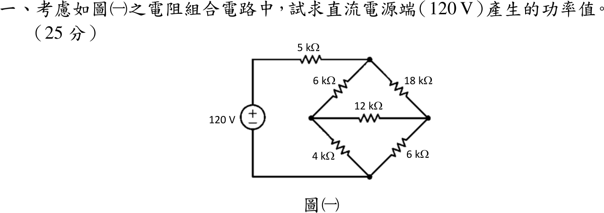

# 112 年電路學第 1 題｜電阻等效與電源功率

## 已知與所求

120 V 電源正端經 5 kΩ 接橋頂點 \(T\)，負端接橋底點 \(B\)。橋內：\(T\)–\(L\) 6 kΩ、\(T\)–\(R\) 18 kΩ、\(L\)–\(R\) 12 kΩ、\(L\)–\(B\) 4 kΩ、\(R\)–\(B\) 6 kΩ。求 120 V 電源產生的功率（25 分）。

## 考場標準作答

將 \(T,L,R\) 的 Δ（\(6+18+12=36\ \mathrm{k\Omega}\)）轉 Y：
\[
R_T=\frac{6\times18}{36}=3,\quad R_L=\frac{6\times12}{36}=2,\quad R_R=\frac{18\times12}{36}=6\ \mathrm{k\Omega}
\]
中心點到 \(B\)：\((2+4)\parallel(6+6)=6\parallel12=4\ \mathrm{k\Omega}\)，橋等效 \(3+4=7\ \mathrm{k\Omega}\)。
\[
I_s=\frac{120}{5+7}\ \mathrm{mA}=10\ \mathrm{mA},\qquad
\boxed{P_s=120\times0.01=1.2\ \mathrm W\ \text{（提供）}}
\]

## 驗算

以 \(B\) 為參考做節點檢查：橋兩端電壓 \(V_{TB}=10\ \mathrm{mA}\times7\ \mathrm{k\Omega}=70\ \mathrm V\)，節點方程解得 \(v_L=\frac{80}{3}\ \mathrm V\)、\(v_R=20\ \mathrm V\)。由 \(T\) 流出 \(\frac{70-80/3}{6}+\frac{70-20}{18}=7.222+2.778=10\ \mathrm{mA}\)；\(L\) 節點 \(\frac{80/3}{4}=6.667=7.222-\frac{80/3-20}{12}=7.222-0.556\ \mathrm{mA}\)，KCL 成立。

## 失分點

- 此橋 \(6/4\neq18/6\) 不平衡，12 kΩ 有電流，不能直接刪去（刪去會得 \(10\parallel24=7.06\ \mathrm{k\Omega}\)）。
- 漏掉外部 5 kΩ 而得 \(120^2/7\mathrm k=2.06\ \mathrm W\)。
