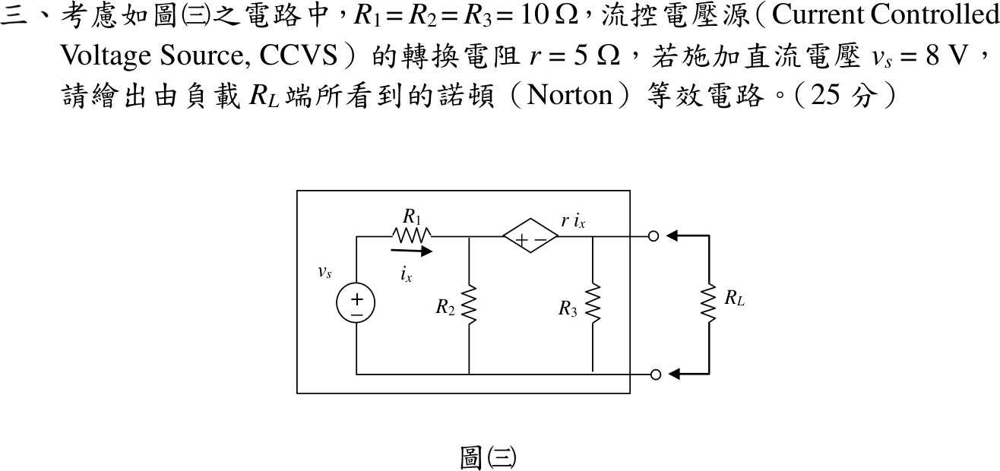

# 112 年電路學第 3 題｜含 CCVS 的諾頓等效

## 已知與所求

\(v_s=8\ \mathrm V\) 串 \(R_1\)（\(i_x\) 向右）至節點 \(v_1\)，\(R_2\) 由 \(v_1\) 接地；CCVS \(ri_x\)（\(r=5\ \Omega\)）左正右負接於 \(v_1\) 與輸出節點 \(v_2\) 之間；\(R_3\) 由 \(v_2\) 接地，\(R_L\) 接在 \(v_2\) 與地。\(R_1=R_2=R_3=10\ \Omega\)。求 \(R_L\) 端看入的諾頓等效（25 分）。

## 考場標準作答

\[
i_x=\frac{8-v_1}{10},\qquad v_1-v_2=5i_x
\]

**開路電壓**：CCVS 電流等於 \(R_3\) 電流 \(v_2/10\)，\(v_1\) 節點 KCL：\(i_x=\frac{v_1}{10}+\frac{v_2}{10}\Rightarrow 2v_1+v_2=8\)；又 \(v_2=v_1-\frac{8-v_1}{2}=\frac32v_1-4\)。解得 \(v_1=\frac{24}{7}\ \mathrm V\)，
\[
V_{oc}=\frac87\ \mathrm V
\]

**短路電流**：\(v_2=0\Rightarrow v_1=5\cdot\frac{8-v_1}{10}\Rightarrow v_1=\frac83\ \mathrm V\)，\(i_x=\frac8{15}\ \mathrm A\)，\(R_3\) 無電流：
\[
I_{sc}=i_x-\frac{v_1}{10}=\frac8{15}-\frac4{15}=\frac4{15}\ \mathrm A
\]

**諾頓等效**：
\[
\boxed{I_N=\frac4{15}=0.2667\ \mathrm A},\qquad
\boxed{R_N=\frac{V_{oc}}{I_{sc}}=\frac{30}{7}=4.286\ \Omega}
\]
\(I_N\) 與 \(R_N\) 並聯接於負載兩端，電流源箭頭指向上端（\(v_2\) 端）。

## 驗算

測試源法：\(v_s\) 短路、保留 CCVS，在輸出端加 \(v_2\)。\(i_x=-v_1/10\)，\(v_1-v_2=-v_1/2\Rightarrow v_1=\frac23v_2\)。測試電流 \(i_t=\frac{v_2}{10}+\frac{v_1}{10}+\frac{v_1}{10}=\frac{v_2}{10}+\frac{2v_2}{15}=\frac7{30}v_2\)，\(R_N=\frac{30}7\ \Omega\)，與 \(V_{oc}/I_{sc}\) 一致。

## 失分點

- 求 \(R_N\) 時把 CCVS 短路（相依源歸零），會得 \(10\parallel(10\parallel10)=3.33\ \Omega\)。
- 短路時 \(i_x\) 會改變（\(\frac{16}{35}\to\frac8{15}\ \mathrm A\)），不可沿用開路時的 \(i_x\)。
