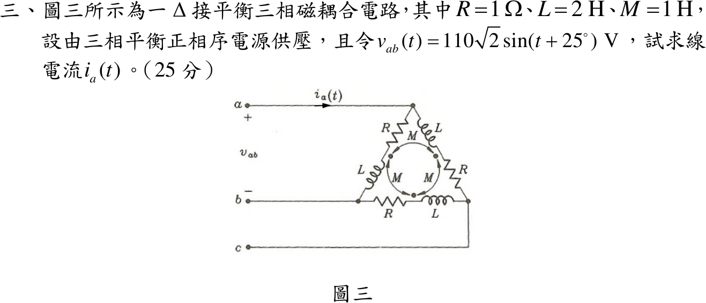

# 113 年電路學第 3 題｜三相 Δ 磁耦合線電流

## 已知與所求

Δ 接負載每邊為 \(R=1\ \Omega\) 串 \(L=2\ \mathrm H\)，任兩電感間互感 \(M=1\ \mathrm H\)；三個同名端都在電感緊鄰電阻的一端，即支路電流取 \(a\to b\)、\(b\to c\)、\(c\to a\) 時皆由點端流入。正相序平衡電源，\(v_{ab}(t)=110\sqrt2\sin(t+25^\circ)\ \mathrm V\)。求 \(i_a(t)\)（25 分）。

## 考場標準作答

\(\omega=1\ \mathrm{rad/s}\)，採正弦基準峰值相量 \(\mathbf V_{ab}=110\sqrt2\angle25^\circ\)。三支路電流皆由點端流入，互感項同號：
\[
\mathbf V_{ab}=(R+j\omega L)\mathbf I_{ab}+j\omega M(\mathbf I_{bc}+\mathbf I_{ca})
\]
平衡時 \(\mathbf I_{bc}+\mathbf I_{ca}=-\mathbf I_{ab}\)，故
\[
Z_\phi=R+j\omega(L-M)=1+j1=\sqrt2\angle45^\circ\ \Omega,\qquad
\mathbf I_{ab}=\frac{110\sqrt2\angle25^\circ}{\sqrt2\angle45^\circ}=110\angle-20^\circ\ \mathrm A
\]
正相序 Δ 接線電流 \(\mathbf I_a=\mathbf I_{ab}-\mathbf I_{ca}=\sqrt3\,\mathbf I_{ab}\angle-30^\circ=110\sqrt3\angle-50^\circ\ \mathrm A\)：
\[
\boxed{i_a(t)=110\sqrt3\sin(t-50^\circ)=190.5\sin(t-50^\circ)\ \mathrm A}
\]

## 驗算

Δ–Y 等效：\(Z_Y=Z_\phi/3=\frac{\sqrt2}{3}\angle45^\circ\)，\(\mathbf V_{an}=\frac{110\sqrt2}{\sqrt3}\angle(25^\circ-30^\circ)\)，
\[
\mathbf I_a=\frac{\mathbf V_{an}}{Z_Y}=\frac{110\sqrt2\cdot3}{\sqrt3\cdot\sqrt2}\angle(-5^\circ-45^\circ)=110\sqrt3\angle-50^\circ\ \mathrm A
\]
與直接由支路電流求得者一致。

## 失分點

- 互感當成串聯 \(L+2M\) 或忽略同名端寫 \(L+M\)，會分別得 \(Z_\phi=1+j4\) 或 \(1+j3\)。
- 把支路電流 \(110\angle-20^\circ\) 當作線電流，漏乘 \(\sqrt3\angle-30^\circ\)。
- 正弦基準相量回時域時改寫成 \(\cos\) 而未補 \(90^\circ\)。
