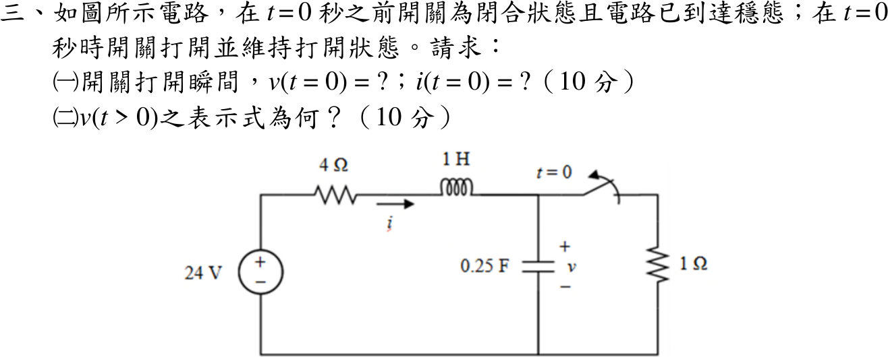

# 114 年電路學第 3 題｜二階 RLC 暫態

## 已知與所求

24 V 電源串 4 Ω、1 H（電流 \(i\) 向右）後接 0.25 F 電容（電壓 \(v\) 上正下負）；1 Ω 經開關與電容並聯。\(t<0\) 開關閉合且已穩態，\(t=0\) 打開。求（一）\(v(0)\)、\(i(0)\)（10 分）；（二）\(v(t>0)\)（10 分）。

## 考場標準作答

### （一）開關打開瞬間

\(t<0\) 直流穩態：電感短路、電容開路，\(i(0^-)=\dfrac{24}{4+1}=4.8\ \mathrm A\)，\(v(0^-)=1\times4.8=4.8\ \mathrm V\)。電感電流、電容電壓連續：
\[
\boxed{v(0)=4.8\ \mathrm V},\qquad \boxed{i(0)=4.8\ \mathrm A}
\]

### （二）\(v(t>0)\)

開關打開後為串聯 RLC，\(i=C\dot v=0.25\dot v\)，KVL：
\[
24=4i+\frac{di}{dt}+v\;\Rightarrow\;\ddot v+4\dot v+4v=96
\]
特徵方程 \(s^2+4s+4=(s+2)^2=0\)，臨界阻尼，\(v(\infty)=24\ \mathrm V\)：
\[
v(t)=24+(A+Bt)e^{-2t}
\]
\(v(0)=4.8\Rightarrow A=-19.2\)；\(\dot v(0)=\dfrac{i(0)}{C}=19.2=B-2A\Rightarrow B=-19.2\)。
\[
\boxed{v(t)=24-19.2(1+t)e^{-2t}\ \mathrm V,\quad t>0}
\]

## 驗算

由答案求 \(i=0.25\dot v=4.8(1+2t)e^{-2t}\)、\(\dfrac{di}{dt}=-19.2te^{-2t}\)，代回 KVL：
\[
4i+\frac{di}{dt}+v=19.2(1+2t)e^{-2t}-19.2te^{-2t}+24-19.2(1+t)e^{-2t}=24\ \mathrm V
\]
且 \(i(0)=4.8\ \mathrm A\)、\(i(\infty)=0\)，與初值及電容開路終值一致。

## 失分點

- 只用 \(v(0)=4.8\) 而漏用 \(\dot v(0)=i(0)/C=19.2\ \mathrm V/\mathrm s\)，重根解的 \(B\) 無法決定。
- 開關打開後仍把 1 Ω 留在電路，會誤得 \(s^2+8s+20=0\) 的欠阻尼解且 \(v(\infty)=4.8\ \mathrm V\)。
- 寫成 \(\dot v=iC\)（\(=1.2\)）而非 \(i/C\)。
