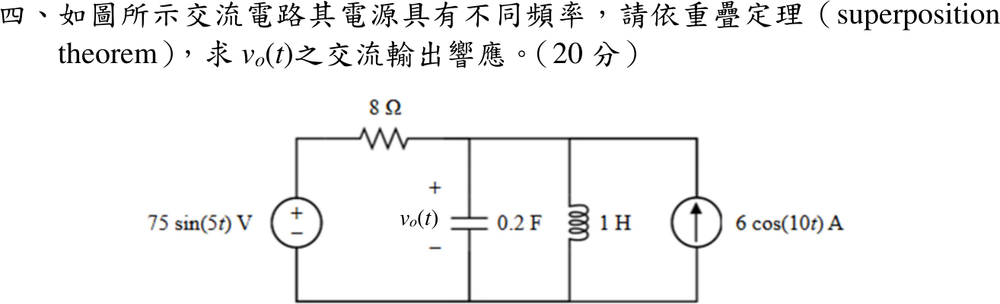

# 114 年電路學第 4 題｜不同頻率的重疊定理

## 已知與所求

\(75\sin(5t)\ \mathrm V\) 電壓源串 8 Ω 至輸出節點；輸出節點對地並接 0.2 F、1 H 與 \(6\cos(10t)\ \mathrm A\) 電流源（箭頭向上注入輸出節點）。以重疊定理求 \(v_o(t)\)（20 分）。

## 考場標準作答

輸出節點的電容、電感並聯導納 \(Y(j\omega)=j\left(0.2\omega-\dfrac1\omega\right)\)。

**5 rad/s 分量**（電流源開路），以正弦為基準：
\[
Y_5=j0.8,\qquad V_{o,5}=\frac{75}{1+8Y_5}=\frac{75}{1+j6.4}=11.5783\angle-81.1193^\circ\ \mathrm V
\]

**10 rad/s 分量**（電壓源短路，8 Ω 仍跨在輸出節點與地之間），以餘弦為基準：
\[
Y_{10}=j1.9,\qquad
\widetilde V_{o,10}=\frac6{1/8+j1.9}=0.206861-j3.144285=3.15108\angle-86.23597^\circ\ \mathrm V
\]
即 \(3.15108\cos(10t-86.23597^\circ)=3.15108\sin(10t+3.76403^\circ)\)。兩分量頻率不同，回到時域相加：
\[
\boxed{v_o(t)=11.5783\sin(5t-81.1193^\circ)+3.15108\sin(10t+3.76403^\circ)\ \mathrm V}
\]

## 驗算

改用阻抗分壓／分流。5 rad/s：\(Z_p=\dfrac{(-j1)(j5)}{j4}=-j1.25\ \Omega\)，\(|V_{o,5}|=\dfrac{75(1.25)}{\sqrt{8^2+1.25^2}}=11.578\)，相角 \(-90^\circ+\tan^{-1}\frac{1.25}{8}=-81.12^\circ\)。
10 rad/s：\(Z_p=\dfrac{(-j0.5)(j10)}{j9.5}=-j0.52632\ \Omega\)，再並 8 Ω：\(|Z|=\dfrac{8(0.52632)}{\sqrt{64+0.277}}=0.52518\ \Omega\)，\(6|Z|=3.1511\ \mathrm V\)，相角 \(-90^\circ+\tan^{-1}\frac{0.52632}{8}=-86.24^\circ\)。

## 失分點

- 短路電壓源時連 8 Ω 一起刪除，誤得 \(6/(j1.9)=3.158\angle-90^\circ\ \mathrm V\)。
- 把 5 rad/s 與 10 rad/s 的相量直接相加。
- 10 rad/s 分量用餘弦求得後，改寫成正弦時漏加 \(90^\circ\)。
