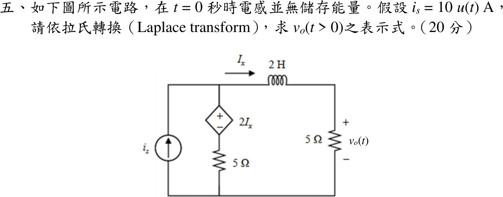

# 114 年電路學第 5 題｜拉氏轉換與含相依源電路

## 已知與所求

\(i_s=10u(t)\ \mathrm A\) 向上注入上方節點 \(a\)；中間支路為相依電壓源 \(2I_x\)（上正）串 5 Ω 接地，兩者之間節點記為 \(c\)；2 H 電感（\(I_x\) 向右，初始無儲能）串右側 5 Ω 接地，\(v_o\) 為右側 5 Ω 電壓。以拉氏轉換求 \(v_o(t>0)\)（20 分）。

## 考場標準作答

零初始條件，\(Z_L=2s\)，\(I_s=10/s\)。右支路與輸出：
\[
V_a=(2s+5)I_x,\qquad V_o=5I_x
\]
相依源上正下負：\(V_c=V_a-2I_x=(2s+3)I_x\)。節點 \(a\) 的 KCL：
\[
\frac{10}{s}=I_x+\frac{V_c}{5}=I_x\,\frac{2s+8}{5}
\;\Rightarrow\;
I_x=\frac{25}{s(s+4)}
\]
\[
V_o(s)=\frac{125}{s(s+4)}=\frac{125}{4}\left(\frac1s-\frac1{s+4}\right)
\]
\[
\boxed{v_o(t)=31.25(1-e^{-4t})\ \mathrm V,\quad t>0}
\]

## 驗算

時域直接列式。\(i_x=v_o/5\)，電感 \(v_a=v_o+2\dot i_x=v_o+\frac25\dot v_o\)，故 \(v_c=v_a-2i_x=\frac35v_o+\frac25\dot v_o\)。節點 \(a\)：\(i_x+v_c/5=10\)，即
\[
\frac{v_o}{5}+\frac{3v_o}{25}+\frac{2\dot v_o}{25}=10\;\Longleftrightarrow\;\dot v_o+4v_o=125
\]
答案代入：\(125e^{-4t}+125(1-e^{-4t})=125\)，且 \(v_o(0^+)=0\)（電感電流為零）、\(v_o(\infty)=31.25\ \mathrm V\)。

## 失分點

- 相依源極性寫反（\(V_c=V_a+2I_x\)）會得 \(I_x=25/[s(s+6)]\)、終值 \(20.83\ \mathrm V\)。
- 把零初始電感當直流短路只求終值，漏掉 \(e^{-4t}\) 暫態項。
