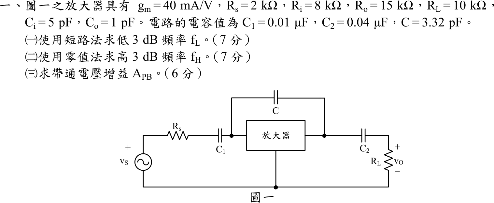
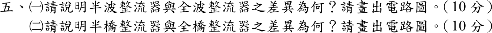

# 📝 105 年電機工程技師｜電子學（包括電力電子學）逐題詳解

> 本頁由題級 canonical 筆記組合；每題保留官方裁切圖、校驗狀態與可追溯的推導。

## 題目導覽
- [[#一、105 年電子學（含電力電子）第 1 題｜放大器頻率響應與時間常數|第 1 題：放大器頻率響應與時間常數]]
- [[#二、105 年電子學（含電力電子）第 2 題｜有限開路增益反相運算放大器|第 2 題：有限開路增益反相運算放大器]]
- [[#三、105 年電子學（含電力電子）第 3 題｜可調式雙向二極體限幅器|第 3 題：可調式雙向二極體限幅器]]
- [[#四、105 年電子學（含電力電子）第 4 題｜非線性負載諧波功率與功率因數|第 4 題：非線性負載諧波功率與功率因數]]
- [[#五、105 年電子學第 5 題｜整流器拓撲與波形比較|第 5 題：整流器拓撲與波形比較]]

---

## 一、105 年電子學（含電力電子）第 1 題｜放大器頻率響應與時間常數

> 題級識別：EE-105-02-1
> canonical 來源：[[canonical/EE-105-02-1.md]]
> 題級校驗狀態：verified



### 已知與所求

$g_m=40\text{ mA/V}$、$R_s=2\text{ k}\Omega$、$R_i=8\text{ k}\Omega$、$R_o=15\text{ k}\Omega$、$R_L=10\text{ k}\Omega$、$C_i=5\text{ pF}$、$C_o=1\text{ pF}$、$C_1=0.01\ \mu\text{F}$、$C_2=0.04\ \mu\text{F}$、$C=3.32\text{ pF}$。依圖：$v_S\to R_s\to C_1\to$ 放大器輸入端（$R_i$、$C_i$ 對地），輸出端為受控電流源 $g_mv_i$ 並聯 $R_o$、$C_o$，再經 $C_2$ 接 $R_L$；$C$ 跨接放大器輸入與輸出節點。

求（一）短路法 $f_L$（7 分）；（二）零值法 $f_H$（7 分）；（三）帶通增益 $A_{PB}$（6 分）。

### 考場標準作答

#### （一）低 3 dB 頻率（短路時間常數法）

內部電容 $C_i,C_o,C$ 開路，耦合電容逐一求所見電阻（另一顆短路）：
$$
R_{C1}=R_s+R_i=10\text{ k}\Omega,\qquad R_{C2}=R_o+R_L=25\text{ k}\Omega
$$
$$
f_{L1}=\frac{1}{2\pi R_{C1}C_1}=1591.5\text{ Hz},\qquad
f_{L2}=\frac{1}{2\pi R_{C2}C_2}=159.2\text{ Hz}
$$
$$
\boxed{f_L\approx f_{L1}+f_{L2}=1750.7\text{ Hz}\approx 1.751\text{ kHz}}
$$

#### （二）高 3 dB 頻率（零值時間常數法）

$C_1,C_2$ 短路，$v_S=0$。$C_i$ 與 $C_o$ 所見電阻：
$$
R_{in}'=R_s\parallel R_i=1.6\text{ k}\Omega,\qquad R_{out}'=R_o\parallel R_L=6\text{ k}\Omega
$$
跨接電容 $C$ 所見電阻（輸入／輸出兩側電阻再加受控源的米勒放大）：
$$
R_C=R_{in}'+R_{out}'+g_mR_{in}'R_{out}'=1.6+6+384=391.6\text{ k}\Omega
$$
$$
\tau=R_{in}'C_i+R_{out}'C_o+R_CC=8+6+1300.1=1314.1\text{ ns}
$$
$$
\boxed{f_H=\frac{1}{2\pi\tau}\approx 121.1\text{ kHz}}
$$

#### （三）帶通電壓增益

$$
A_{PB}=\frac{R_i}{R_s+R_i}\bigl[-g_m(R_o\parallel R_L)\bigr]=0.8\times(-40\times 6)=\boxed{-192\text{ V/V}}
$$

### 驗算

- 高頻側改解 $C_1,C_2$ 短路時的完整節點方程式，得二階轉移函數 $H(s)=\dfrac{-192\,(1-s/s_z)}{1+b_1s+b_2s^2}$；其 $b_1=1.3141\ \mu\text{s}$ 正好等於零值時間常數總和，主極點為 $7.61\times10^5\text{ rad/s}$（$121.1\text{ kHz}$），第二極點約 $5.5\times10^{9}\text{ rad/s}$，遠離主極點，故以單極點估算 $f_H$ 合理。
- 低頻側改解兩個高通極點的完整幅頻式 $\dfrac{\omega^4}{(\omega^2+\omega_1^2)(\omega^2+\omega_2^2)}=\dfrac12$，得 $f_{-3\,\mathrm{dB}}\approx1.607\text{ kHz}$；短路法的 $1.751\text{ kHz}$ 是題目指定方法下的估計值，略偏高。

### 失分點

- $C$ 跨接輸入與輸出，必須用 $R_C=R_{in}'+R_{out}'+g_mR_{in}'R_{out}'$；若只加 $C_i$、$C_o$ 的時間常數，$f_H$ 會高估約百倍。
- 低頻短路法求 $C_1$ 的電阻要含 $R_s$（$10\text{ k}\Omega$），而高頻零值法的輸入電阻是 $R_s\parallel R_i=1.6\text{ k}\Omega$，兩者不同。
- $A_{PB}$ 為負號（反相），且須含 $R_i/(R_s+R_i)=0.8$ 的輸入分壓。

---

## 二、105 年電子學（含電力電子）第 2 題｜有限開路增益反相運算放大器

> 題級識別：EE-105-02-2
> canonical 來源：[[canonical/EE-105-02-2.md]]
> 題級校驗狀態：verified


### 已知與所求

$R_F=800\text{ k}\Omega$、$R_1=10\text{ k}\Omega$、$A_o=2\times10^5$；$v_p$ 經 $R_x=R_1\parallel R_F$ 接地（無電流，$v_p=0$），運算放大器 $v_O=A_o(v_p-v_n)=-A_ov_n$。求（一）$A_f=v_O/v_S$（9 分）；（二）$v_S=100\text{ mV}$ 時的 $v_O$（5 分）；（三）$A_o\to\infty$ 時 $v_O$ 與 $A_f$ 的誤差（$R_S=0$，6 分）。

### 考場標準作答

#### （一）閉迴路增益

反相端 KCL：$\dfrac{v_S-v_n}{R_1}=\dfrac{v_n-v_O}{R_F}$，代 $v_n=-v_O/A_o$：
$$
A_f=\frac{v_O}{v_S}=-\frac{R_F/R_1}{1+\dfrac{1+R_F/R_1}{A_o}}
=-\frac{80}{1+\dfrac{81}{2\times10^{5}}}=-\frac{80}{1.000405}
$$
$$
\boxed{A_f\approx-79.9676\text{ V/V}}
$$

#### （二）輸出電壓

$$
v_O=A_fv_S=-79.9676\times0.1=\boxed{-7.9967613\text{ V}}
$$

#### （三）與 $A_o\to\infty$ 比較的誤差

$A_o\to\infty$ 時 $A_f=-R_F/R_1=-80\text{ V/V}$、$v_O=-8\text{ V}$：
$$
\Delta v_O=-7.9967613-(-8)=\boxed{+3.2387\text{ mV}}
$$
$$
\varepsilon=\frac{A_f-(-80)}{-80}=\boxed{-0.0405\%}
\quad(\text{輸出電壓與增益的相對誤差相同})
$$

### 驗算

反相端電壓 $v_n=-v_O/A_o=+40\ \mu\text{V}$，幾乎為虛接地。以兩側電流回代：$\dfrac{v_S-v_n}{R_1}=\dfrac{0.1-0.00004}{10\text{ k}}=9.9960\ \mu\text{A}$，$\dfrac{v_n-v_O}{R_F}=\dfrac{0.00004+7.99676}{800\text{ k}}=9.9960\ \mu\text{A}$，兩者相等，KCL 成立。

### 失分點

- 誤差須相對 $A_o\to\infty$ 的理想值 $-80$（$-8\text{ V}$）計算；用 $1/A_o$ 近似 $-81/A_o$ 時別漏掉 $1+R_F/R_1=81$。
- $v_O$ 為負，誤差 $\Delta v_O=+3.2387\text{ mV}$ 是「比理想值 $-8\text{ V}$ 更正」，符號不可寫反。

---

## 三、105 年電子學（含電力電子）第 3 題｜可調式雙向二極體限幅器

> 題級識別：EE-105-02-3
> canonical 來源：[[canonical/EE-105-02-3.md]]
> 題級校驗狀態：verified


### 已知與所求

$R_1=15\text{ k}\Omega$、$R_F=60\text{ k}\Omega$、$R_2=4\text{ k}\Omega$、$R_3=1\text{ k}\Omega$、$R_4=5\text{ k}\Omega$、$R_5=1\text{ k}\Omega$、$V_A=15\text{ V}$、$-V_B=-15\text{ V}$、$V_D=0.7\text{ V}$，理想運算放大器。依圖：$D_1$ 陽極接反相端 $n$、陰極接 $V_x$（$R_2$ 接 $+V_A$，$R_3$ 接 $v_O$）；$D_2$ 陽極接 $V_y$（$R_5$ 接 $v_O$，$R_4$ 接 $-V_B$）、陰極接 $n$；$R_F$ 始終跨接 $n$ 與輸出。

求（一）$v_{O(max)}$ 與 $v_{S(min)}$（8 分）；（二）$v_{O(min)}$ 與 $v_{S(max)}$（6 分）；（三）$v_S=5\text{ V}$ 的 $v_O$（6 分）。

### 考場標準作答

#### （一）正向限幅位準

兩二極體皆截止時 $v_O=-(R_F/R_1)v_S=-4v_S$。$v_O$ 上升到 $D_2$ 剛導通（$V_y=+V_D$，$n$ 為虛接地）：
$$
V_y=-15+(v_O+15)\frac{R_4}{R_4+R_5}=0.7\ \Rightarrow\ (v_O+15)\frac56=15.7
$$
$$
\boxed{v_{O(max)}=+3.84\text{ V}},\qquad \boxed{v_{S(min)}=\frac{3.84}{-4}=-0.96\text{ V}}
$$

#### （二）負向限幅位準

$D_1$ 剛導通：$V_x=-V_D=-0.7\text{ V}$：
$$
V_x=15+(v_O-15)\frac{R_2}{R_2+R_3}=-0.7\ \Rightarrow\ (v_O-15)\frac45=-15.7
$$
$$
\boxed{v_{O(min)}=-4.625\text{ V}},\qquad \boxed{v_{S(max)}=\frac{-4.625}{-4}=+1.156\text{ V}}
$$

#### （三）$v_S=5\text{ V}$

$5\text{ V}>v_{S(max)}$，$D_1$ 導通，$V_x=-0.7\text{ V}$ 固定，但 $R_F$ 仍跨在輸出與 $n$ 之間，輸出隨 $v_S$ 緩慢下降而非完全定值。$n$ 的 KCL（$D_1$ 電流 $i_1$ 流入 $V_x$）：
$$
\frac{v_S}{R_1}+\frac{v_O}{R_F}=i_1,\qquad
i_1=-\left[\frac{V_A+0.7}{R_2}+\frac{v_O+0.7}{R_3}\right]
$$
$$
v_O\left(\frac1{R_F}+\frac1{R_3}\right)=-\frac{v_S}{R_1}-\frac{15.7}{4\text{ k}}-\frac{0.7}{1\text{ k}}
\ \Rightarrow\
\boxed{v_O=\frac{-0.3333-3.925-0.7}{1.01667}=-4.877\text{ V}}
$$
限幅區斜率為 $-(R_F\parallel R_3)/R_1=-0.0656\text{ V/V}$，從膝點 $(1.156\text{ V},-4.625\text{ V})$ 起再往負走 $-0.0656\times(5-1.156)=-0.252\text{ V}$，得 $-4.877\text{ V}$。

### 驗算

以兩側電流對照 $D_1$ 電流（$v_O=-4.877\text{ V}$）：$n$ 端 $i_1=\dfrac{5}{15\text{ k}}+\dfrac{-4.877}{60\text{ k}}=0.3333-0.0813=0.2520\text{ mA}$；$V_x$ 端 $i_1=-\left[\dfrac{15.7}{4\text{ k}}+\dfrac{-4.877+0.7}{1\text{ k}}\right]=-[3.925-4.177]=0.2520\text{ mA}$，兩者相等且 $>0$，$D_1$ 確實導通。線性區 $v_S=0.5\text{ V}$ 得 $v_O=-2\text{ V}$ 且兩二極體皆截止，兩個膝點由「四種二極體組合逐一求解、取電流與偏壓皆合理者」的數值掃描得 $v_S=-0.96\text{ V}$、$+1.15625\text{ V}$，與（一）（二）相同。

### 失分點

- 把 $-4.625\text{ V}$ 當成 $v_S=5\text{ V}$ 的輸出：它是限幅開始的位準；$R_F$ 與分壓電阻仍在迴路中，$5\text{ V}$ 時輸出為 $-4.877\text{ V}$。
- 正向限幅的分壓是 $R_4/(R_4+R_5)=5/6$（下端接 $-V_B$），負向限幅是 $R_2/(R_2+R_3)=4/5$（上端接 $+V_A$），兩側不可互換。
- 虛接地使二極體導通時節點電壓為 $\pm V_D$，輸入端 $v_S$ 與輸出關係為反相：$v_{S(min)}$ 對應正限幅。

### 條件與疑義

註：若以硬箝位簡化，（三）會寫成 $v_{O(min)}=-4.625\text{ V}$（見（二））；本解保留 $R_F$ 在迴路中，答 $-4.877\text{ V}$。

---

## 四、105 年電子學（含電力電子）第 4 題｜非線性負載諧波功率與功率因數

> 題級識別：EE-105-02-4
> canonical 來源：[[canonical/EE-105-02-4.md]]
> 題級校驗狀態：verified


### 已知與所求

$v(t)=100\sin\omega t$；$i(t)=7+12\sin(\omega t+30^\circ)+5\sin(3\omega t+60^\circ)$。求（一）吸收功率；（二）功率因數；（三）電流失真因數；（四）電流總諧波失真（各 5 分）。

### 考場標準作答

電壓只有基波，$V_{rms}=100/\sqrt2=70.71\text{ V}$；電流各分量 rms：$I_{dc}=7\text{ A}$、$I_1=12/\sqrt2=8.485\text{ A}$、$I_3=5/\sqrt2=3.536\text{ A}$。
$$
I_{rms}=\sqrt{7^2+\tfrac{12^2}{2}+\tfrac{5^2}{2}}=\sqrt{133.5}=11.554\text{ A}
$$

#### （一）吸收功率

不同頻率分量乘積平均為零，只有基波貢獻：
$$
P=V_{rms}I_1\cos(30^\circ)=\frac{100}{\sqrt2}\cdot\frac{12}{\sqrt2}\cdot\frac{\sqrt3}{2}=\boxed{300\sqrt{3}\approx519.62\text{ W}}
$$

#### （二）功率因數

$$
S=V_{rms}I_{rms}=70.711\times11.554=817.0\text{ VA},\qquad
\boxed{PF=\frac PS=0.6360\ (\text{超前})}
$$

電流基波相位 $+30^\circ$ 超前電壓，故為超前。

#### （三）失真因數

$$
\boxed{DF=\frac{I_1}{I_{rms}}=\sqrt{\frac{72}{133.5}}=0.7344\ (73.44\%)}
$$

#### （四）總諧波失真

以基波為基準，含直流與三次諧波：
$$
\boxed{THD=\frac{\sqrt{I_{rms}^2-I_1^2}}{I_1}=\sqrt{\frac{133.5-72}{72}}=0.9242\ (92.42\%)}
$$
依 IEEE-519 不計直流時 $THD=I_3/I_1=5/12=41.67\%$。

### 驗算

$PF=DF\cdot\cos\phi_1=0.7344\times0.8660=0.6360$，與 $P/S$ 一致；$THD=\sqrt{1/DF^2-1}=\sqrt{1/0.5393-1}=0.9242$。再以一個週期取樣積分 $\overline{vi}$ 與 FFT 分離基波，得 $P=519.62\text{ W}$、$DF=0.7344$，同上。

### 失分點

- 直流 $7\text{ A}$ 與三次諧波都計入 $I_{rms}$，但因電壓無直流與三次成分，不貢獻實功；若把 $5\sin(3\omega t+60^\circ)$ 也乘進 $P$ 會多算。
- 峰值需除 $\sqrt2$ 才是 rms；漏除會使 $S$ 與 PF 錯。
- THD 的分母是基波 $I_1$，不是 $I_{rms}$。

---

## 五、105 年電子學第 5 題｜整流器拓撲與波形比較

> 題級識別：EE-105-02-5
> canonical 來源：[[canonical/EE-105-02-5.md]]
> 題級校驗狀態：needs_manual_review
> [!WARNING] 本題仍有官方資料缺口或事件定義歧義；請以 canonical 條件式解答為準。



### 已知與所求

題目要求（一）說明半波與全波整流器之差異並畫電路（10 分）；（二）說明半橋與全橋整流器之差異並畫電路（10 分）。未指定負載與元件，以下採理想二極體、純電阻負載、輸入 $v_s=V_m\sin\omega t$（頻率 $f$）。「半橋」一詞題目未定義，（二）依兩種常見讀法分別作答。

### 考場標準作答

#### （一）半波與全波

半波：一個二極體，只有正半週導通。全波：兩個半週都導通，並將輸出翻成同一極性；可用中心抽頭（2 顆二極體）或橋式（4 顆二極體）。

```text
半波                              全波（中心抽頭）
 a o──|>|──┬── vo(+)               a  o──|>|──┐
           R_L                                 ├── (+)
 回端 o─────┴── 0                   b  o──|>|──┘    │
                                                   R_L
                                    CT o────────────┴── (−)
```

兩顆二極體的陰極共接 $(+)$，$R_L$ 接在 $(+)$ 與中心抽頭 CT 之間，CT 為輸出負端。

| 指標 | 半波 | 全波 |
|---|---:|---:|
| 平均值 $V_{DC}$ | $V_m/\pi$ | $2V_m/\pi$ |
| 負載 rms 電壓 | $V_m/2$ | $V_m/\sqrt2$ |
| 漣波基頻 | $f$ | $2f$ |
| 變壓器二次電流 | 單向，含直流分量，易使鐵心偏磁 | 交流對稱，無直流分量 |

結論：$\boxed{V_{DC,\text{全波}}=2V_{DC,\text{半波}}=\dfrac{2V_m}{\pi},\ f_{ripple}=2f}$。全波的平均輸出為半波的 2 倍，漣波頻率加倍，同樣的濾波電容可得較小的漣波電壓。

#### （二）半橋與全橋

**讀法 (a)：二極體臂＋電容臂（半橋）對四二極體全橋。**

```text
半橋（2 二極體 + 2 電容）              全橋（4 二極體）

 AC1 o──┬──|>|──┬── (+)               AC1 ─ D1 ─▶ (+)    (−) ─▶ D3 ─ AC1
        │       C1                    AC2 ─ D2 ─▶ (+)    (−) ─▶ D4 ─ AC2
        │       ├── M ── o AC2        R_L 接於 (+) 與 (−) 之間
        └──|<|──┬── (−)
                C2
```

（半橋圖中 D1 陽極接 AC1、陰極接 $(+)$；D2 陰極接 AC1、陽極接 $(−)$；電容中點 M 接 AC2。）

| 項目 | 半橋（二極體臂＋電容臂） | 全橋 |
|---|---|---|
| 元件 | 2 二極體、2 電容 | 4 二極體 |
| 輸出 | 正、負峰值各把 $C_1,C_2$ 充到 $V_m$，相對 M 為 $\pm V_m$，$(+)$ 與 $(−)$ 間無載約 $2V_m$（倍壓） | 輸出約 $V_m$（扣兩顆二極體壓降）、脈動為 $\lvert v_s\rvert$ |
| 導通壓降 | 1 顆二極體 | 2 顆二極體 |
| 每顆二極體反向峰值 | 約 $2V_m$ | 約 $V_m$ |

結論：$\boxed{\text{半橋：2 二極體＋2 電容，輸出 }\pm V_m\text{（倍壓 }2V_m\text{）；全橋：4 二極體，輸出 }V_m}$。

**讀法 (b)：相控整流的半控橋對全控橋。**

```text
半控橋                              全控橋
 AC1─┬─SCR1─▶(+)  (−)─▶D3─┬─AC1       AC1─┬─SCR1─▶(+)  (−)─▶SCR3─┬─AC1
 AC2─┴─SCR2─▶(+)  (−)─▶D4─┴─AC2       AC2─┴─SCR2─▶(+)  (−)─▶SCR4─┴─AC2
```

連續電流、理想元件、觸發角 $\alpha$：

| 項目 | 半控橋（2 SCR＋2 二極體） | 全控橋（4 SCR） |
|---|---|---|
| 平均輸出 | $\dfrac{V_m}{\pi}(1+\cos\alpha)$ | $\dfrac{2V_m}{\pi}\cos\alpha$ |
| 輸出極性 | 不為負，$\alpha\to\pi$ 時趨近 0 | $\alpha>90^\circ$ 可為負（逆變） |
| 續流 | 有自然續流路徑 | 無，需電源側換相 |

結論：$\boxed{V_{DC,\text{半控}}=\dfrac{V_m}{\pi}(1+\cos\alpha),\ \ V_{DC,\text{全控}}=\dfrac{2V_m}{\pi}\cos\alpha}$。

### 驗算

以理想二極體取樣模擬：半波平均 $0.3183V_m$、全波 $0.6366V_m$；半波 rms $0.5V_m$、全波 $0.7071V_m$；FFT 最低漣波分量位於 $f$（半波）與 $2f$（全波）；半波二次電流平均值不為零，橋式為零；電容臂半橋穩態兩電容各充至 $V_m$；半控橋與全控橋的平均值取樣積分與上列兩式一致（如 $\alpha=60^\circ$：$0.4775V_m$ 與 $0.3183V_m$）。

### 失分點

- 全波不是「半波的二極體數量加倍」：重點是負半週也被翻正，所以平均值與漣波頻率都加倍。
- 整流語境的半橋、全橋不是兩開關、四開關的逆變器半橋、H 橋。
- 比較 $V_{DC}$ 前須先確定「半橋」指哪一種讀法與 $V_m$ 的定義；半控橋的輸出平均值含 $(1+\cos\alpha)$，不是 $2\cos\alpha$。

### 條件與疑義

「半橋」在題目中未定義，上列 (a)、(b) 為兩種讀法。第三種讀法：半橋指中心抽頭全波整流（2 顆二極體、二次側分兩半繞組輪流供電，免四顆二極體但需抽頭；每顆二極體反向峰值約 $2V_m$，$V_m$ 為半繞組峰值；導通壓降 1 顆），與全橋（4 顆、免抽頭、PIV 約 $V_m$、壓降 2 顆）比較，兩者理想平均值同為 $2V_m/\pi$（各以自身繞組峰值定義）。

---
