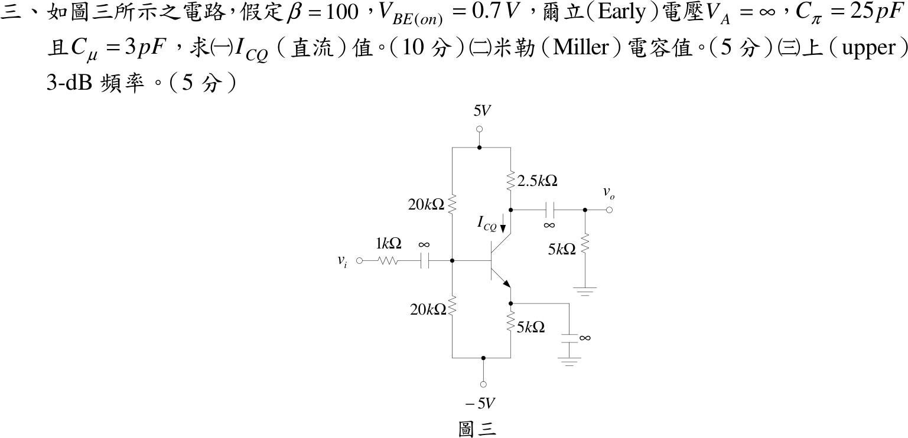
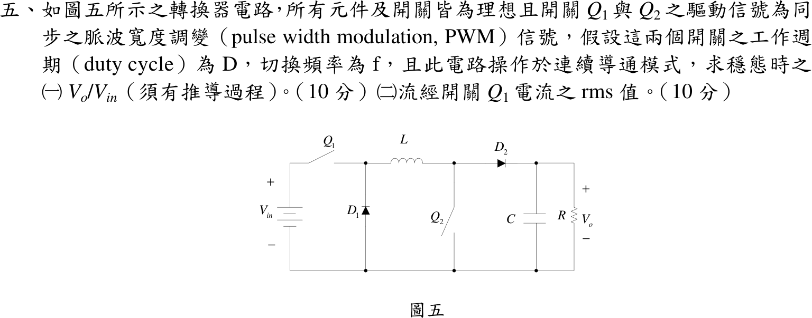

# 106 年電機工程技師｜電子學（包括電力電子學）逐題詳解

> 本頁由題級 canonical 筆記組合；每題保留官方裁切圖、校驗狀態與可追溯的推導。

## 題目導覽
- [[#一、106 年電子學（含電力電子）第 1 題｜雙積分器狀態變數濾波器|第 1 題：雙積分器狀態變數濾波器]]
- [[#二、106 年電子學_含電力電子第 2 題|第 2 題：106 年電子學_含電力電子第 2 題]]
- [[#三、106 年電子學_含電力電子第 3 題|第 3 題：106 年電子學_含電力電子第 3 題]]
- [[#四、106 年電子學（含電力電子）第 4 題｜單相半波整流器與續流二極體|第 4 題：單相半波整流器與續流二極體]]
- [[#五、106 年電子學（含電力電子）第 5 題｜非反相升壓型轉換器（同步開關）|第 5 題：非反相升壓型轉換器（同步開關）]]

---

## 一、106 年電子學（含電力電子）第 1 題｜雙積分器狀態變數濾波器

> 題級識別：EE-106-02-1
> canonical 來源：[[canonical/EE-106-02-1.md]]
> 題級校驗狀態：verified

### 已知與所求

三顆運放皆理想。左運放 $A_1$：$+$ 輸入點 $M$ 由 $v_{in}$ 經 $R_4$、由 $X$ 經 $R_5$ 供電；$-$ 輸入點 $N$ 由輸出 $v_{out}$ 經 $R_6$、由 $Y$ 經 $R_3$ 供電；輸出為 $v_{out}$。中運放 $A_2$：$v_{out}$ 經 $R_1$ 入 $-$，$C_1$ 跨接輸出 $X$ 與 $-$，$+$ 接地。右運放 $A_3$：$X$ 經 $R_2$ 入 $-$，$C_2$ 跨接輸出 $Y$ 與 $-$，$+$ 接地。求（一）$v_X/v_{out}$、（二）$v_Y/v_{out}$、（三）$v_{out}=A\,v_{in}+B\,v_{out}$ 中的 $A$、$B$。

### 考場標準作答

#### （一）

$A_2$ 為反相積分器：
\[
\boxed{\frac{v_X}{v_{out}}(s) = -\frac{1}{sR_1C_1}}
\]

#### （二）

$A_3$ 為反相積分器，$v_Y/v_X=-1/(sR_2C_2)$，級聯兩次反相：
\[
\boxed{\frac{v_Y}{v_{out}}(s)=\frac{1}{s^2R_1R_2C_1C_2}}
\]

#### （三）

$M$、$N$ 為電阻分壓（運放輸入不取電流）：
\[
v_M=\frac{R_5v_{in}+R_4v_X}{R_4+R_5},\qquad
v_N=\frac{R_3v_{out}+R_6v_Y}{R_3+R_6}
\]
虛短 $v_M=v_N$，解 $v_{out}$：
\[
v_{out}=\frac{R_3+R_6}{R_3}\cdot\frac{R_5v_{in}+R_4v_X}{R_4+R_5}-\frac{R_6}{R_3}v_Y
\]
代入（一）、（二）的 $v_X,v_Y$（均正比於 $v_{out}$）：
\[
\boxed{A=\frac{R_5 (R_3 + R_6)}{R_3 (R_4 + R_5)}}
\]
\[
\boxed{B=-\frac{R_4(R_3+R_6)}{R_3(R_4+R_5)}\cdot\frac{1}{sR_1C_1}-\frac{R_6}{R_3}\cdot\frac{1}{s^2R_1R_2C_1C_2}}
\]
$B$ 是 $s$ 的函數（回授項）；整理得 $\dfrac{v_{out}}{v_{in}}=\dfrac{A}{1-B}$。

### 驗算

令 $R_1\sim R_6=1\,\mathrm{k\Omega}$、$C_1=C_2=1\,\mu\mathrm F$、$\omega=1000\ \mathrm{rad/s}$（$sRC=j$）：$A=1$、$B=-\dfrac1j-\dfrac{1}{j^2}=1+j$，故 $v_{out}/v_{in}=1/(1-B)=j$。直接檢查：$v_X=-v_{out}/j=jv_{out}$、$v_Y=-v_{out}$，故 $v_N=(v_{out}+v_Y)/2=0$；虛短得 $v_M=(v_{in}+v_X)/2=0$，即 $v_X=-v_{in}$、$v_{out}=jv_{in}$，一致。另外令 $v_X=v_Y=0$ 時 $A_1$ 為非反相放大器，增益 $(1+R_6/R_3)\cdot R_5/(R_4+R_5)=A$。

### 失分點

- $v_Y/v_{out}$ 經兩級反相積分器，符號為正（$+1/(s^2R_1R_2C_1C_2)$），不是負。
- $N$ 點是 $v_{out}$ 經 $R_6$、$v_Y$ 經 $R_3$ 的分壓：$v_{out}$ 的權重是 $R_3/(R_3+R_6)$，$v_Y$ 的權重是 $R_6/(R_3+R_6)$；對調權重會使 $A$ 變成 $R_5(R_3+R_6)/(R_6(R_4+R_5))$。
- $M$ 點 $v_{in}$ 的權重是 $R_5/(R_4+R_5)$（遠端電阻在分子），不是 $R_4/(R_4+R_5)$。

---

## 二、106 年電子學_含電力電子第 2 題

> 題級識別：EE-106-02-2
> canonical 來源：[[canonical/EE-106-02-2.md]]
> 題級校驗狀態：needs_manual_review
> [!WARNING] 本題仍有官方資料缺口或事件定義歧義；請以 canonical 條件式解答為準。

### 已知與所求

$M_1$、$M_2$ 為 NMOS 差動對（尾端理想電流源 $I_{SS}$），$M_3$（閘汲短接）、$M_4$ 為 PMOS 電流鏡負載；$V_{in}$ 加在 $M_1$ 閘極，輸出 $V_{out}$ 取自 $M_2$、$M_4$ 汲極，經 $R_2$、$R_1$ 分壓接到 $M_2$ 閘極。考慮所有 MOSFET 的 $r_o$。題圖無元件數值，答案為符號式；參考書（reference_book evidence，非官方答案）採對稱模型 $r_{ON}=r_{OP}=r_o$，$g_{mN}=g_{m1}=g_{m2}$，$\beta=R_1/(R_1+R_2)$。求（一）回授的影響；（二）閉迴路增益；（三）閉迴路輸出阻抗。

### 考場標準作答

#### （一）回授的影響

$R_1,R_2$ 取樣輸出電壓（分壓器並接於輸出）、在 $M_2$ 閘極與 $V_{in}$ 串聯相減，為
\[
\boxed{\text{串聯-並聯（電壓串聯）負回授}}
\]
極性：$V_{out}$ 上升使 $M_2$ 汲極電流增加、把輸出拉低，確為負回授。效果：閉迴路增益由 $A_f=A/(1+A\beta)$ 趨近 $1/\beta=1+R_2/R_1$，對 $g_m,r_o$ 變動不敏感；輸出阻抗降為開迴路的 $1/(1+A\beta)$；頻寬增加、非線性失真降低；閘極輸入阻抗仍近無限大。

#### （二）閉迴路增益

差模誤差 $v_d=V_{in}-\beta V_{out}$。差動對加電流鏡使輸出的短路電流為 $g_{mN}v_d$；分壓器從輸出端到地是一條串聯支路，輸出端負載為 $R_1+R_2$，與 $M_2$、$M_4$ 的 $r_o$ 並聯（鏡像理想時為 $r_o/2$）：
\[
R_o=\frac{r_o}{2}\parallel(R_1+R_2),\qquad
A=g_{mN}R_o=g_{mN}\left[\frac{r_o}{2}\parallel(R_1+R_2)\right]
\]
\[
\boxed{A_f=\frac{V_{out}}{V_{in}}=\frac{A}{1+A\beta}},\qquad \beta=\frac{R_1}{R_1+R_2}
\]
$R_1+R_2\gg r_o/2$ 時 $A\to\tfrac12g_{mN}r_o$，即參考書採用的 $A$；$A\beta\gg1$ 時 $A_f\to1+R_2/R_1$。

#### （三）閉迴路輸出阻抗

電壓取樣（並聯）使輸出阻抗減為 $1/(1+A\beta)$：
\[
\boxed{R_{out,f}=\frac{R_o}{1+A\beta}=\frac{\dfrac{r_o}{2}\parallel(R_1+R_2)}{1+A\beta}}
\]
分子與參考書的 $(R_1+R_2)\parallel(r_o/2)$ 相同；參考書分母的 $A$ 取 $\tfrac12g_{mN}r_o$（未含負載），$R_{out,f}$ 因此差約 28%，見條件與疑義。

### 驗算

對四顆電晶體做完整小訊號節點解（含 $g_{m3},g_{m4}$、各 $r_o$，尾端理想電流源），代入 $g_{mN}=g_{mP}=1\,\mathrm{mS}$、$r_o=100\,\mathrm{k\Omega}$、$R_1=10\,\mathrm{k\Omega}$、$R_2=90\,\mathrm{k\Omega}$：$A_f=7.681$，上式（含負載的 $A$）給 $7.692$，相差 0.14%；$R_{out,f}$ 精確 $7757\,\Omega$，上式 $7692\,\Omega$（0.8%）。令 $g_{mP}\to\infty$ 兩式嚴格相等。

### 失分點

- 把分壓器負載寫成 $R_1\parallel R_2$；從輸出端看，$R_1$、$R_2$ 是串聯到地，負載是 $R_1+R_2$。
- 以為 $A_f$ 恆等於 $1+R_2/R_1$；只有 $A\beta\gg1$ 才成立，有限 $A$ 時是 $A/(1+A\beta)$。
- 只說「降低輸出阻抗」而不寫 $1/(1+A\beta)$，且忘記要乘上 $r_o/2$ 與 $R_1+R_2$ 的並聯開迴路值。

### 條件與疑義

參考書的開迴路增益 $A=\tfrac12g_{mN}r_o$ 未計入分壓器負載 $R_1+R_2$，但其 $R_{out,f}$ 分子卻含 $(R_1+R_2)\parallel(r_o/2)$，兩處對負載的處理不一致。以上述數值（完整節點解 $A_f=7.681$、$R_{out,f}=7757\,\Omega$）比較：

| 項目 | 完整節點解 | 含負載的 $A$ | 參考書未含負載的 $A=\tfrac12g_{mN}r_o$ |
|---|---|---|---|
| $A_f$ | 7.681 | 7.692 | 8.333（高 8.5%） |
| $R_{out,f}$ | 7757 $\Omega$ | 7692 $\Omega$ | 5556 $\Omega$（低 28%） |

兩者僅在 $R_1+R_2\gg r_o/2$ 時一致。官方題面未給數值，也無標準答案；本解以含負載的 $A$ 為主解，參考書形式視為該極限。

---

## 三、106 年電子學_含電力電子第 3 題

> 題級識別：EE-106-02-3
> canonical 來源：[[canonical/EE-106-02-3.md]]
> 題級校驗狀態：verified

### 已知與所求

供電 $\pm5\,\mathrm V$；基極分壓 $20\,\mathrm{k\Omega}$（接 $+5\,\mathrm V$）與 $20\,\mathrm{k\Omega}$（接 $-5\,\mathrm V$）；$R_C=2.5\,\mathrm{k\Omega}$、射極 $5\,\mathrm{k\Omega}$ 接 $-5\,\mathrm V$ 並以無限大電容旁路；輸入為 $1\,\mathrm{k\Omega}$ 串耦合電容（無限大）、輸出經耦合電容接 $R_L=5\,\mathrm{k\Omega}$。$\beta=100$、$V_{BE(on)}=0.7\,\mathrm V$、$V_A=\infty$、$C_\pi=25\,\mathrm{pF}$、$C_\mu=3\,\mathrm{pF}$。求（一）$I_{CQ}$、（二）Miller 電容、（三）上 3-dB 頻率。

題目未給，本解採用 $V_T=25\,\mathrm{mV}$（假設）。

### 考場標準作答

#### （一）$I_{CQ}$

基極戴維寧：$V_{TH}=0\,\mathrm V$，$R_{TH}=20\,\mathrm{k}\parallel20\,\mathrm k=10\,\mathrm{k\Omega}$。基-射迴路 KVL：
\[
I_B=\frac{V_{TH}-V_{BE}-(-5)}{R_{TH}+(\beta+1)R_E}=\frac{4.3}{10\,\mathrm k+101(5\,\mathrm k)}=\frac{4.3}{515\,\mathrm{k\Omega}}=8.35\ \mu\mathrm A
\]
\[
\boxed{I_{CQ}=\beta I_B=0.835\ \mathrm{mA}}
\]

#### （二）Miller 電容

$g_m=I_{CQ}/V_T=33.4\ \mathrm{mS}$，$r_\pi=\beta/g_m=2.994\ \mathrm{k\Omega}$，$R_L'=R_C\parallel R_L=1.667\ \mathrm{k\Omega}$，$K=-g_mR_L'=-55.7$：
\[
\boxed{C_M=C_\mu(1-K)=3\ \mathrm{pF}\times56.7=170\ \mathrm{pF}}
\]

#### （三）上 3-dB 頻率

基極節點看出去的電阻為 $1\,\mathrm k\parallel10\,\mathrm k$（信號源與偏壓分壓）再與 $r_\pi$ 並聯：
\[
R_{in}'=(1\,\mathrm k\parallel10\,\mathrm k)\parallel r_\pi=0.909\,\mathrm k\parallel2.994\,\mathrm k=698\ \Omega
\]
\[
\boxed{f_H=\frac1{2\pi R_{in}'(C_\pi+C_M)}=\frac1{2\pi(698)(195\ \mathrm{pF})}=1.17\ \mathrm{MHz}}
\]
輸出端 Miller 電容 $C_\mu(1-1/K)\approx3.05\ \mathrm{pF}$，輸出極點 $1/(2\pi R_L'C)\approx31\ \mathrm{MHz}\gg f_H$，輸入極點主導。

### 驗算

偏壓：$I_E=(\beta+1)I_B=0.843\ \mathrm{mA}$，$V_E=-5+0.843(5)=-0.784\ \mathrm V$，$V_B=-I_B(10\,\mathrm k)=-0.084\ \mathrm V$，$V_B-V_E=0.700\ \mathrm V$ 吻合 $V_{BE}$；$V_{CE}=(5-0.835\times2.5)-(-0.784)=3.70\ \mathrm V>0.3\ \mathrm V$，在主動區。高頻：以 $C_\mu$ 跨接基極與集極的完整兩節點方程數值求 $|v_o/v_s|$ 下降 3 dB，得 $1.13\ \mathrm{MHz}$，與 Miller 近似 $1.17\ \mathrm{MHz}$ 差約 3%。

### 失分點

- 射極電阻反射到基極要乘 $(\beta+1)=101$，分母是 $R_{TH}+101R_E$，不是 $R_{TH}+\beta R_E$ 或只有 $R_E$。
- Miller 增益用 $R_C\parallel R_L=1.667\ \mathrm{k\Omega}$（交流負載），不是只用 $R_C$ 或 $R_L$。
- $R_{in}'$ 漏掉基極偏壓分壓 $10\,\mathrm{k\Omega}$ 時，$R_{in}'=749\ \Omega$，$f_H$ 偏低為 $1.09\ \mathrm{MHz}$。

---

## 四、106 年電子學（含電力電子）第 4 題｜單相半波整流器與續流二極體

> 題級識別：EE-106-02-4
> canonical 來源：[[canonical/EE-106-02-4.md]]
> 題級校驗狀態：verified

### 已知與所求

$v_s=V_P\sin\omega t$，$V_P=340\,\mathrm V$、$\omega=377\,\mathrm{rad/s}$，$D_1$ 串在電源與負載之間，$D_2$ 跨在負載兩端（陰極接 $v_o$ 的 $+$ 端），負載 $R=4\,\Omega$ 串 $L\to\infty$。求（一）$v_o,i_{D1},i_{D2}$ 波形；（二）$i_o$ 平均值；（三）輸入電流 rms；（四）功率因數。

### 考場標準作答

#### （一）波形

$L\to\infty$ 使負載電流為常數 $I_o$。正半週（$0<\theta<\pi$，$\theta=\omega t$）$D_1$ 導通、$D_2$ 截止；負半週 $D_1$ 截止，電感電流經 $D_2$ 續流：
\[
v_o=\begin{cases}340\sin\theta,&0<\theta<\pi\\0,&\pi<\theta<2\pi\end{cases},\quad
i_{D1}=\begin{cases}I_o,&0<\theta<\pi\\0,&\pi<\theta<2\pi\end{cases},\quad
i_{D2}=\begin{cases}0,&0<\theta<\pi\\I_o,&\pi<\theta<2\pi\end{cases}
\]
\[
\boxed{D_1:\ 0\sim\pi\ \text{導通},\qquad D_2:\ \pi\sim2\pi\ \text{續流}}
\]

#### （二）平均值

穩態電感平均電壓為零，$V_{o,avg}=RI_o=V_P/\pi=108.23\ \mathrm V$：
\[
\boxed{I_o = \frac{V_{o,avg}}{R}=\frac{340/\pi}{4}=27.06\ \mathrm A}
\]

#### （三）輸入電流 rms

輸入電流即 $i_{D1}$（正半週為 $I_o$，負半週為 0）：
\[
\boxed{I_{s,rms}=\sqrt{\frac1{2\pi}\int_0^\pi I_o^2\,d\theta}=\frac{I_o}{\sqrt2}=19.13\ \mathrm A}
\]

#### （四）功率因數

\[
P=I_o^2R=2928\ \mathrm W,\quad S=\frac{V_P}{\sqrt2}\,I_{s,rms}=240.4\times19.13=4600\ \mathrm{VA}
\]
\[
\boxed{PF = \frac{2}{\pi}=0.6366}
\]
電流基本波與電壓同相，PF 偏低完全來自電流波形失真。

### 驗算

以傅立葉基本波檢查：輸入電流為 $0\sim\pi$ 的方波 $I_o$，基本波正弦分量振幅 $2I_o/\pi$、餘弦分量為 0，故基本波與電壓同相（位移因數 1），基本波 rms $=\sqrt2I_o/\pi$。畸變因數 $=\dfrac{\sqrt2I_o/\pi}{I_o/\sqrt2}=\dfrac2\pi$，PF $=1\times2/\pi$，與 $P/S$ 相同。電源實功率 $\frac1{2\pi}\int_0^\pi V_P\sin\theta\,I_o\,d\theta=V_PI_o/\pi=2928\ \mathrm W=RI_o^2$。

### 失分點

- 把輸入電流算成負載電流（$I_o$）或含 $D_2$ 續流段；$D_2$ 的電流不經電源，輸入 rms 只有 $I_o/\sqrt2$。
- 套用純電阻半波整流的 $I_{s,rms}=V_P/(2R)=42.5\ \mathrm A$；本題 $L\to\infty$ 使電流為定值 $27.06\ \mathrm A$。
- 把功率因數當成位移因數 $\cos\phi=1$；輸入電流是方波，畸變使 PF $=2/\pi$。

---

## 五、106 年電子學（含電力電子）第 5 題｜非反相升壓型轉換器（同步開關）

> 題級識別：EE-106-02-5
> canonical 來源：[[canonical/EE-106-02-5.md]]
> 題級校驗狀態：verified

### 已知與所求

理想元件；$Q_1$ 串於 $V_{in}$ 與 $L$ 之間，$D_1$ 自地接到 $Q_1$–$L$ 節點，$Q_2$ 自 $L$–$D_2$ 節點接地，$D_2$ 接輸出電容 $C$ 與 $R$。$Q_1,Q_2$ 同步 PWM、工作週期 $D$、頻率 $f$，CCM 穩態。題目無數值，答案為符號式。求（一）$V_o/V_{in}$（須推導）；（二）$Q_1$ 電流 rms。

### 考場標準作答

#### （一）電壓比

$T_s=1/f$。$Q_1,Q_2$ 導通（$DT_s$）：$L$ 跨在 $V_{in}$ 與地之間，$v_L=V_{in}$；關斷（$(1-D)T_s$）：電感電流經 $D_1$、$D_2$ 流向輸出，$v_L=-V_o$。電感伏秒平衡：
\[
V_{in}DT_s-V_o(1-D)T_s=0\ \Longrightarrow\ \frac{V_o}{V_{in}}=\frac{D}{1-D}
\]
\[
\boxed{\frac{V_o}{V_{in}} = \frac{D}{1 - D}}
\]

#### （二）$Q_1$ 電流 rms

CCM 下輸出電荷平衡 $I_o=(1-D)I_L$，故電感平均電流與漣波
\[
I_L=\frac{V_o}{(1-D)R},\qquad \Delta I_L=\frac{V_{in}D}{Lf}
\]
$Q_1$ 只在 $DT_s$ 內導通且電流等於電感電流（三角形電感電流，以 $I_L$ 為中心）。三角波對平均值的均方偏差為峰峰值平方的 $\frac{1}{12}$，故導通區均方值 $I_L^2+\dfrac{(\Delta I_L)^2}{12}$，再乘上 $D$：
\[
\boxed{I_{Q1,rms}=\sqrt{D\left[\left(\frac{V_o}{(1-D)R}\right)^2+\frac{(\Delta I_L)^2}{12}\right]},\quad \Delta I_L=\frac{V_{in}D}{Lf}}
\]
僅在小漣波近似（$\Delta I_L\ll I_L$）下才簡化為 $I_{Q1,rms}\approx I_L\sqrt D=\dfrac{V_o\sqrt D}{(1-D)R}=\dfrac{D^{1.5}V_{in}}{(1-D)^2R}$。

### 驗算

功率守恆：$P_{in}=V_{in}\cdot DI_L$（輸入電流平均值 $DI_L$）$=V_{in}D\cdot\dfrac{V_{in}D}{(1-D)^2R}=\dfrac{V_o^2}{R}$，與 $V_o=V_{in}D/(1-D)$ 相容。取假想數值（非題目給定）$V_{in}=12\,\mathrm V$、$D=0.4$、$R=10\,\Omega$、$L=100\,\mu\mathrm H$、$f=25\,\mathrm{kHz}$：$V_o=8\,\mathrm V$、$I_L=1.333\,\mathrm A$、$\Delta I_L=1.92\,\mathrm A$，時域兩段斜坡積分得 $I_{Q1,rms}=0.913\,\mathrm A$，與公式一致（小漣波近似只有 $0.843\,\mathrm A$）。

### 失分點

- 把此同步雙開關拓撲當成普通 Boost，寫成 $V_o/V_{in}=1/(1-D)$；本圖導通時 $L$ 兩端是 $V_{in}$，關斷時是 $-V_o$，比值為 $D/(1-D)$。
- $I_L=I_o/(1-D)$，漏除 $(1-D)$ 會低估 $Q_1$ 電流。
- rms 要除以整個週期 $T_s$（乘 $D$ 再開根號），並保留 $\Delta I_L^2/12$；未註明小漣波近似就刪掉此項是不完整的。

---
