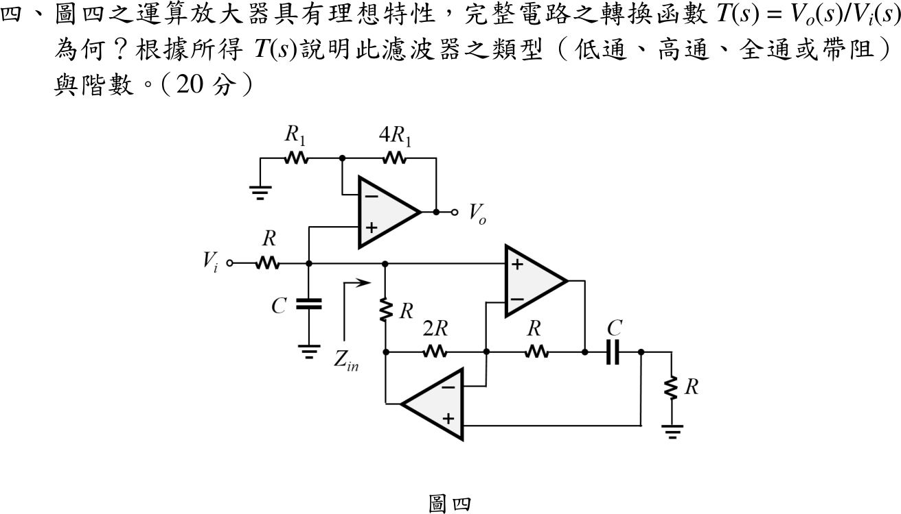

# 📝 108 年電機工程技師｜電子學（包括電力電子學）逐題詳解

> 本頁由題級 canonical 筆記組合；每題保留 QID、官方裁切、校驗狀態與完整得分型解答。

## 題目導覽
- [[#一、108 年電子學第 1 題｜單極點運算放大器波德圖|第 1 題：單極點運算放大器波德圖]]
- [[#二、108 年電子學第 2 題｜三相三角波整流（五顆二極體）|第 2 題：三相三角波整流（五顆二極體）]]
- [[#三、108 年電子學第 3 題｜MOSFET 串聯-串聯負回授|第 3 題：MOSFET 串聯-串聯負回授]]
- [[#四、108 年電子學第 4 題｜GIC 主動濾波器轉移函數|第 4 題：GIC 主動濾波器轉移函數]]
- [[#五、108 年電子學第 5 題｜三相交錯式降壓轉換器|第 5 題：三相交錯式降壓轉換器]]

---

## 一、108 年電子學第 1 題｜單極點運算放大器波德圖

> 題級識別：`EE-108-02-1`
> canonical 來源：`canonical/EE-108-02-1.md`
> 題級校驗狀態：`verified`

![[01_原始試題/依考科/02_電子學_含電力電子/images/questions/PE_108年_電子學（包括電力電子學）_Q01.png]]

> 官方裁切來源：`01_原始試題/依考科/02_電子學_含電力電子/images/questions/PE_108年_電子學（包括電力電子學）_Q01.png`


### 已知與所求

單極點開路增益：$f\to0$ 時 $|A|=80\,\mathrm{dB}$；$f=10\,\mathrm{kHz}$ 時 $|A|=40\,\mathrm{dB}$。畫幅頻與相頻波德圖，標出極點頻率 $f_b$、0 dB 頻率 $f_t$，範圍至少 $f_b/100\sim10f_t$，相位以度、頻率以 Hz。

### 考場標準作答

#### 極點頻率 $f_b$

$A(f)=\dfrac{A_0}{1+jf/f_b}$，$A_0=10^{80/20}=10^4$，$|A(10\,\mathrm{kHz})|=10^{40/20}=100$：
\[
100=\frac{10^4}{\sqrt{1+(10^4/f_b)^2}}\ \Rightarrow\ (10^4/f_b)^2=9999
\]
\[
\boxed{f_b=\frac{10^4}{\sqrt{9999}}=100.005\ \mathrm{Hz}\approx100\ \mathrm{Hz}}
\]

#### 0 dB 頻率 $f_t$

$|A(f_t)|=1$：
\[
\boxed{f_t=f_b\sqrt{A_0^2-1}\approx1.00005\ \mathrm{MHz}\approx1\ \mathrm{MHz}}
\]

#### 波德圖

\[
G_{\mathrm{dB}}(f)=80-10\log_{10}\!\left[1+(f/f_b)^2\right],\qquad \phi(f)=-\tan^{-1}(f/f_b)
\]

```
|A|
  80 dB │────────────●  f_b
  60 dB │                  ╲
  40 dB │                        ●  10 kHz
  20 dB │                              ╲
   0 dB │                                    ●  f_t
 -20 dB │                                          ╲
        └──────────────────────────────────────────────
         1     10    100   1k    10k   100k  1M    10M  f (Hz)

φ
   0 °  │───────╲
 -45 °  │            ●
 -90 °  │                  ╲───────────────────────────
        └──────────────────────────────────────────────
         1     10    100   1k    10k   100k  1M    10M  f (Hz)
```

圖中 80 dB 平線延伸到 $f_b=100\ \mathrm{Hz}$，之後以 $-20\ \mathrm{dB/decade}$ 直線下降，經 $10\ \mathrm{kHz}$ 的 40 dB 到 $f_t\approx1\ \mathrm{MHz}$ 的 0 dB，延伸至 $10\ \mathrm{MHz}$（$-20\ \mathrm{dB}$）；相位在 $f_b$ 為 $-45^\circ$，兩側各約一個十倍頻後趨近 $0^\circ$、$-90^\circ$。

| $f$ | 1 Hz | $f_b$ | 10 kHz | $f_t$ | 10 MHz |
|---|---|---|---|---|---|
| $\lvert A\rvert$ (dB) | 80 | 76.99 | 40 | 0 | −20 |
| $\phi$ (°) | −0.57 | −45 | −89.43 | −89.994 | −89.9994 |

### 驗算

以幾何方式檢查增益頻寬積：$A_0f_b=10^4\times100.005=1.00005\ \mathrm{MHz}=f_t$；漸近線在 10 kHz 為 $80-20\log_{10}(10^4/100)=40\ \mathrm{dB}$，與題給量測一致。

### 失分點

- 40 dB 是 $100$ V/V（$20\log_{10}$），不是 40 V/V；若誤用 $10\log_{10}$ 會得 $10^4$ 而得到錯誤的 $f_b$。
- $f_b$ 是 $-3\,\mathrm{dB}$ 轉折點（相位 $-45^\circ$），$f_t\approx10^4f_b$ 才是 0 dB 交越；兩者不可混標。
- 單極點相位是 $0^\circ\to-90^\circ$（負值），並要涵蓋 $f_b/100=1\ \mathrm{Hz}$ 到 $10f_t=10\ \mathrm{MHz}$。


---

## 二、108 年電子學第 2 題｜三相三角波整流（五顆二極體）

> 題級識別：`EE-108-02-2`
> canonical 來源：`canonical/EE-108-02-2.md`
> 題級校驗狀態：`verified`

![[01_原始試題/依考科/02_電子學_含電力電子/images/questions/PE_108年_電子學（包括電力電子學）_Q02.png]]

> 官方裁切來源：`01_原始試題/依考科/02_電子學_含電力電子/images/questions/PE_108年_電子學（包括電力電子學）_Q02.png`


### 已知與所求

$V_{an},V_{bn},V_{cn}$ 為 $\pm90\,\mathrm V$ 對稱三角波，$V_{an}$ 於 $\theta=0^\circ$ 以正斜率過零，$V_{bn},V_{cn}$ 落後 $120^\circ$、$240^\circ$；二極體理想。依圖逐線追蹤：

- 上臂（陰極接負載 $+$）：$D_1$ 接 $a$ 相、$D_2$ 接 $c$ 相；**$b$ 相上臂為斷開的缺口，沒有二極體**。
- 下臂（陽極接負載 $-$）：$D_3$ 接 $a$、$D_4$ 接 $b$、$D_5$ 接 $c$。

求 $0\le\theta\le360^\circ$ 各段導通二極體、$V_L(\theta)$ 波形與 $V_{dc}$。

### 考場標準作答

#### 導通判斷

上節點電位取 $\max(V_{an},V_{cn})$，下節點取 $\min(V_{an},V_{bn},V_{cn})$：
\[
V_L(\theta)=\max(V_{an},V_{cn})-\min(V_{an},V_{bn},V_{cn})
\]
三角波斜率 $1\,\mathrm{V/deg}$；$a$ 的下降段 $V_{an}=180^\circ-\theta$（$90^\circ\sim270^\circ$），$c$ 的上升段 $V_{cn}=\theta-240^\circ$（$150^\circ\sim330^\circ$）。

| $\theta$ | 上臂 | 下臂 | $V_L$ |
|---|---|---|---|
| $0^\circ\sim30^\circ$ | $D_2$（$c$） | $D_4$（$b$） | $120\,\mathrm V$ |
| $30^\circ\sim90^\circ$ | $D_1$（$a$） | $D_4$（$b$） | $120\,\mathrm V$ |
| $90^\circ\sim150^\circ$ | $D_1$（$a$） | $D_5$（$c$） | $120\,\mathrm V$ |
| $150^\circ\sim210^\circ$ | $D_1$（$a$） | $D_5$（$c$） | $420-2\theta$（$\mathrm V$） |
| $210^\circ\sim270^\circ$ | $D_2$（$c$） | $D_3$（$a$） | $2\theta-420$（$\mathrm V$） |
| $270^\circ\sim330^\circ$ | $D_2$（$c$） | $D_3$（$a$） | $120\,\mathrm V$ |
| $330^\circ\sim360^\circ$ | $D_2$（$c$） | $D_4$（$b$） | $120\,\mathrm V$ |

$150^\circ\sim270^\circ$ 時 $b$ 相最高卻沒有上臂二極體，上節點只能取 $a$ 或 $c$，$V_L$ 在 $210^\circ$（$V_{an}=V_{cn}=-30\,\mathrm V$）降到 $0$。

#### 波形

```
V_L (V)
120 ─────────────────╲            ╱──────────────
                      ╲          ╱
  0                    ╲________╱
   0   30   90  150  210  270  330  360  θ(°)
```

#### 平均值

$V_L=120\,\mathrm V$ 的區間共 $240^\circ$，兩段斜坡各 $60^\circ$，每段面積 $\tfrac12(60^\circ)(120\,\mathrm V)$：
\[
\boxed{V_{dc}=\frac{1}{360^\circ}\left[120(240^\circ)+2\cdot\tfrac12(60^\circ)(120)\right]=\frac{28800+7200}{360}=100\ \mathrm V}
\]

### 驗算

用「缺臂扣除」法：若 $b$ 相也有上臂二極體，$V_L$ 全程為 $120\,\mathrm V$；缺少它造成 $150^\circ\sim270^\circ$ 的三角形凹陷，面積 $\tfrac12(120^\circ)(120\,\mathrm V)=7200\ \mathrm{V\cdot deg}$，平均少 $7200/360=20\,\mathrm V$，得 $120-20=100\,\mathrm V$。

### 失分點

- 把圖當成六顆二極體的標準橋式，得 $V_L\equiv120\,\mathrm V$、$V_{dc}=120\,\mathrm V$；本圖 $b$ 相上臂缺口使 $V_{dc}$ 只有 $100\,\mathrm V$。
- 只標最高相與最低相，忽略 $210^\circ$ 附近上臂只能在 $a$、$c$ 之間換相，漏畫 $V_L$ 降到 0 的凹陷。
- 套用正弦三相的 $1.35V_{LL}$；本題輸入是三角波，須逐段用直線方程式。


---

## 三、108 年電子學第 3 題｜MOSFET 串聯-串聯負回授

> 題級識別：`EE-108-02-3`
> canonical 來源：`canonical/EE-108-02-3.md`
> 題級校驗狀態：`verified`

![[01_原始試題/依考科/02_電子學_含電力電子/images/questions/PE_108年_電子學（包括電力電子學）_Q03.png]]

> 官方裁切來源：`01_原始試題/依考科/02_電子學_含電力電子/images/questions/PE_108年_電子學（包括電力電子學）_Q03.png`


### 已知與所求

NMOS 偏壓於飽和區，小訊號只有 $g_m$、$r_o$；閘極接 $v_{sig}$，汲極接 $R_L$（$i_o$ 為汲極電流，$v_o$ 為 $R_L$ 上電壓），源極經 $R_S$ 接地；虛線內 $R_S$ 為回授網路。求回授型態、$A$、$\beta$、$R_{of}$、$A_{vf}=v_o/v_{sig}$。

### 考場標準作答

#### 回授型態

$R_S$ 流過輸出（汲極）電流 $i_o$，取樣的是**電流**；產生的 $v_f=R_Si_o$ 與 $v_{sig}$ 在閘源迴路**串聯相減**（$v_{gs}=v_{sig}-v_f$）。故為**串聯-串聯（電流串聯）負回授**，基本放大器是互導放大器 $A=i_o/v_i$。

#### $A$、$\beta$

回授網路對基本放大器的負載：輸入端閘極不取電流，$R_S$ 無負載效應；輸出迴路中 $R_S$ 與 $R_L$ 串聯於 $r_o$ 之後。令 $v_{gs}=v_i$：
\[
\boxed{A=\frac{i_o}{v_i}=\frac{g_mr_o}{r_o+R_L+R_S}},\qquad
\boxed{\beta=\frac{v_f}{i_o}=R_S}
\]
理想 $r_o\to\infty$ 時 $A=g_m$。

#### 完整放大器

\[
A_f=\frac{i_o}{v_{sig}}=\frac{A}{1+A\beta}=\frac{g_mr_o}{r_o+R_L+R_S+g_mr_oR_S}
\]
$i_o$ 由 $R_L$ 的接地端流入汲極，故 $v_o=-i_oR_L$：
\[
\boxed{A_{vf}=\frac{v_o}{v_{sig}}=-\frac{g_mr_oR_L}{r_o+R_L+R_S+g_mr_oR_S}}
\]
輸出電阻（由 $R_L$ 端看入，不含 $R_L$）以 $R_L=0$ 的 $A_0=g_mr_o/(r_o+R_S)$、$R_o=r_o+R_S$：
\[
\boxed{R_{of}=R_o(1+A_0\beta)=r_o+R_S+g_mr_oR_S}
\]
輸入電阻 $R_{if}\to\infty$（閘極）。

### 驗算

直接對閘、汲、源節點寫小訊號 KCL（不用回授公式）：$v_o/R_L+i_d=0$、$i_d=v_s/R_S$，$i_d=g_m(v_{sig}-v_s)+(v_o-v_s)/r_o$，解得與上式相同。代入 $g_m=2\,\mathrm{mS}$、$r_o=50\,\mathrm{k\Omega}$、$R_L=5\,\mathrm{k\Omega}$、$R_S=1\,\mathrm{k\Omega}$：$A_{vf}=-3.205$，此時 $v_s=0.641\,\mathrm V$（$v_{sig}=1\,\mathrm V$），$g_m(1-0.641)-3.846/50\,\mathrm k=0.718-0.077=0.641\ \mathrm{mA}=v_s/R_S$，KCL 成立；$R_{of}=151\,\mathrm{k\Omega}$。極限：$R_S\to0$ 得 $-g_mr_oR_L/(r_o+R_L)$（無退化共源級）；$r_o\to\infty$ 得 $-g_mR_L/(1+g_mR_S)$。

### 失分點

- 把電流取樣誤判為並聯取樣而寫成串並或並串；$R_S$ 串在源極、取樣的是汲極電流。
- 忘記 $v_o=-i_oR_L$ 的反相號，把 $A_{vf}$ 寫成正值。
- 取 $A=g_m$ 卻同時保留 $r_o$：有限 $r_o$ 時基本放大器要用 $g_mr_o/(r_o+R_L+R_S)$，否則分母少了 $R_L+R_S$。


---

## 四、108 年電子學第 4 題｜GIC 主動濾波器轉移函數

> 題級識別：`EE-108-02-4`
> canonical 來源：`canonical/EE-108-02-4.md`
> 題級校驗狀態：`verified`

![[01_原始試題/依考科/02_電子學_含電力電子/images/questions/PE_108年_電子學（包括電力電子學）_Q04.png]]

> 官方裁切來源：`01_原始試題/依考科/02_電子學_含電力電子/images/questions/PE_108年_電子學（包括電力電子學）_Q04.png`



### 已知與所求

運算放大器皆理想。上方放大器：$+$ 輸入接節點 $X$，$-$ 輸入經 $R_1$ 接地、$4R_1$ 接回輸出 $V_o$。$V_i$ 經 $R$ 接到 $X$，$X$ 對地接 $C$，另有 GIC 由 $X$ 經 $R\to P$、$2R\to Q$、$R\to Y$、$C\to Z$、$R\to$ 地串成鏈：右上運放 $A$（$+$ 接 $X$、$-$ 接 $Q$、輸出 $Y$），左下運放 $B$（輸出 $P$、$-$ 接 $Q$、$+$ 接 $Z$）。求 $T(s)=V_o/V_i$，並判斷濾波器類型與階數。

### 考場標準作答

#### GIC 由 $X$ 看入的阻抗

$A$ 的虛短 $V_Q=V_X$，$B$ 的虛短 $V_Z=V_Q$，故 $V_Z=V_X$。最右鏈 $C$–$R$ 電流 $V_X/R$：
\[
V_Y=V_X+\frac{V_X/R}{sC}=V_X\left(1+\frac{1}{sRC}\right)
\]
$R$（$Q$–$Y$）電流 $(V_Y-V_X)/R=V_X/(sR^2C)$ 全部流經 $2R$（運放輸入不取電流）：
\[
V_P=V_X-2R\cdot\frac{V_X}{sR^2C}=V_X\left(1-\frac{2}{sRC}\right),\qquad
I_{in}=\frac{V_X-V_P}{R}=\frac{2V_X}{sR^2C}
\]
\[
Z_{in}=\frac{V_X}{I_{in}}=\frac{Z_1Z_3Z_5}{Z_2Z_4}=\frac{R\cdot R\cdot R}{2R\cdot(1/sC)}=\frac{sR^2C}{2}
\]
即等效電感 $L_{eq}=R^2C/2$。

#### 轉移函數

節點 $X$ 對地為 $C\parallel L_{eq}$，再與串聯 $R$ 分壓；上方非反相級增益 $1+4R_1/R_1=5$：
\[
\frac{V_X}{V_i}=\frac{sL_{eq}/(1+s^2L_{eq}C)}{R+sL_{eq}/(1+s^2L_{eq}C)}
=\frac{sRC}{s^2R^2C^2+sRC+2}
\]
\[
\boxed{T(s)=\frac{V_o}{V_i}=\frac{5sRC}{s^2R^2C^2+sRC+2}}
\]

#### 類型與階數

$T(0)=0$，$T(\infty)=0$，分母為 $s$ 的二次式，故為
\[
\boxed{\text{二階帶通濾波器}}
\]
其中心角頻率 $\omega_0=\sqrt2/(RC)$、$Q=\sqrt2$、中心增益 $|T(j\omega_0)|=5$。

### 驗算

以 LC 並聯諧振的物理觀點檢查：$X$ 對地為 $C\parallel L_{eq}$，$\omega_0=1/\sqrt{L_{eq}C}=\sqrt2/(RC)$ 時兩者電流互相抵消、對地阻抗為無限大，故 $V_X=V_i$，$V_o=5V_i$，$|T(j\omega_0)|=5$（相位 $0^\circ$）；與直接代入 $s=j\omega_0$ 的結果（分母 $=j\sqrt2$、分子 $=5j\sqrt2$）相同。極限：$s\to0$ 時 $L_{eq}$ 短路，$s\to\infty$ 時 $C$ 短路，$V_X\to0$，故 $T(0)=T(\infty)=0$；$-3\ \mathrm{dB}$ 頻寬 $=\omega_0/Q=1/(RC)$。

### 失分點

- GIC 公式 $Z_1Z_3Z_5/(Z_2Z_4)$ 中 $2R$ 在鏈的第二位（$Z_2$，分母）；若放在 $Z_3$ 會得 $2sR^2C$，等效電感大 4 倍，中心頻率與分母全錯。
- 漏掉 $X$ 對地的實體電容 $C$，只留 GIC 電感，就變成一階高通而非二階。
- 上方非反相級增益是 $1+4R_1/R_1=5$，不是 $4$。


---

## 五、108 年電子學第 5 題｜三相交錯式降壓轉換器

> 題級識別：`EE-108-02-5`
> canonical 來源：`canonical/EE-108-02-5.md`
> 題級校驗狀態：`needs_manual_review`

![[01_原始試題/依考科/02_電子學_含電力電子/images/questions/PE_108年_電子學（包括電力電子學）_Q05.png]]

> 官方裁切來源：`01_原始試題/依考科/02_電子學_含電力電子/images/questions/PE_108年_電子學（包括電力電子學）_Q05.png`

> [!WARNING] 本題仍有官方資料缺口或事件定義歧義；以下條件分支不得視為唯一無條件答案。


### 已知與所求

$V_S=9\,\mathrm V$、$R_L=1\,\Omega$、$f_s=20\,\mathrm{kHz}$、$D=1/6$。僅 $S_1$ 工作時題給 $V_L=3\,\mathrm V$，單相電感電流高低差 $<0.5\,\mathrm A$，$L$ 取最小值。$S_1,S_2,S_3$ 脈寬皆為 $T/6$，彼此相差 $T/3$。求 $L$、輸出電流漣波頻率及其最高、最低值。

### 考場標準作答

\[
T_s=\frac1{20\,\mathrm{kHz}}=50\,\mu\mathrm s,\qquad t_{on}=DT_s=\frac{T_s}{6}
\]

#### 電感

僅 $S_1$ 工作，導通期間電感跨壓 $V_S-V_L=6\,\mathrm V$：
\[
\Delta i_L=\frac{(V_S-V_L)DT_s}{L}=\frac{6\times(50/6)\,\mu\mathrm s}{L}=\frac{50\,\mu\mathrm s}{L}\le0.5\,\mathrm A
\]
\[
\boxed{L_{min}=100\ \mu\mathrm H}
\]

#### 漣波頻率

三相脈波相差 $T_s/3$，輸出電流每 $T_s/3$ 重複一次：
\[
\boxed{f_{ripple}=3f_s=3\times20\text{ kHz}=\mathbf{60\text{ kHz}}}
\]

#### 最高、最低值

脈寬 $T_s/6$、間隔 $T_s/3$，任一時刻至多一相導通。三相電感電流之和的斜率（取 $V_L$ 為定值）：

- 一相導通：$\dfrac{(V_S-V_L)-V_L-V_L}{L}$；全部關斷：$-\dfrac{3V_L}{L}$，歷時 $T_s/6$。

**（甲）依題給 $V_L=3\,\mathrm V$（形式值）**：一相導通斜率 $(6-3-3)/L=0$，全關 $-9/L$，總電流高低差
\[
\Delta I_o=\frac9L\cdot\frac{T_s}{6}=\frac{9}{100\,\mu\mathrm H}\cdot\frac{50\,\mu\mathrm s}{6}=\mathbf{0.75\text{ A}}
\]
取 $I_{o,avg}=V_L/R_L=3\,\mathrm A$，以平均值 $\pm\Delta I_o/2$：
\[
\boxed{\mathbf{I_{o,max}=3.375\text{ A}}},\qquad
\boxed{\mathbf{I_{o,min}=2.625\text{ A}}}
\]
此為形式上取的平均值 $\pm\Delta I_o/2$，並非自洽穩態：$V_L=3\,\mathrm V$ 下總電流每 $T_s/3$ 淨變化 $0\cdot\frac{T_s}{6}-\frac9L\frac{T_s}{6}=-0.75\,\mathrm A\ne0$，只降不升。

**（乙）自洽值 $V_L=DV_S=1.5\,\mathrm V$**（伏秒平衡 $(V_S-V_L)D=V_L(1-D)$ 的唯一解）：此時 $L_{min}=(9-1.5)(T_s/6)/0.5=125\ \mu\mathrm H$，一相導通斜率 $+4.5/L$、全關 $-4.5/L$（各 $T_s/6$），週期淨變化為 0，$\Delta I_o=0.30\ \mathrm A$，$I_{o,avg}=1.5\ \mathrm A$：
\[
\boxed{I_{o,max}=1.65\ \mathrm A},\qquad \boxed{I_{o,min}=1.35\ \mathrm A}
\]

兩組的漣波頻率皆為 $60\,\mathrm{kHz}$。主答案 $L=100\ \mu\mathrm H$ 與 $60\,\mathrm{kHz}$ 由題給 $V_L$ 直接推得。

### 驗算

單一電感的伏秒平衡：導通 $(V_S-V_L)DT_s$ 須等於關斷 $V_L(1-D)T_s$。代入 $V_L=3\,\mathrm V$：$6\times\frac16=1$ 對 $3\times\frac56=2.5\,(\mathrm{V\cdot T_s})$，不平衡，故題給數據無週期穩態；代入 $V_L=1.5\,\mathrm V$：$7.5\times\frac16=1.25=1.5\times\frac56$，平衡。上述（乙）的總電流週期淨變化為 0 即由此而來。

### 失分點

- 漣波頻率寫成單相的 $20\,\mathrm{kHz}$，漏乘三相交錯的 3 倍。
- 導通時間用 $T_s/3$（相位間隔）而非脈寬 $T_s/6$。
- 把 $0.5\,\mathrm A$ 當成三相總電流漣波，極值寫成 $3.25$ 與 $2.75\,\mathrm A$。

### 條件與疑義

題給 $V_S=9\,\mathrm V$、$D=1/6$ 的理想降壓平均輸出為 $DV_S=1.5\,\mathrm V$，與題給 $V_L=3\,\mathrm V$ 不一致。本解以題面明載的 $V_L=3\,\mathrm V$ 與導通區間斜率求主答案 $L_{min}=100\ \mu\mathrm H$；最高、最低值並列（甲）形式值與（乙）自洽值。若同樣用 $V_L=3\,\mathrm V$ 但取關斷區間 $\Delta i_L=V_L(1-D)T_s/L\le0.5\,\mathrm A$，則 $L_{min}=250\ \mu\mathrm H$。
