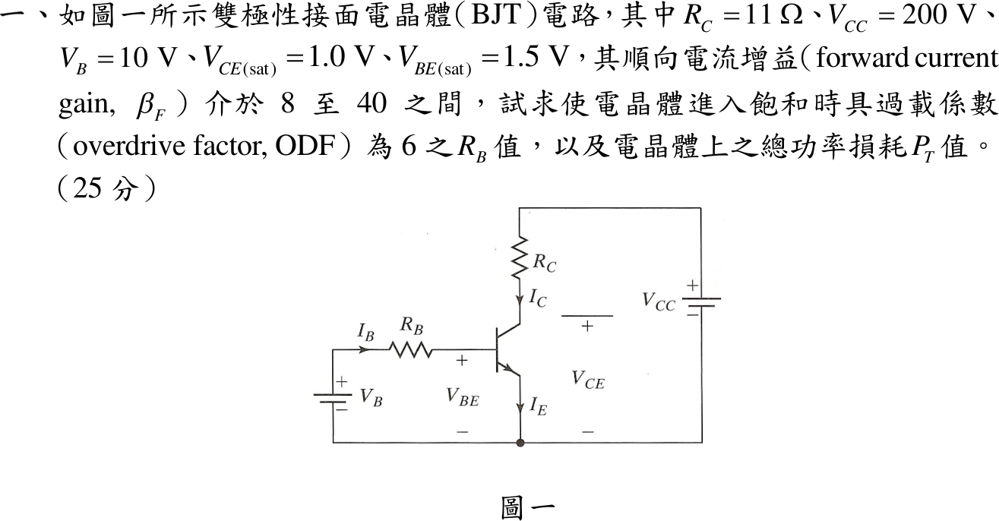
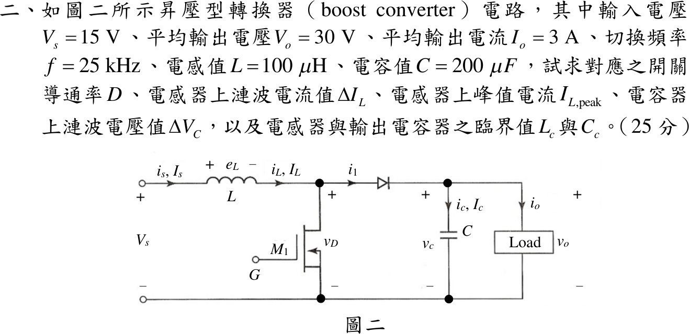
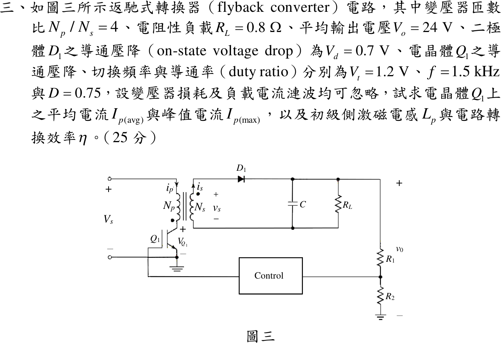
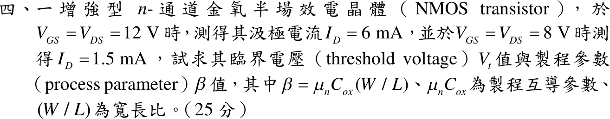

# 109 年電機工程技師｜電子學（包括電力電子學）逐題詳解

> 本頁由題級 canonical 筆記組合；每題保留官方裁切圖、校驗狀態與可追溯的推導。

## 題目導覽
- [[#一、109 年電子學_含電力電子第 1 題|第 1 題：109 年電子學_含電力電子第 1 題]]
- [[#二、109 年電子學_含電力電子第 2 題|第 2 題：109 年電子學_含電力電子第 2 題]]
- [[#三、109 年電子學（含電力電子）第 3 題｜返馳式轉換器|第 3 題：返馳式轉換器]]
- [[#四、109 年電子學_含電力電子第 4 題|第 4 題：109 年電子學_含電力電子第 4 題]]

---

## 一、109 年電子學_含電力電子第 1 題

> 題級識別：EE-109-02-1
> canonical 來源：[[canonical/EE-109-02-1.md]]
> 題級校驗狀態：verified

### 已知與所求

共射開關：$V_B$ 經 $R_B$ 驅動基極，$R_C=11\,\Omega$ 接 $V_{CC}=200\,\mathrm V$；$V_B=10\,\mathrm V$、$V_{CE(sat)}=1.0\,\mathrm V$、$V_{BE(sat)}=1.5\,\mathrm V$，$\beta_F=8\sim40$。求 $\mathrm{ODF}=6$ 時的 $R_B$ 與電晶體總損耗 $P_T$。

### 考場標準作答

#### 基極電阻

飽和集極電流與最劣（$\beta_{F,\min}=8$）臨界基極電流：
\[
I_{CS}=\frac{V_{CC}-V_{CE(sat)}}{R_C}=\frac{199}{11}=18.091\ \mathrm A,\qquad I_{BS}=\frac{I_{CS}}{\beta_{\min}}=2.2614\ \mathrm A
\]
\[
I_B=\mathrm{ODF}\cdot I_{BS}=6\times2.2614=13.568\ \mathrm A
\]
\[
\boxed{R_B=\frac{V_B-V_{BE(sat)}}{I_B}=\frac{8.5}{13.568}=0.6265\ \Omega}
\]

#### 總功率損耗

\[
\boxed{P_T=V_{BE(sat)}I_B+V_{CE(sat)}I_{CS}=1.5(13.568)+1.0(18.091)=38.44\ \mathrm W}
\]

### 驗算

功率平衡：電源供給 $V_{CC}I_{CS}+V_BI_B=3618.18+135.68=3753.86\,\mathrm W$，電阻消耗 $I_{CS}^2R_C+I_B^2R_B=3600.09+115.33=3715.42\,\mathrm W$，差值 $38.44\,\mathrm W=P_T$。強迫增益 $\beta_{forced}=18.091/13.568=1.33<8$，任何 $\beta_F$ 都飽和。

### 失分點

- 取 $\beta_{\max}=40$ 計算 $I_{BS}$，低增益元件會無法飽和（得 $R_B=3.13\,\Omega$）。
- $P_T$ 漏掉基極損耗 $20.35\,\mathrm W$，只答 $18.09\,\mathrm W$。

---

## 二、109 年電子學_含電力電子第 2 題

> 題級識別：EE-109-02-2
> canonical 來源：[[canonical/EE-109-02-2.md]]
> 題級校驗狀態：needs_manual_review
> [!WARNING] 本題仍有官方資料缺口或事件定義歧義；請以 canonical 條件式解答為準。

### 已知與所求

理想 Boost：$V_s=15\,\mathrm V$、$V_o=30\,\mathrm V$、$I_o=3\,\mathrm A$、$f=25\,\mathrm{kHz}$（$T=40\,\mu\mathrm s$）、$L=100\,\mu\mathrm H$、$C=200\,\mu\mathrm F$。求 $D$、$\Delta I_L$、$I_{L,\mathrm{peak}}$、$\Delta V_C$、臨界 $L_c$ 與 $C_c$。

### 考場標準作答

#### 導通率與電感電流

\[
\boxed{D=1-\frac{V_s}{V_o}=0.5},\qquad
\boxed{\Delta I_L=\frac{V_sDT}{L}=\frac{15(0.5)(40\,\mu)}{100\,\mu}=3\ \mathrm A}
\]
\[
I_L=\frac{I_o}{1-D}=6\ \mathrm A,\qquad \boxed{I_{L,\mathrm{peak}}=I_L+\frac{\Delta I_L}{2}=7.5\ \mathrm A}
\]

#### 電容漣波

導通期間電容獨自供應負載：
\[
\boxed{\Delta V_C=\frac{I_oDT}{C}=\frac{3(0.5)(40\,\mu)}{200\,\mu}=0.3\ \mathrm V}
\]

#### 臨界電感

$R=V_o/I_o=10\,\Omega$，CCM／DCM 邊界 $I_L=\Delta I_L/2$：
\[
\frac{V_o}{R(1-D)}=\frac{V_sDT}{2L_c}\Rightarrow\boxed{L_c=\frac{D(1-D)^2R}{2f}=25\ \mu\mathrm H}
\]
$L=100\,\mu\mathrm H>L_c$，$I_{L,\min}=4.5\,\mathrm A>0$，確為 CCM。

#### 臨界電容

臨界電容定義為輸出電容電壓剛好連續的邊界：導通期間電容獨自供應負載，漣波達 $\Delta V_C=2V_o$（電容電壓在週期內降到零）：
\[
\frac{I_oDT}{C_c}=2V_o\Rightarrow\boxed{C_c=\frac{D}{2fR}=\frac{0.5}{2(25\,\mathrm k)(10)}=1\ \mu\mathrm F}
\]
已知 $C=200\,\mu\mathrm F\gg C_c$，輸出電壓連續。

### 驗算

伏秒平衡 $15(0.5)+(15-30)(0.5)=0$；電荷平衡 $3(0.5)(40\,\mu)=0.3(200\,\mu)=60\,\mu\mathrm C$；功率 $15\times6=30\times3=90\,\mathrm W$。邊界回代：$L=L_c$ 時 $I_{L,\min}=6-\frac{15(0.5)(40\,\mu)}{2(25\,\mu)}=0$；$C=C_c$ 時 $\Delta V_C=\frac{3(0.5)(40\,\mu)}{1\,\mu}=60\,\mathrm V=2V_o$。

### 失分點

- 平均電感電流用 $I_o=3\,\mathrm A$，峰值低估為 $4.5\,\mathrm A$；Boost 的 $I_L=I_s=6\,\mathrm A$。
- 臨界電感漏 $(1-D)^2$ 或 $\frac12$。
- 用自己算出的 $0.3\,\mathrm V$ 倒推出已知的 $200\,\mu\mathrm F$ 當臨界值；臨界值是 $\Delta V_C=2V_o$ 的邊界。

### 條件與疑義

- 題面未明寫臨界電容判準，主解採教材定義 $\Delta V_C=2V_o$；若評分改以容許漣波比 $\varepsilon=\Delta V_{C,\text{允許}}/V_o$ 設計，則 $C_c(\varepsilon)=\frac{D}{Rf\varepsilon}=\frac{2\,\mu\mathrm F}{\varepsilon}$。

---

## 三、109 年電子學（含電力電子）第 3 題｜返馳式轉換器

> 題級識別：EE-109-02-3
> canonical 來源：[[canonical/EE-109-02-3.md]]
> 題級校驗狀態：reference_book_verified

### 已知與所求

返馳式轉換器 $N_p/N_s=4$，$R_L=0.8\,\Omega$、$V_o=24\,\mathrm V$、$V_d=0.7\,\mathrm V$、$V_t=1.2\,\mathrm V$、$f=1.5\,\mathrm{kHz}$（$T=666.67\,\mu\mathrm s$）、$D=0.75$；忽略變壓器損耗與負載電流漣波，$V_s$ 未給。求 $I_{p(avg)}$、$I_{p(max)}$、$L_p$、$\eta$。

參考書主解採磁化電流由零開始的 DCM 三角波，且 $I_{p(avg)}$ 指整個週期平均。

### 考場標準作答

#### 負載與輸入電壓

\[
I_o=\frac{24}{0.8}=30\ \mathrm A,\qquad P_o=720\ \mathrm W
\]
一次側伏秒平衡：
\[
(V_s-V_t)D=\frac{N_p}{N_s}(V_o+V_d)(1-D)\Rightarrow V_s-V_t=\frac{4(24.7)(0.25)}{0.75}=32.933\ \mathrm V,\quad V_s=34.133\ \mathrm V
\]

#### 峰值電流

二次側三角波在 $(1-D)T$ 內由峰值降到零，平均等於 $I_o$：
\[
I_o=\tfrac12I_{s(max)}(1-D)\Rightarrow I_{s(max)}=240\ \mathrm A,\qquad
\boxed{I_{p(max)}=\frac{N_s}{N_p}I_{s(max)}=60\text{ A}}
\]

#### 平均電流

導通區間平均 $I_{p,\,avg\mid on}=\frac{I_{p(max)}}2=30\,\mathrm A$；整個週期平均
\[
\boxed{I_{p,\,avg}=D\,I_{p,\,avg\mid on}=0.75\times30=22.5\ \mathrm A}
\]

#### 激磁電感

\[
\boxed{L_p=\frac{(V_s-V_t)DT}{I_{p(max)}}=\frac{32.933\times500\,\mu\mathrm s}{60}=274.4\ \mu\text{H}}
\]

#### 效率

\[
\boxed{\eta=\frac{P_o}{V_sI_{p,\,avg}}=\frac{720}{34.133\times22.5}=\frac{720}{768}=93.75\%}
\]

### 驗算

- 能量法：每週期傳送 $\frac12L_pI_{p(max)}^2f=\frac12(274.4\,\mu)(60^2)(1500)=741\,\mathrm W=(V_o+V_d)I_o$。
- 退磁時間 $t_{demag}=\frac{L_pI_{p(max)}}{(N_p/N_s)(V_o+V_d)}=\frac{274.4\,\mu\times60}{98.8}=166.67\,\mu\mathrm s=(1-D)T$，電流恰在週期結束歸零。
- 損耗分帳：$V_tI_{p,avg}+V_dI_o=27+21=48\,\mathrm W=768-720$。

### 失分點

- 用導通區間平均 $30\,\mathrm A$ 乘 $V_s$，輸入功率多算成 $1024\,\mathrm W$。
- 二次側三角波只在 $(1-D)T=0.25T$ 內導通，誤用 $D$ 會得 $I_{p(max)}=20\,\mathrm A$。
- 反射電壓要含二極體壓降：$4(24+0.7)=98.8\,\mathrm V$。

### 條件與疑義

題圖未明示 CCM/DCM，也未定義 $I_{p(avg)}$ 是導通區間平均或整個週期平均；另須區分 $I_{p,avg\mid on}=I_{p(max)}/2$ 與 $I_{p,avg}=D\,I_{p,avg\mid on}$ 兩種定義。由 $t_{demag}=t_{off}$，參考書數值恰落在 DCM／臨界導通模式（CrCM）邊界。

$V_s$、$I_{p,avg}=22.5\,\mathrm A$ 與 $\eta=93.75\%$ 只由平均功率與伏秒平衡決定，CCM 下也相同；若實為 CCM，初級電流有未給定的谷值 $I_{p,valley}>0$，$I_{p(max)}$ 與 $L_p$ 須另給谷值或波形才能唯一決定。

---

## 四、109 年電子學_含電力電子第 4 題

> 題級識別：EE-109-02-4
> canonical 來源：[[canonical/EE-109-02-4.md]]
> 題級校驗狀態：verified

### 已知與所求

增強型 NMOS：$V_{GS}=V_{DS}=12\,\mathrm V$ 時 $I_D=6\,\mathrm{mA}$；$V_{GS}=V_{DS}=8\,\mathrm V$ 時 $I_D=1.5\,\mathrm{mA}$。$\beta=\mu_nC_{ox}(W/L)$。求 $V_t$ 與 $\beta$。

### 考場標準作答

$V_{DS}=V_{GS}>V_{GS}-V_t$，兩點皆在飽和區，$I_D=\frac{\beta}{2}(V_{GS}-V_t)^2$。兩式相除：
\[
\left(\frac{12-V_t}{8-V_t}\right)^2=\frac{6}{1.5}=4\Rightarrow\frac{12-V_t}{8-V_t}=2\Rightarrow\boxed{V_t=4\ \mathrm V}
\]
（取負根 $-2$ 得 $V_t=9.33\,\mathrm V>8\,\mathrm V$，第二點會截止，捨去。）
\[
\boxed{\beta=\frac{2I_D}{(V_{GS}-V_t)^2}=\frac{2(1.5\,\mathrm{mA})}{4^2}=0.1875\ \mathrm{mA/V^2}=187.5\ \mu\mathrm{A/V^2}}
\]

### 驗算

以另一點回代：$\frac12(0.1875\,\mathrm m)(12-4)^2=6.000\,\mathrm{mA}$，與量測一致；兩點 $V_{DS}-(V_{GS}-V_t)=V_t=4\,\mathrm V>0$，飽和假設成立。

### 失分點

- 題目定義 $\beta=\mu_nC_{ox}(W/L)$，電流式要帶 $\frac12$；寫成 $I_D=\beta(V_{GS}-V_t)^2$ 會得 $93.75\,\mu\mathrm{A/V^2}$。
- 開根號未排除 $V_t=9.33\,\mathrm V$ 的增根。

---
