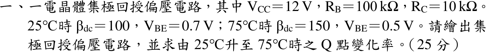
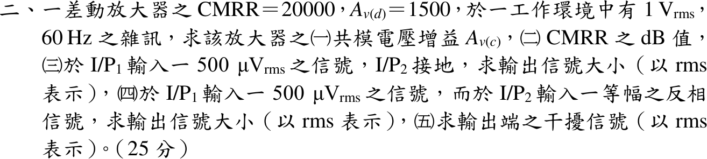
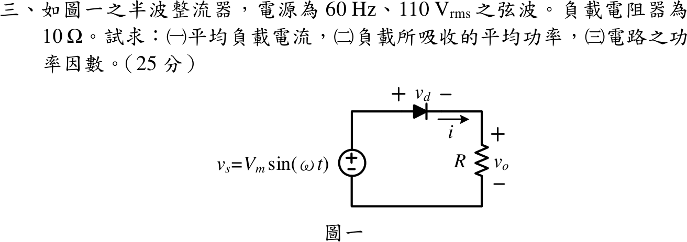
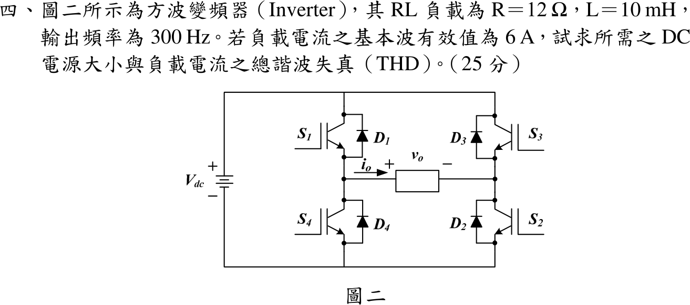

# 📝 110 年電機工程技師｜電子學（包括電力電子學）逐題詳解

> 本頁由題級 canonical 筆記組合；每題保留官方裁切圖、校驗狀態與可追溯的推導。

## 題目導覽
- [[#一、110 年電子學_含電力電子第 1 題|第 1 題：110 年電子學_含電力電子第 1 題]]
- [[#二、110 年電子學_含電力電子第 2 題|第 2 題：110 年電子學_含電力電子第 2 題]]
- [[#三、110 年電子學_含電力電子第 3 題｜半波整流器|第 3 題：半波整流器]]
- [[#四、110 年電子學_含電力電子第 4 題|第 4 題：110 年電子學_含電力電子第 4 題]]

---

## 一、110 年電子學_含電力電子第 1 題

> 題級識別：EE-110-02-1
> canonical 來源：[[canonical/EE-110-02-1.md]]
> 題級校驗狀態：verified

### 已知與所求

$V_{CC}=12\,\mathrm V$、$R_B=100\,\mathrm{k}\Omega$、$R_C=10\,\mathrm{k}\Omega$；$25^\circ\mathrm C$：$\beta_{dc}=100$、$V_{BE}=0.7\,\mathrm V$；$75^\circ\mathrm C$：$\beta_{dc}=150$、$V_{BE}=0.5\,\mathrm V$。繪出集極回授偏壓電路，求 $25\to75^\circ\mathrm C$ 的 Q 點變化率。

### 考場標準作答

#### 電路

NPN 射極接地；$R_C$ 由 $V_{CC}$ 接到集極 C；$R_B$ 由集極 C 接回基極 B（無其他基極偏壓源）。$R_C$ 流過 $I_C+I_B$。

#### 工作點通式

集極迴路 $V_{CC}=(I_C+I_B)R_C+V_{CE}$，基極迴路 $V_{CE}=I_BR_B+V_{BE}$：
\[
I_B=\frac{V_{CC}-V_{BE}}{R_B+(\beta+1)R_C},\qquad I_C=\beta I_B,\qquad V_{CE}=I_BR_B+V_{BE}
\]

#### 兩溫度 Q 點

\[
25^\circ\mathrm C:\ I_B=\frac{11.3}{1110\,\mathrm k}=10.180\,\mu\mathrm A,\quad I_C=1.0180\,\mathrm{mA},\quad V_{CE}=1.0180+0.7=1.7180\,\mathrm V
\]
\[
75^\circ\mathrm C:\ I_B=\frac{11.5}{1610\,\mathrm k}=7.1429\,\mu\mathrm A,\quad I_C=1.0714\,\mathrm{mA},\quad V_{CE}=0.7143+0.5=1.2143\,\mathrm V
\]

#### Q 點變化率

\[
\boxed{\frac{\Delta I_C}{I_C}=\frac{1.0714-1.0180}{1.0180}=+5.25\%},\qquad
\boxed{\frac{\Delta V_{CE}}{V_{CE}}=\frac{1.2143-1.7180}{1.7180}=-29.32\%}
\]
$\beta$ 增 50% 而 $I_C$ 只增 5.25%，集極回授有穩定作用；兩點 $V_{CE}>0.2\,\mathrm V$，仍在主動區。

### 驗算

集極迴路回代：$25^\circ\mathrm C$ 時 $(1.0180+0.0102)\,\mathrm{mA}\times10\,\mathrm k+1.7180=12.000\,\mathrm V$；$75^\circ\mathrm C$ 時 $(1.0714+0.0071)\times10+1.2143=12.000\,\mathrm V$。

### 失分點

- $R_C$ 上的電流寫成 $I_C$（漏 $I_B$），分母變 $R_B+\beta R_C$，得 $I_C=1.027\to1.078\,\mathrm{mA}$、變化率 4.95%。
- $V_{CE}$ 由 $V_{CC}-I_CR_C$ 計算而漏掉 $I_BR_C$，$25^\circ\mathrm C$ 會得 $1.82\,\mathrm V$。
- 只算 $I_C$ 變化率而漏了 $V_{CE}$；Q 點是 $(I_C,V_{CE})$ 兩個量。

---

## 二、110 年電子學_含電力電子第 2 題

> 題級識別：EE-110-02-2
> canonical 來源：[[canonical/EE-110-02-2.md]]
> 題級校驗狀態：verified

### 已知與所求

$\mathrm{CMRR}=20000$、$A_{v(d)}=1500$，環境有 $1\,\mathrm V_{rms}$、$60\,\mathrm{Hz}$ 雜訊（兩輸入端共模耦合）。求（一）$A_{v(c)}$；（二）CMRR 的 dB 值；（三）$I/P_1$ 加 $500\,\mu\mathrm V_{rms}$、$I/P_2$ 接地的輸出；（四）$I/P_1$、$I/P_2$ 加等幅反相 $500\,\mu\mathrm V_{rms}$ 的輸出；（五）輸出端干擾。

### 考場標準作答

輸出通式 $v_o=A_{v(d)}v_d+A_{v(c)}v_{cm}$，$v_d=v_1-v_2$，$v_{cm}=\frac{v_1+v_2}2$。

#### （一）共模增益

\[
\boxed{A_{v(c)}=\frac{A_{v(d)}}{\mathrm{CMRR}}=\frac{1500}{20000}=0.075}
\]

#### （二）CMRR（dB）

\[
\boxed{20\log_{10}20000=86.02\ \mathrm{dB}}
\]

#### （三）單端輸入

$v_d=500\,\mu\mathrm V$、$v_{cm}=250\,\mu\mathrm V$：
\[
v_o=1500(500\,\mu)+0.075(250\,\mu)=0.75+0.0000188\ \mathrm V\Rightarrow\boxed{v_o\approx0.75\ \mathrm V_{rms}}
\]

#### （四）等幅反相輸入

$v_d=1\,\mathrm{mV}$、$v_{cm}=0$：
\[
\boxed{v_o=1500\times1\,\mathrm{mV}=1.5\ \mathrm V_{rms}}
\]

#### （五）輸出干擾

雜訊同時出現在兩輸入，為純共模：
\[
\boxed{v_{o,n}=A_{v(c)}\times1\,\mathrm V=0.075\ \mathrm V_{rms}=75\ \mathrm{mV_{rms}}}
\]

### 驗算

以單端增益拆解（四）：只加 $v_1$ 得 $0.75\,\mathrm V$，只加 $-v_1$ 於 $I/P_2$ 又得同相 $0.75\,\mathrm V$，疊加為 $1.5\,\mathrm V$，與 $v_d=1\,\mathrm{mV}$ 一致。訊號對干擾比：（四）$1.5/0.075=20$ 倍，等於 $\mathrm{CMRR}\times\frac{1\,\mathrm{mV}}{1\,\mathrm V}=20$。

### 失分點

- （三）的差模輸入是 $500\,\mu\mathrm V$ 而非 $250\,\mu\mathrm V$；$250\,\mu\mathrm V$ 是共模成分。
- （四）兩端反相，$v_d=1\,\mathrm{mV}$，輸出加倍為 $1.5\,\mathrm V$，不是 $0.75\,\mathrm V$。
- CMRR 換 dB 用 $20\log$（電壓比），用 $10\log$ 會得 43.01 dB。

---

## 三、110 年電子學_含電力電子第 3 題｜半波整流器

> 題級識別：EE-110-02-3
> canonical 來源：[[canonical/EE-110-02-3.md]]
> 題級校驗狀態：verified

### 已知與所求

單一二極體半波整流，$v_s=V_m\sin\omega t$，$110\,\mathrm V_{rms}$、$60\,\mathrm{Hz}$（$V_m=110\sqrt2=155.56\,\mathrm V$），純電阻負載 $R=10\,\Omega$；題面未給二極體壓降，取理想二極體。求（一）平均負載電流；（二）負載平均功率；（三）功率因數。

### 考場標準作答

令 $\theta=\omega t$：
\[
v_o(\theta)=\begin{cases}V_m\sin\theta,&0<\theta<\pi\\0,&\pi<\theta<2\pi\end{cases},\qquad i_s(\theta)=i_L(\theta)=v_o(\theta)/R
\]
純電阻負載，負半週負載與電源電流都為零（無續流路徑）。

#### （一）平均負載電流

\[
\boxed{I_{avg}=\frac{V_m}{\pi R}=\frac{155.56}{10\pi}=4.952\ \mathrm A}
\]

#### （二）負載平均功率

$I_{rms}=\frac{V_m}{2R}=7.778\,\mathrm A$：
\[
\boxed{P=I_{rms}^2R=\frac{V_m^2}{4R}=605\ \mathrm W}
\]

#### （三）功率因數

電源電流即負載電流，$I_{s,rms}=7.778\,\mathrm A$：
\[
\boxed{\mathrm{PF}=\frac{P}{V_{s,rms}I_{s,rms}}=\frac{605}{110\times7.778}=\frac1{\sqrt2}=0.7071}
\]
此為非正弦電流的總功率因數（含失真），不標超前或落後。

### 驗算

傅立葉功率和：$v_o=\frac{V_m}{\pi}+\frac{V_m}{2}\sin\theta-\sum_{n=2,4,\ldots}\frac{2V_m}{\pi(n^2-1)}\cos n\theta$，
$P=\frac{(49.517)^2}{10}+\frac{(77.782)^2}{2\cdot10}+\cdots=245.2+302.5+57.3=605\,\mathrm W$（偶次諧波合計 $57.3\,\mathrm W$），與 rms 積分一致。

### 失分點

- 用 $I_{avg}^2R=245.2\,\mathrm W$ 當功率；非直流波形必須用 rms。
- 純電阻就答 PF $=1$；半波電流的失真使 PF 只有 $0.7071$。
- 把 $110\,\mathrm V$ 當峰值，得 $I_{avg}=3.50\,\mathrm A$。

---

## 四、110 年電子學_含電力電子第 4 題

> 題級識別：EE-110-02-4
> canonical 來源：[[canonical/EE-110-02-4.md]]
> 題級校驗狀態：verified

### 已知與所求

全橋方波逆變器（$S_1S_2$ 與 $S_3S_4$ 交替導通，$v_o=\pm V_{dc}$），RL 負載 $R=12\,\Omega$、$L=10\,\mathrm{mH}$，$f=300\,\mathrm{Hz}$，負載電流基本波有效值 $I_{1}=6\,\mathrm A$。求 $V_{dc}$ 與負載電流 THD。

### 考場標準作答

#### 所需直流電源

方波傅立葉級數 $v_o=\sum_{n\ \mathrm{odd}}\frac{4V_{dc}}{n\pi}\sin n\omega t$，$\omega=600\pi=1885.0\,\mathrm{rad/s}$，$X_1=\omega L=18.850\,\Omega$：
\[
|Z_1|=\sqrt{12^2+18.850^2}=22.345\ \Omega,\qquad V_{1,rms}=6\times22.345=134.07\ \mathrm V
\]
\[
\boxed{V_{dc}=\frac{\pi\sqrt2}{4}V_{1,rms}=1.1107\times134.07=148.92\ \mathrm V}
\]

#### 電流 THD

$I_{n,rms}=\dfrac{V_{1,rms}/n}{\sqrt{R^2+(nX_1)^2}}$：
\[
I_3=\frac{44.69}{57.81}=0.7731\ \mathrm A,\quad I_5=\frac{26.81}{95.01}=0.2822\ \mathrm A,\quad I_7=\frac{19.15}{132.5}=0.1446\ \mathrm A,\ \ldots
\]
\[
\sqrt{\textstyle\sum_{n\ge3}I_n^2}=0.8451\ \mathrm A\Rightarrow
\boxed{\mathrm{THD}_i=\frac{0.8451}{6}=14.08\%}
\]
只取 $n=3,5,7$ 得 $0.8356\,\mathrm A$、13.93%；高次項貢獻小但不為零。

### 驗算

時域精確解：半週期內 $i=\frac{V_{dc}}{R}+\left(-I_{max}-\frac{V_{dc}}{R}\right)e^{-t/\tau}$，$\tau=L/R=0.8333\,\mathrm{ms}$，由半波對稱 $i(T/2)=I_{max}$ 得 $I_{max}=\frac{V_{dc}}{R}\frac{1-e^{-T/2\tau}}{1+e^{-T/2\tau}}=9.451\,\mathrm A$。積分得 $I_{rms}=6.0592\,\mathrm A$，
$\mathrm{THD}=\sqrt{6.0592^2-6^2}/6=14.08\%$，與諧波和一致。

### 失分點

- 基本波有效值是 $\frac{4V_{dc}}{\sqrt2\pi}=0.9003V_{dc}$，漏 $\sqrt2$ 會得 $V_{dc}=105.3\,\mathrm V$。
- 諧波阻抗要用 $nX_1$，不能沿用 $|Z_1|$；否則 $I_n=I_1/n$，THD 變成電壓的 48.3%。
- THD 分母是基本波 $6\,\mathrm A$，不是總有效值。

---
