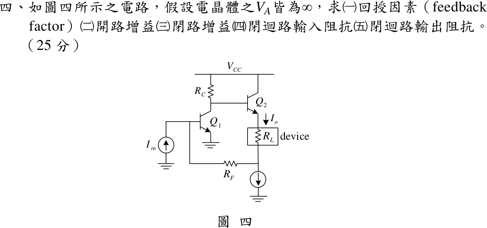

# 111 年電機工程技師｜電子學（包括電力電子學）逐題詳解

> 本頁由題級 canonical 筆記組合；每題保留官方裁切圖、校驗狀態與可追溯的推導。

## 題目導覽
- [[#一、111 年第 1 題｜全波橋式整流器傅立葉分析|第 1 題：全波橋式整流器傅立葉分析]]
- [[#二、111 年電子學第 2 題｜SEPIC 轉換器元件設計|第 2 題：SEPIC 轉換器元件設計]]
- [[#三、111 年電子學第 3 題：MOSFET 源極退化放大器|第 3 題：111 年電子學第 3 題：MOSFET 源極退化放大器]]
- [[#四、111 年電子學第 4 題：並聯—串聯電流回授放大器|第 4 題：111 年電子學第 4 題：並聯—串聯電流回授放大器]]

---

## 一、111 年第 1 題｜全波橋式整流器傅立葉分析

> 題級識別：EE-111-02-1
> canonical 來源：[[canonical/EE-111-02-1.md]]
> 題級校驗狀態：verified

### 已知與所求

理想二極體橋式整流，$v_s=V_m\sin\omega t$，$V_m=100\,\mathrm V$、$f=60\,\mathrm{Hz}$（$\omega=376.991\,\mathrm{rad/s}$），負載串聯 $R=10\,\Omega$、$L=12\,\mathrm{mH}$。題給 $v_o=V_o+\sum_{n=2,4,\ldots}V_n\cos(n\omega t+\pi)$，$V_n=V_o\left(\frac1{n-1}-\frac1{n+1}\right)=\frac{2V_o}{n^2-1}$。求（一）$V_o$；（二）$I_2,I_4$；（三）負載功率；（四）功率因數。

### 考場標準作答

#### （一）直流輸出電壓

\[
\boxed{V_o=\frac{2V_m}{\pi}=63.662\ \mathrm V},\qquad I_0=\frac{V_o}{R}=6.3662\ \mathrm A
\]

#### （二）最初兩個交流項電流（振幅）

\[
V_2=\tfrac23V_o=42.441\ \mathrm V,\quad |Z_2|=\sqrt{10^2+(2\omega L)^2}=\sqrt{10^2+9.0478^2}=13.486\ \Omega
\Rightarrow \boxed{I_2=3.147\ \mathrm A}
\]
\[
V_4=\tfrac2{15}V_o=8.4883\ \mathrm V,\quad |Z_4|=\sqrt{10^2+18.096^2}=20.675\ \Omega
\Rightarrow \boxed{I_4=0.4106\ \mathrm A}
\]

#### （三）負載消耗功率

電感不耗實功，只算 $R$；各諧波正交：
\[
I_{rms}^2=I_0^2+\frac{I_2^2+I_4^2}{2}+\cdots=40.528+4.952+0.084+\cdots=45.575\ \mathrm{A^2}
\]
\[
\boxed{P=I_{rms}^2R=455.75\ \mathrm W}
\]
只取 $n=0,2,4$ 得 $455.65\,\mathrm W$，與完整級數差 0.02%，考場可用。

#### （四）功率因數

橋式整流只改變電流方向，$I_{s,rms}=I_{rms}=6.7509\,\mathrm A$：
\[
\boxed{\mathrm{PF}=\frac{P}{V_{s,rms}I_{s,rms}}=\frac{455.75}{70.711\times6.7509}=0.9547}
\]

### 驗算

時域法：半週期內 $i(\theta)=\frac{V_m}{|Z_1|}\sin(\theta-\phi)+Ke^{-\theta R/(\omega L)}$，以週期條件 $i(0)=i(\pi)$ 定 $K$，得 $i(0)=i_{\min}>0$（連續導通，$v_o$ 確為全波正弦），積分 $\frac1\pi\int_0^\pi i^2d\theta=45.575\,\mathrm{A^2}$，與傅立葉功率和一致。另 $(10+j9.0478)\tilde I_2=-42.441$ 回到題給相位 $\pi$ 的諧波電壓。

### 失分點

- $I_2,I_4$ 是振幅，功率要再除以 2（或先換有效值）；直接 $I_0^2+I_2^2+I_4^2$ 會高估。
- 功率因數分母要用電源電流有效值 $6.751\,\mathrm A$，不是 $I_0=6.366\,\mathrm A$。
- 阻抗要用 $n\omega L$，誤用基頻 $\omega L=4.52\,\Omega$ 會使 $I_2$ 偏大。

---

## 二、111 年電子學第 2 題｜SEPIC 轉換器元件設計

> 題級識別：EE-111-02-2
> canonical 來源：[[canonical/EE-111-02-2.md]]
> 題級校驗狀態：verified

### 已知與所求

SEPIC：$V_{in}=15\,\mathrm V$、$V_o=6\,\mathrm V$、$R=2\,\Omega$、$f=250\,\mathrm{kHz}$（$T=4\,\mu\mathrm s$）。求（一）$L_1,L_2$ 使各自電感電流峰對峰變化為其平均值的 40%；（二）$C_1,C_2$ 使電容電壓變化為 $V_o$ 的 2%（$0.12\,\mathrm V$）。

### 考場標準作答

#### 工作點

\[
\frac{V_o}{V_{in}}=\frac{D}{1-D}\Rightarrow D=\frac{6}{21}=\frac27,\qquad V_{C1}=V_{in}=15\ \mathrm V
\]
\[
I_o=\frac{V_o}{R}=3\ \mathrm A,\qquad I_{L1}=I_{in}=\frac{V_oI_o}{V_{in}}=1.2\ \mathrm A,\qquad I_{L2}=I_o=3\ \mathrm A
\]

#### （一）電感

開關導通時 $L_1$ 承受 $V_{in}$、$L_2$ 承受 $V_{C1}=V_{in}$，$\Delta i_L=\frac{V_{in}DT}{L}$，$V_{in}DT=17.143\,\mu\mathrm{V\cdot s}$：
\[
\boxed{L_1=\frac{17.143\,\mu}{0.4\times1.2}=35.71\ \mu\mathrm H},\qquad
\boxed{L_2=\frac{17.143\,\mu}{0.4\times3}=14.29\ \mu\mathrm H}
\]

#### （二）電容

導通期間 $C_1$ 放出 $I_{L2}$、$C_2$ 獨自供應 $I_o$，兩者都是 $3\,\mathrm A$ 持續 $DT$：
\[
C=\frac{I\,DT}{\Delta V_C}=\frac{3\times\frac27\times4\,\mu}{0.12}
\Rightarrow\boxed{C_1=28.57\ \mu\mathrm F},\qquad \boxed{C_2=28.57\ \mu\mathrm F}
\]

### 驗算

截止期間核對電荷平衡：$C_1$ 吸收 $I_{L1}(1-D)T=1.2\times\frac57\times4\,\mu=3.429\,\mu\mathrm C$，等於導通期間放出的 $I_{L2}DT=3\times\frac27\times4\,\mu=3.429\,\mu\mathrm C$，故 $\Delta V_{C1}=3.429\,\mu/28.57\,\mu=0.12\,\mathrm V$。功率守恆 $15\times1.2=6\times3=18\,\mathrm W$。

### 失分點

- $C_1$ 的轉移電荷用 $I_{L2}=3\,\mathrm A$（或截止期間的 $I_{L1}$ 配 $1-D$）；用 $I_{in}=1.2\,\mathrm A$ 配 $D$ 會得 $11.43\,\mu\mathrm F$。
- $L_2$ 的平均電流是 $I_o=3\,\mathrm A$，不是 $I_{in}$。
- SEPIC 增益為 $D/(1-D)$，誤用 Boost 的 $1/(1-D)$ 會得負的 $D$。

---

## 三、111 年電子學第 3 題：MOSFET 源極退化放大器

> 題級識別：EE-111-02-3
> canonical 來源：[[canonical/EE-111-02-3.md]]
> 題級校驗狀態：reference_book_verified

### 已知與所求

$\mu_nC_{ox}=200\,\mu\mathrm{A/V^2}$、$\lambda=0$、$V_{TH}=0.4\,\mathrm V$、$|A_v|=5\,\mathrm{V/V}$、$I_{DS}=3.17\,\mathrm{mA}$、$I_{R1}=0.167\,\mathrm{mA}$、$R_S=30\,\Omega$、$R_D=200\,\Omega$、$V_{DD}=1.8\,\mathrm V$；$R_1$–$R_2$ 閘極分壓，輸入經電容耦合；跨 $R_S$ 電壓等於過驅電壓。求（一）$g_m$；（二）$W/L$；（三）$R_1,R_2$。

題面資料互相矛盾：$V_{OV}=I_DR_S$ 加上平方律必得 $g_m=2I_D/V_{OV}=2/R_S$，與指定增益 5 不相容，故 $g_m$、$W/L$ 以雙分支作答。

### 考場標準作答

#### 偏壓量

\[
V_{OV}=V_S=I_DR_S=3.17\,\mathrm{mA}\times30\,\Omega=0.0951\ \mathrm V,\qquad
V_G=V_{TH}+V_{OV}+V_S=0.5902\ \mathrm V
\]
$V_{DS}=1.8-3.17\,\mathrm{mA}\times230\,\Omega=1.0709\,\mathrm V>V_{OV}$，飽和成立。

#### （一）$g_m$

增益分支（以題給 $|A_v|=5$ 為準）：
\[
\frac{g_mR_D}{1+g_mR_S}=5\Rightarrow g_m=\frac{5}{R_D-5R_S}=\frac{5}{50}
\Rightarrow\boxed{g_m=0.1\ \mathrm S}
\]
平方律分支（以 $I_D$ 與 $V_{OV}$ 為準）：
\[
\boxed{g_m=\frac{2I_D}{V_{OV}}=\frac{2}{R_S}=0.0666667\ \mathrm S},\qquad |A_v|=\frac{0.0666667\times200}{1+0.0666667\times30}=4.444444\neq5
\]

#### （二）$W/L$

由 $g_m=\mu_nC_{ox}(W/L)V_{OV}$，$\mu_nC_{ox}V_{OV}=1.902\times10^{-5}\,\mathrm{A/V^2}$：
\[
\text{增益分支：}\boxed{\frac WL=\frac{0.1}{1.902\times10^{-5}}=5257.624},\qquad
\text{平方律分支：}\boxed{\frac WL=\frac{2I_D}{\mu_nC_{ox}V_{OV}^2}=3505.082}
\]

#### （三）$R_1,R_2$

閘極無直流電流，$I_{R2}=I_{R1}=0.167\,\mathrm{mA}$，兩分支相同：
\[
\boxed{R_1=\frac{1.8-0.5902}{0.167\,\mathrm{mA}}=7.244\ \mathrm{k}\Omega},\qquad
\boxed{R_2=\frac{0.5902}{0.167\,\mathrm{mA}}=3.534\ \mathrm{k}\Omega}
\]

### 驗算

- 增益分支回代：$\frac{0.1\times200}{1+0.1\times30}=\frac{20}{4}=5$。
- 平方律分支以另一式 $g_m=\sqrt{2\mu_nC_{ox}(W/L)I_D}=\sqrt{2(200\,\mu)(3505.082)(3.17\,\mathrm m)}=0.0666667\,\mathrm S$，與 $2I_D/V_{OV}$ 一致。
- KVL：$0.167\,\mathrm{mA}\times(7.244+3.534)\,\mathrm{k}\Omega=1.800\,\mathrm V=V_{DD}$。

### 失分點

- $V_G$ 要加兩次 $V_{OV}$（$V_{GS}=V_{TH}+V_{OV}$ 再加 $V_S=V_{OV}$），只加一次會得 $R_2=2.964\,\mathrm{k}\Omega$。
- 源極未旁路，增益分母必有 $1+g_mR_S$；寫成 $g_mR_D=5$ 會得 $g_m=25\,\mathrm{mS}$。
- 只寫其中一個 $g_m$ 而不說明另一條件不成立，會被視為忽略題給數據。

### 條件與疑義

**雙分支來源。**參考書主解列 $g_m=1\,\mathrm{mS}$、$W/L=3522.2$、$R_2=3.3185\,\mathrm{k}\Omega$、$R_1=7.459\,\mathrm{k}\Omega$；但 $g_m=1\,\mathrm{mS}$ 代入其增益式只得 $\frac{200}{1030}=0.1942$，應為排印或計算錯誤，且其 $R_1,R_2$ 來自把 $V_{GS}=0.4951\,\mathrm V$ 誤排為 $0.4591\,\mathrm V$。

**最小更正候選。**矛盾無法靠改 $I_D$ 消除（$g_m=2/R_S$ 與 $I_D$ 無關），只有兩種單點更正：

- 增益改為 $4.444444$：即上方平方律分支。
- 保留 $|A_v|=5$、改 $R_S$：$5=\frac{(2/R_S)R_D}{3}\Rightarrow R_S=26.666667\,\Omega$、$g_m=0.075\,\mathrm S$、$V_{OV}=0.0845333\,\mathrm V$、$W/L=4436.120$，$R_1=7.370858\,\mathrm{k}\Omega$、$R_2=3.407585\,\mathrm{k}\Omega$。

---

## 四、111 年電子學第 4 題：並聯—串聯電流回授放大器

> 題級識別：EE-111-02-4
> canonical 來源：[[canonical/EE-111-02-4.md]]
> 題級校驗狀態：needs_manual_review
> [!WARNING] 本題仍有官方資料缺口或事件定義歧義；請以 canonical 條件式解答為準。

### 已知與所求

$I_{in}$ 注入 $Q_1$ 基極；$Q_1$ 共射，集極經 $R_C$ 接 $V_{CC}$ 並驅動 $Q_2$ 基極；$Q_2$ 射極電流 $I_o$ 向下流過負載 $R_L$（device）到節點 $x$，$x$ 經 $R_F$ 接回 $Q_1$ 基極，另以理想電流源接地（交流開路）。$V_A=\infty$（$r_o=\infty$），題面無數值。以 $\beta_T$ 表 $Q_2$ 電流增益、$\beta_f$ 表回授因素。求（一）回授因素；（二）開路增益；（三）閉路增益；（四）閉迴路輸入阻抗；（五）閉迴路輸出阻抗。

### 考場標準作答

**型態：**輸入端是電流並聯混合，輸出端是電流串聯取樣，屬並聯-串聯（Shunt-Series）／電流-電流（Current-Current Feedback）負回授，以 g 參數二埠分析；回授網路為 $R_F$，埠 1 為 $Q_1$ 基極、埠 2 為節點 $x$。

#### （一）回授因素

令 $I_f$ 為由輸入節點經 $R_F$ 流出的電流（誤差電流 $I_{in}-I_f$）。偏壓電流源交流開路，$x$ 點 KCL 使 $I_o$ 全部經 $R_F$ 流入輸入節點，即 $I_f=-I_o$：
\[
\boxed{\beta_f=\frac{I_f}{I_o}=-1}
\]

#### （二）開路增益

負載效應：$g_{11}=I_1/V_1|_{I_2=0}=0$（$x$ 端開路時 $R_F$ 無電流），輸入端不加負載，$R_{iA}=r_{\pi1}$；$g_{22}=R_F$ 串入輸出迴路。$Q_2$ 基極看入 $r_{\pi2}+(1+\beta_T)(R_L+R_F)$，$Q_1$ 集極電流在 $R_C$ 與它之間分流：
\[
\boxed{A=\frac{I_o}{I_{in}}=-\frac{g_{m1}r_{\pi1}(1+\beta_T)R_C}{R_C+r_{\pi2}+(1+\beta_T)(R_L+R_F)}}
\]
$A<0$、$\beta_f<0$，迴路增益 $A\beta_f=|A|>0$，確為負回授。

#### （三）閉路增益

\[
\boxed{A_f=\frac{A}{1+A\beta_f}=\frac{A}{1+|A|}}\approx\frac1{\beta_f}=-1\quad(|A|\gg1)
\]

#### （四）閉迴路輸入阻抗

並聯混合使輸入阻抗降低：
\[
\boxed{R_{if}=\frac{R_{iA}}{1+A\beta_f}=\frac{r_{\pi1}}{1+|A|}}
\]

#### （五）閉迴路輸出阻抗

串聯取樣使輸出阻抗提高，$R_{oA}=R_L+R_F+\frac{R_C+r_{\pi2}}{1+\beta_T}$：
\[
\boxed{R_{of}=R_{oA}(1+A\beta_f)=R_L+R_F+\frac{R_C+r_{\pi2}}{1+\beta_T}+g_{m1}r_{\pi1}R_C}
\]
（$R_{oA}|A|=g_{m1}r_{\pi1}R_C$，因 $A$ 的分母正是 $(1+\beta_T)R_{oA}$。）

### 驗算

精確節點分析（不做二埠近似）：基極 KCL $v_b/r_{\pi1}=I_{in}-I_f$，$x$ 點 $I_f=-I_o$，解得
\[
\frac{I_o}{I_{in}}=\frac{-r_{\pi1}(1+\beta_T)(1+g_{m1}R_C)}{r_{\pi1}(1+\beta_T)(1+g_{m1}R_C)+R_C+r_{\pi2}+(1+\beta_T)(R_L+R_F)}
\]
與（三）只差 $R_F$ 的前饋項，$g_{m1}\to\infty$ 時同趨於 $-1$。精確輸入電阻 $R_{in}=R_{if}\parallel R_{oA}$（前饋路徑經 $R_F$、$R_L$ 進 $Q_2$），相對差約 $1/(g_{m1}R_C)$；負載看入的精確輸出電阻為 $R_F+\frac{R_C+r_{\pi2}}{1+\beta_T}+g_{m1}r_{\pi1}R_C+r_{\pi1}$，即（五）去掉 $R_L$ 後再加前饋項 $r_{\pi1}$。

### 失分點

- 把型態判成串聯-並聯（電壓）回授；本題輸入是電流源、取樣量是負載電流。
- 把 $R_F$ 當成輸入端對地負載（$R_F\parallel r_{\pi1}$）；$x$ 端只接交流開路的電流源，$g_{11}=0$。
- 偏壓電流源當交流短路，會讓 $I_o$ 分流到地而得 $|\beta_f|<1$。

### 條件與疑義

參考書取 $I_f$ 流入輸入節點，寫 $\beta_f=\frac{I_f}{I_o}=1$，並以 $R_{iA}=R_F\parallel r_{\pi1}$ 作輸入負載：$A=-(R_F\parallel r_{\pi1})g_{m1}\frac{(1+\beta_T)R_C}{R_C+r_{\pi2}+(1+\beta_T)(R_L+R_F)}$、$R_{if}=\frac{R_F\parallel r_{\pi1}}{1+A\beta_f}$（參考書開路增益式漏掉 $R_F\parallel r_{\pi1}$ 因子，此處已補回；其 $A<0$ 配 $\beta_f=+1$ 時分母須讀作 $1+|A|$）。$R_F$ 要成為輸入端對地負載，必須其遠端交流接地；但那樣 $I_o$ 會流入地而不經 $R_F$ 回到輸入，$\beta_f=0$，與參考書自己的 $|\beta_f|=1$ 矛盾，故不採用。以 $r_{\pi1}=2.5\,\mathrm{k}\Omega$、$r_{\pi2}=250\,\Omega$、$g_{m1}=40\,\mathrm{mS}$、$\beta_T=100$、$R_C=5\,\mathrm{k}\Omega$、$R_L=100\,\Omega$、$R_F=1\,\mathrm{k}\Omega$ 試算：$A_f$ 精確 $-0.997713$、本解 $-0.997701$、參考書形式 $-0.992001$；$A$ 本解 $-434.0$、參考書 $-124.0$；負載看入輸出電阻精確 $503.6\,\mathrm{k}\Omega$、本解（含 $R_L$）$501.2\,\mathrm{k}\Omega$、參考書形式 $144.0\,\mathrm{k}\Omega$。

---
