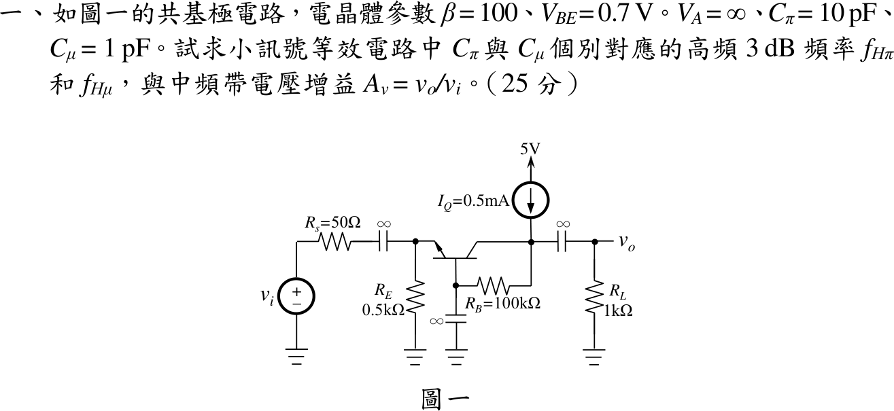
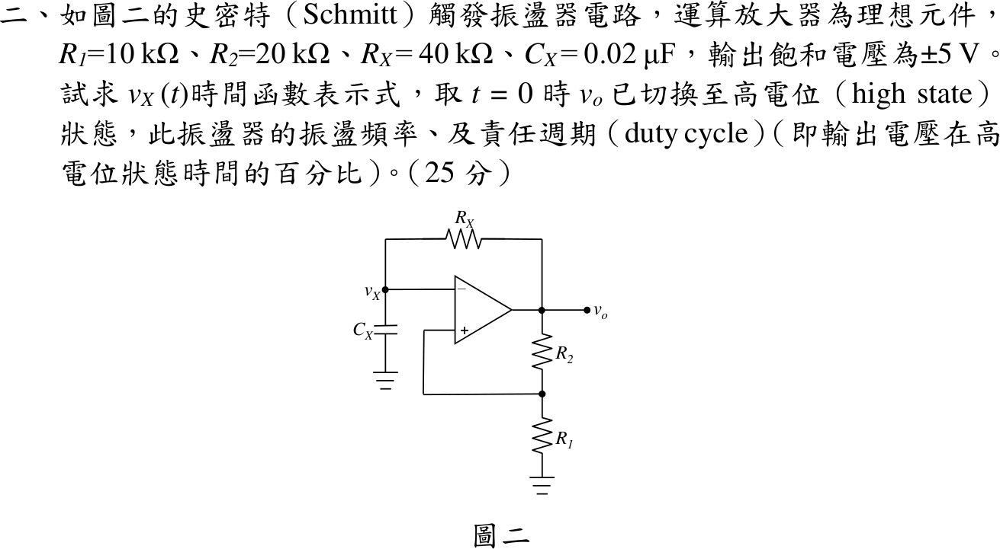

# 112 年電機工程技師｜電子學（包括電力電子學）逐題詳解

> 本頁由題級 canonical 筆記組合；每題保留官方裁切圖、校驗狀態與可追溯的推導。

## 題目導覽
- [[#一、EE-112-02-1|第 1 題：EE-112-02-1]]
- [[#二、112 年電子學第 2 題：Schmitt 觸發鬆弛振盪器|第 2 題：112 年電子學第 2 題：Schmitt 觸發鬆弛振盪器]]
- [[#三、112 年電子學（含電力電子）第 3 題｜反相降升壓轉換器 CCM 漣波設計|第 3 題：反相降升壓轉換器 CCM 漣波設計]]
- [[#四、112 年電子學（含電力電子）第 4 題｜半波整流器傅立葉級數與平滑電感|第 4 題：半波整流器傅立葉級數與平滑電感]]

---

## 一、EE-112-02-1

> 題級識別：EE-112-02-1
> canonical 來源：[[canonical/EE-112-02-1.md]]
> 題級校驗狀態：reference_book_verified

### 已知與所求

$\beta=100$、$V_{BE}=0.7\,\mathrm V$、$V_A=\infty$、$C_\pi=10\,\mathrm{pF}$、$C_\mu=1\,\mathrm{pF}$；$R_s=50\,\Omega$、$R_E=0.5\,\mathrm{k}\Omega$、$R_B=100\,\mathrm{k}\Omega$（集極接基極，基極經電容旁路）、$R_L=1\,\mathrm{k}\Omega$；$I_Q=0.5\,\mathrm{mA}$ 由 5 V 流入集極節點。圖中三個標示 $\infty$ 的外接電容交流短路。求 $f_{H\pi}$、$f_{H\mu}$ 與中頻 $A_v=v_o/v_i$。題圖沒有明示熱電壓，取 $V_T=25\,\mathrm{mV}$。

### 考場標準作答

#### 偏壓與小訊號參數

集極節點 KCL：$I_Q=I_C+I_B$（$I_B$ 經 $R_B$ 流入基極），故
\[
I_E=I_Q=0.5\,\mathrm{mA},\qquad I_C=\frac{\beta}{\beta+1}I_E=0.4950495\,\mathrm{mA}
\]
\[
g_m=\frac{I_C}{V_T}=19.80198\,\mathrm{mS},\qquad r_e=\frac{V_T}{I_E}=50.000\,\Omega
\]
基極交流接地，$C_\pi$ 跨射極–地、$C_\mu$ 跨集極–地。

#### $C_\pi$ 對應的 $f_{H\pi}$

$v_i=0$、$C_\mu$ 開路時 $C_\pi$ 所見電阻 $R_s\parallel R_E\parallel r_e=50\parallel500\parallel50=23.810\,\Omega$：
\[
\boxed{f_{H\pi}=\frac{1}{2\pi(23.810\,\Omega)(10\,\mathrm{pF})}=668.451\,\mathrm{MHz}}
\]

#### $C_\mu$ 對應的 $f_{H\mu}$

$r_o=\infty$、理想電流源交流開路，$R_B$ 經旁路接地，$C_\mu$ 所見電阻 $R_L\parallel R_B=990.099\,\Omega$：
\[
\boxed{f_{H\mu}=\frac{1}{2\pi(990.099\,\Omega)(1\,\mathrm{pF})}=160.746\,\mathrm{MHz}}
\]

#### 中頻帶電壓增益

中頻時 $C_\pi,C_\mu$ 視為開路。射極輸入電阻 $R_E\parallel r_e=45.4545\,\Omega$，共基極不反相：
\[
\boxed{A_v=\frac{R_E\parallel r_e}{R_s+R_E\parallel r_e}\,g_m(R_L\parallel R_B)=0.476190\times19.80198\,\mathrm{mS}\times990.099\,\Omega=9.336153\ \mathrm{V/V}}
\]

### 驗算

- 直流：$V_B=0.7+0.25=0.95\,\mathrm V$，$V_C=V_B+I_BR_B=1.445\,\mathrm V$，$V_{CB}=0.495\,\mathrm V>0$，工作於主動區。
- 電流分流（取 $v_i=1\,\mathrm V$）：$i_e=\frac{v_i}{R_s+45.4545}\cdot\frac{R_E}{R_E+r_e}=9.5238\,\mathrm{mA/V}$，$v_o=\alpha i_e(R_L\parallel R_B)=0.990099\times9.5238\,\mathrm{mA}\times990.099\,\Omega=9.336\,\mathrm V$。
- 含兩電容的節點方程中，射極節點只含 $C_\pi$、集極節點只含 $C_\mu$，受控源單向耦合，故 $A_v(s)=9.336/[(1+s/\omega_{H\pi})(1+s/\omega_{H\mu})]$，兩極點恰為上兩式。

### 失分點

- 漏掉 $R_B$（集極只取 $R_L$）會得 $f_{H\mu}=159.155\,\mathrm{MHz}$、$A_v=9.430\,\mathrm{V/V}$。
- $C_\pi$ 所見電阻漏掉 $r_e$（只取 $R_s\parallel R_E$）會得 $f_{H\pi}=350.1\,\mathrm{MHz}$。
- 基極交流接地，$C_\mu$ 直接跨集極–地，不可套共射極的米勒倍增。

### 條件與疑義

- 取 $V_T=26\,\mathrm{mV}$ 時 $f_{H\pi}=656.21\,\mathrm{MHz}$、$A_v=9.1446\,\mathrm{V/V}$，$f_{H\mu}$ 不變。
- 參考書同取 25 mV，得 $f_{H\pi}=6.69\times10^8\,\mathrm{Hz}$、$f_{H\mu}=1.6\times10^8\,\mathrm{Hz}$，與上式一致；書中中頻增益約 9.47 V/V 為近似值，與本解差 1.4%。

---

## 二、112 年電子學第 2 題：Schmitt 觸發鬆弛振盪器

> 題級識別：EE-112-02-2
> canonical 來源：[[canonical/EE-112-02-2.md]]
> 題級校驗狀態：verified

### 已知與所求

理想運放；$v_X$ 接反相端，經 $R_X=40\,\mathrm{k}\Omega$ 接 $v_o$、經 $C_X=0.02\,\mu\mathrm F$ 接地；非反相端由 $R_2=20\,\mathrm{k}\Omega$（接 $v_o$）與 $R_1=10\,\mathrm{k}\Omega$（接地）分壓；$v_o=\pm5\,\mathrm V$。$t=0$ 時 $v_o$ 剛切至高電位。求 $v_X(t)$、振盪頻率、責任週期。

### 考場標準作答

#### 臨界電壓與時間常數

\[
v_+=\frac{R_1}{R_1+R_2}v_o=\frac{v_o}{3}\Rightarrow V_{TH}=\pm\frac53\,\mathrm V,\qquad \tau=R_XC_X=0.8\,\mathrm{ms}
\]
$v_o$ 剛由 $-5$ 切到 $+5\,\mathrm V$，表示 $v_X$ 剛降到下臨界：$v_X(0)=-5/3\,\mathrm V$。

#### $v_X(t)$

$v_X$ 以 $\tau$ 趨向 $v_o$：
\[
\boxed{v_X(t)=\begin{cases}5-\dfrac{20}{3}e^{-t/0.8\,\mathrm{ms}}\ \mathrm V, & 0\le t<t_H\\[6pt]-5+\dfrac{20}{3}e^{-(t-t_H)/0.8\,\mathrm{ms}}\ \mathrm V, & t_H\le t<T\end{cases},\quad v_X(t+T)=v_X(t)}
\]
由 $5-\frac{20}{3}e^{-t_H/\tau}=\frac53$ 得 $e^{-t_H/\tau}=\frac12$，$t_H=\tau\ln2=0.554518\,\mathrm{ms}$；低電位段對稱，$t_L=t_H$。

#### 頻率與責任週期

\[
T=2\tau\ln2=1.109035\,\mathrm{ms},\qquad \boxed{f=\frac{1}{T}=901.684\,\mathrm{Hz}},\qquad \boxed{D=\frac{t_H}{T}=50\%}
\]

### 驗算

通式 $T=2\tau\ln\dfrac{1+\beta}{1-\beta}$，$\beta=1/3$：$\ln(4/3)/(2/3)=\ln2$，$T=1.6\,\mathrm{ms}\times0.693147=1.109\,\mathrm{ms}$。逐步模擬比較器切換所得頻率亦為 $901.68\,\mathrm{Hz}$。

### 失分點

- 起點取 $v_X(0)=0$；$t=0$ 剛切換，電容電壓應在下臨界 $-5/3\,\mathrm V$。
- 分壓比寫成 $R_2/(R_1+R_2)=2/3$，臨界值會錯成 $\pm10/3\,\mathrm V$、$f=388.3\,\mathrm{Hz}$。

---

## 三、112 年電子學（含電力電子）第 3 題｜反相降升壓轉換器 CCM 漣波設計

> 題級識別：EE-112-02-3
> canonical 來源：[[canonical/EE-112-02-3.md]]
> 題級校驗狀態：verified

### 已知與所求

$V_s=24\,\mathrm V$，$V_o=36\,\mathrm V$（題圖輸出端上負下正，即上端對共地為 $V_o=-36\,\mathrm V$ 的反相輸出），$R=10\,\Omega$，$f_s=100\,\mathrm{kHz}$（$T_s=10\,\mu\mathrm s$），理想、CCM。求使 $i_{L,\min}=0.4I_L$ 的 $L$，及 $\Delta V_o/V_o=0.5\%$ 的 $C$。

### 考場標準作答

#### 責任週期與平均電感電流

伏秒平衡 $V_sD=V_o(1-D)$：
\[
D=\frac{V_o}{V_s+V_o}=\frac{36}{60}=0.6,\qquad I_o=\frac{36}{10}=3.6\,\mathrm A,\qquad I_L=\frac{I_o}{1-D}=9\,\mathrm A
\]
（二極體只在 $(1-D)T_s$ 把 $i_L$ 送往負載。）

#### 電感值

$i_{L,\min}=0.4I_L=3.6\,\mathrm A$，三角波峰對峰 $\Delta i_L=2(I_L-i_{L,\min})=10.8\,\mathrm A$。導通時 $v_L=V_s$：
\[
\boxed{L=\frac{V_sDT_s}{\Delta i_L}=\frac{24(0.6)(10\,\mu\mathrm s)}{10.8}=13.33\,\mu\mathrm H}
\]

#### 電容值

導通期間二極體截止，$C$ 獨自供應 $I_o$：$\Delta V_o=I_oDT_s/C$，
\[
\frac{\Delta V_o}{V_o}=\frac{D}{RCf_s}=0.005\ \Rightarrow\ \boxed{C=\frac{0.6}{10(10^5)(0.005)}=120\,\mu\text{F}}
\]

### 驗算

- 關斷區 $v_L=-V_o$：下降量 $36(0.4)(10\,\mu\mathrm s)/13.33\,\mu\mathrm H=10.8\,\mathrm A$，與上升量相等；$i_L$ 在 $3.6\sim14.4\,\mathrm A$，谷值 $>0$，CCM 成立。
- 功率守恆：$P_o=36^2/10=129.6\,\mathrm W$，輸入平均電流 $DI_L=5.4\,\mathrm A$，$24\times5.4=129.6\,\mathrm W$。

### 失分點

- 把「最小值為平均值 40%」當成 $\Delta i_L=0.4I_L$，得 $L=40\,\mu\mathrm H$。
- 平均電感電流誤取 $I_o=3.6\,\mathrm A$，漏除 $(1-D)$。
- 套 Boost 增益 $1/(1-D)$ 得 $D=1/3$。

---

## 四、112 年電子學（含電力電子）第 4 題｜半波整流器傅立葉級數與平滑電感

> 題級識別：EE-112-02-4
> canonical 來源：[[canonical/EE-112-02-4.md]]
> 題級校驗狀態：verified

### 已知與所求

$v_s=170\sin(377t)\,\mathrm V$，$D_1$ 串聯、$D_2$ 為飛輪二極體，負載 $L$–$R$–$V_{dc}$ 串聯，$R=10\,\Omega$、$V_{dc}=24\,\mathrm V$，元件理想。以傅立葉級數求使 $\Delta i_o\le1\,\mathrm A$ 的 $L$、$V_{dc}$ 吸收功率、$R$ 吸收功率。

### 考場標準作答

#### 負載電壓的傅立葉級數

電流連續時（下方驗證），負載端電壓為半波正弦，$V_m=170\,\mathrm V$、$\omega=377\,\mathrm{rad/s}$：
\[
v_o(t)=\frac{V_m}{\pi}+\frac{V_m}{2}\sin\omega t-\sum_{k=1}^{\infty}\frac{2V_m}{\pi(4k^2-1)}\cos 2k\omega t
\]
\[
I_0=\frac{V_m/\pi-V_{dc}}{R}=\frac{54.113-24}{10}=3.011268\,\mathrm A
\]
各次諧波電流 $I_n=V_n/|R+jn\omega L|$：$V_1=85\,\mathrm V$、$V_2=36.08\,\mathrm V$、$V_4=7.22\,\mathrm V$…

#### 電感值

基頻主導，$\Delta i_o\approx2I_1$ 先估 $L$：$2\times85/\sqrt{10^2+(377L)^2}=1\Rightarrow L\approx0.450\,\mathrm H$。但此時 2 次諧波（$I_2\approx0.106\,\mathrm A$）使實際峰對峰約 $1.10\,\mathrm A$，超過限制。將各次諧波相量疊加求 $\max i_o-\min i_o=1\,\mathrm A$：
\[
\boxed{L=0.4962\,\mathrm H}
\]
此時 $I_1=0.4538\,\mathrm A$、$I_2=0.0964\,\mathrm A$、$I_4=0.0096\,\mathrm A$，$i_o$ 在約 $2.52\sim3.52\,\mathrm A$ 之間，恆正，電流連續。

#### 功率

直流源只吸收平均電流的功率：
\[
\boxed{P_{V_{dc}}=V_{dc}I_0=24(3.011268)=72.2704\,\mathrm W}
\]
電阻依 Parseval：
\[
I_{rms}^2=I_0^2+\sum_n\frac{I_n^2}{2}=9.06774+0.10295+0.00465+0.00005=9.17538\,\mathrm A^2
\]
\[
\boxed{P_R=RI_{rms}^2=91.7538\,\mathrm W}
\]

### 驗算

- 時域：以 $L\,di/dt+Ri=v_o(t)-V_{dc}$ 逐段精確積分至週期穩態，得峰對峰 $1.0000\,\mathrm A$、平均 $3.0113\,\mathrm A$、$R\overline{i^2}=91.75\,\mathrm W$，與級數一致。
- 功率守恆：理想電感與二極體不耗能，電源送出平均功率 $=72.27+91.75=164.02\,\mathrm W$。

### 失分點

- 只用基頻得 $L\approx0.45\,\mathrm H$ 是常見教科書作法，但嚴格峰對峰約 $1.10\,\mathrm A$；考場寫 0.45 H 時應註明 2 次諧波使 $L$ 需略增（約 0.50 H）。
- $P_{V_{dc}}$ 用 $V_{dc}I_{rms}$；直流源只與平均電流作功。
- $P_R$ 只算 $I_0^2R=90.68\,\mathrm W$，漏掉諧波電流的功率。

---
