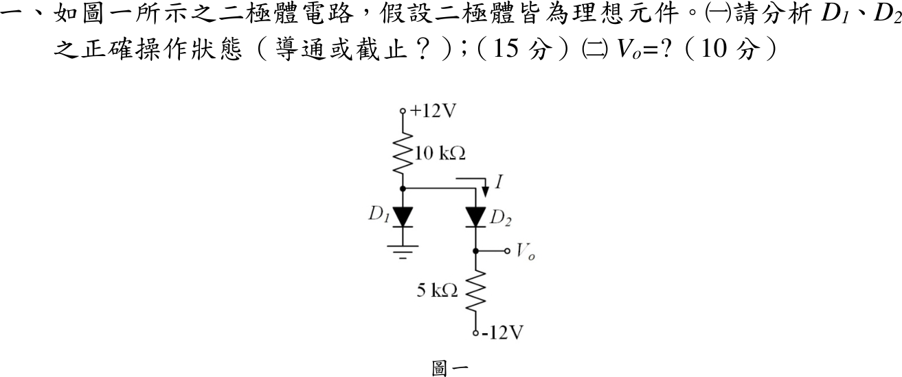
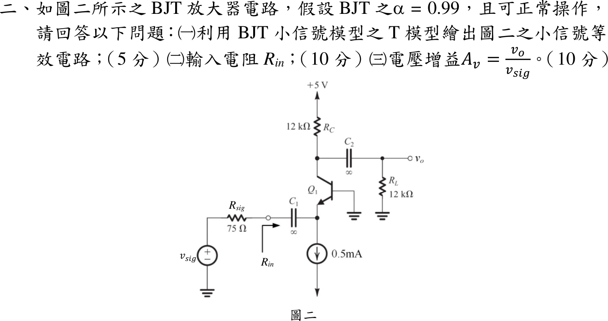
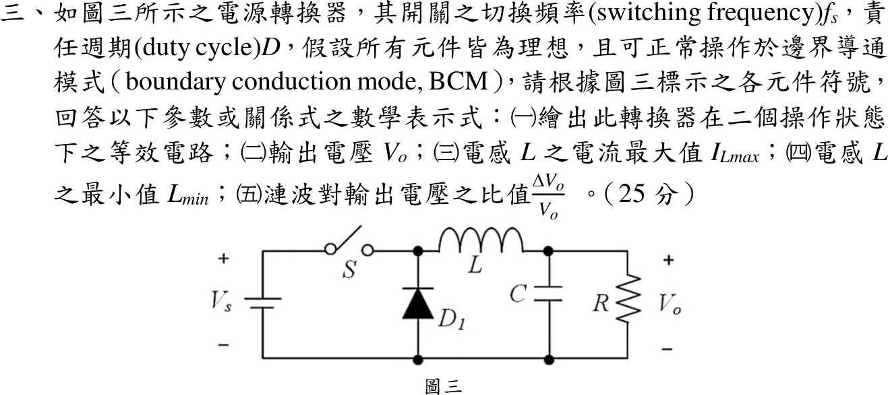

# 113 年電機工程技師｜電子學（包括電力電子學）逐題詳解

> 本頁由題級 canonical 筆記組合；每題保留官方裁切圖、校驗狀態與可追溯的推導。

## 題目導覽
- [[#一、113 年電子學第 1 題：理想二極體操作狀態|第 1 題：113 年電子學第 1 題：理想二極體操作狀態]]
- [[#二、113 年電子學第 2 題：共基極 BJT T 模型與電壓增益|第 2 題：113 年電子學第 2 題：共基極 BJT T 模型與電壓增益]]
- [[#三、113 年電子學含電力電子第 3 題｜降壓型轉換器 BCM|第 3 題：降壓型轉換器 BCM]]
- [[#四、113 年電子學第 4 題：全橋隔離型轉換器|第 4 題：113 年電子學第 4 題：全橋隔離型轉換器]]

---

## 一、113 年電子學第 1 題：理想二極體操作狀態

> 題級識別：EE-113-02-1
> canonical 來源：[[canonical/EE-113-02-1.md]]
> 題級校驗狀態：verified

### 已知與所求

$+12\,\mathrm V$ 經 $10\,\mathrm{k}\Omega$ 到節點 $x$；$D_1$ 陽極接 $x$、陰極接地；$D_2$ 陽極接 $x$、陰極接 $V_o$；$V_o$ 經 $5\,\mathrm{k}\Omega$ 接 $-12\,\mathrm V$。二極體理想。求（一）$D_1,D_2$ 狀態（15 分）；（二）$V_o$（10 分）。

### 考場標準作答

#### （一）操作狀態

**假設兩者皆導通：**$V_x=V_o=0$，$I_{10k}=12/10\,\mathrm k=1.2\,\mathrm{mA}$，$I_{D_2}=(0+12)/5\,\mathrm k=2.4\,\mathrm{mA}$，$I_{D_1}=1.2-2.4=-1.2\,\mathrm{mA}<0$，矛盾，$D_1$ 必截止。

**$D_1$ 截止、$D_2$ 導通：**兩電阻串聯
\[
I=\frac{12-(-12)}{10\,\mathrm k+5\,\mathrm k}=1.6\,\mathrm{mA}>0,\qquad V_x=12-1.6(10)=-4\,\mathrm V
\]
$V_{D_1}=V_x-0=-4\,\mathrm V<0$ 反偏，$D_2$ 電流由陽極流向陰極，假設自洽：
\[
\boxed{D_1\ \text{截止},\ D_2\ \text{導通}}
\]

#### （二）輸出電壓

\[
\boxed{V_o=V_x=-12+I(5\,\mathrm{k}\Omega)=-4.0\,\mathrm V}
\]

### 驗算

- 其餘兩組假設皆矛盾：$D_1$ 導通、$D_2$ 截止時 $V_x=0$、$V_o=-12\,\mathrm V$，$D_2$ 承受 $+12\,\mathrm V$ 正偏；兩者皆截止時 $V_x=+12\,\mathrm V$，$D_1$ 正偏。
- KVL 繞全迴路：$12-1.6(10)-0-1.6(5)=-12\,\mathrm V$，等於下端電源。

### 失分點

- 先假設 $D_1$ 導通便直接得 $V_o=0$，未檢查 $I_{D_1}=-1.2\,\mathrm{mA}$ 為負。
- 只比較節點電位、未驗 $D_2$ 電流 $I=1.6\,\mathrm{mA}>0$ 與 $D_1$ 電壓 $V_{D_1}=-4\,\mathrm V<0$，狀態判斷即不完整。

---

## 二、113 年電子學第 2 題：共基極 BJT T 模型與電壓增益

> 題級識別：EE-113-02-2
> canonical 來源：[[canonical/EE-113-02-2.md]]
> 題級校驗狀態：reference_book_verified

### 已知與所求

$\alpha=0.99$；射極偏壓由 $0.5\,\mathrm{mA}$ 理想電流源提供（$I_E=0.5\,\mathrm{mA}$）；$R_{sig}=75\,\Omega$ 經 $C_1=\infty$ 接射極，基極接地，集極 $R_C=12\,\mathrm{k}\Omega$ 接 $+5\,\mathrm V$，經 $C_2=\infty$ 接 $R_L=12\,\mathrm{k}\Omega$。求（一）T 模型小信號等效電路；（二）$R_{in}$；（三）$A_v=v_o/v_{sig}$。官方題面未明示接面溫度或 $V_T$，參考書主解取 $V_T=25\,\mathrm{mV}$。

### 考場標準作答

#### （一）T 模型等效電路

$+5\,\mathrm V$ 交流接地、偏壓電流源交流開路、$C_1,C_2$ 短路：$v_{sig}$–$R_{sig}$ 接射極 E；$r_e$ 接在內部基極節點與 E 之間，$i_e$ 經 $r_e$ 由基極側流向 E 並流出射極端子；受控電流源 $\alpha i_e$ 由集極 C 流向內部基極節點（基極交流接地）；C 對地接 $R_C\parallel R_L$，$v_o$ 取在 C。
\[
\boxed{r_e=\frac{V_T}{I_E}=\frac{25\,\mathrm{mV}}{0.5\,\mathrm{mA}}=50\,\Omega,\qquad i_c=\alpha i_e}
\]

#### （二）輸入電阻

由射極看入只有 $r_e$（電流源開路）：
\[
\boxed{R_{in}=r_e=50\,\Omega}
\]

#### （三）電壓增益

$i_e=-v_{sig}/(R_{sig}+r_e)$（以流出射極端子為正），$v_o=-\alpha i_e(R_C\parallel R_L)$：
\[
\boxed{A_v=\frac{\alpha(R_C\parallel R_L)}{R_{sig}+r_e}=\frac{0.99\times6\,\mathrm{k}\Omega}{75+50}=47.52\ \mathrm{V/V}}
\]
共基極不反相。

### 驗算

分段相乘：輸入分壓 $v_e/v_{sig}=50/125=0.4$，射極到集極 $v_o/v_e=\alpha R_C'/r_e=0.99(6000)/50=118.8$，$0.4\times118.8=47.52$；與一次電流法相同。

### 失分點

- 漏掉 $R_{sig}$ 分壓，答成 $v_o/v_e=118.8$。
- 負載只取 $R_C$（$12\,\mathrm{k}\Omega$），得 $95.04\,\mathrm{V/V}$。
- 把偏壓電流源當交流短路，$R_{in}$ 變 0。

### 條件與疑義

| $V_T$ | $r_e=R_{in}$ | $A_v$（V/V） |
|---|---:|---:|
| $25\,\mathrm{mV}$（參考書主解） | $50.00\,\Omega$ | $47.520000$ |
| $25.85\,\mathrm{mV}$（室溫） | $51.70\,\Omega$ | $46.882399$ |
| $26\,\mathrm{mV}$ | $52.00\,\Omega$ | $46.771654$ |

---

## 三、113 年電子學含電力電子第 3 題｜降壓型轉換器 BCM

> 題級識別：EE-113-02-3
> canonical 來源：[[canonical/EE-113-02-3.md]]
> 題級校驗狀態：verified

### 已知與所求

$V_s$ 正端經串聯開關 $S$ 到切換節點，再經 $L$ 到輸出 $C\parallel R$；$D_1$ 陽極接共地、陰極接切換節點，故為 Buck（降壓）。切換頻率 $f_s$（$T_s=1/f_s$）、責任週期 $D$，理想元件、BCM。求（一）兩狀態等效電路；（二）$V_o$；（三）$I_{L\max}$；（四）$L_{\min}$；（五）$\Delta V_o/V_o$（峰對峰）。

### 考場標準作答

#### （一）兩個操作狀態

![[113年_電子學_第3題_降壓型Buck轉換器二操作狀態等效電路圖.svg|850]]

- $0\le t<DT_s$：$S$ 導通、$D_1$ 反偏，$V_s\to S\to L\to C\parallel R$，$i_L$ 由 0 線性上升。
- $DT_s\le t<T_s$：$S$ 截止、$D_1$ 續流，共地 $\to D_1\to L\to C\parallel R$，$i_L$ 降回 0。

\[
\boxed{\text{ON：}v_L=V_s-V_o,\qquad \text{OFF：}v_L=-V_o}
\]

#### （二）輸出電壓

伏秒平衡 $(V_s-V_o)D+(-V_o)(1-D)=0$：
\[
\boxed{V_o=DV_s}
\]

#### （三）電感電流最大值

BCM 由 0 上升 $DT_s$；三角波平均等於負載電流 $I_o=V_o/R$：
\[
\boxed{I_{L\max}=\frac{(V_s-V_o)D}{Lf_s}=\frac{V_sD(1-D)}{Lf_s}=2I_o=\frac{2DV_s}{R}}
\]

#### （四）最小電感

令上式兩種寫法相等：
\[
\boxed{L_{\min}=\frac{(1-D)R}{2f_s}}
\]
本題在 BCM 即 $L=L_{\min}$；$L<L_{\min}$ 進入 DCM。

#### （五）漣波比

$i_C=i_L-I_o$，正電荷區為底 $T_s/2$、高 $I_o$ 的三角形，$\Delta Q=I_oT_s/4$：
\[
\boxed{\frac{\Delta V_o}{V_o}=\frac{I_o}{4Cf_sV_o}=\frac{1}{4RCf_s}}\quad\left(=\frac{1-D}{8LCf_s^2}\ \text{於}\ L=L_{\min}\right)
\]

### 驗算

取示例 $V_s=12\,\mathrm V$、$D=0.4$、$R=10\,\Omega$、$f_s=25\,\mathrm{kHz}$、$C=100\,\mu\mathrm F$（僅供回代）：$V_o=4.8\,\mathrm V$、$L_{\min}=120\,\mu\mathrm H$。ON 上升 $(7.2)(0.4)/(120\,\mu\mathrm H\cdot25\,\mathrm{kHz})=0.96\,\mathrm A$，OFF 下降 $(4.8)(0.6)/(3)=0.96\,\mathrm A$，等於 $2I_o=0.96\,\mathrm A$；漣波 $1/(4\cdot10\cdot10^{-4}\cdot25000)=1\%$，即 $0.048\,\mathrm V$。

### 失分點

- 把串聯開關的 Buck 誤判為 Boost，寫出 $V_o=V_s/(1-D)$。
- BCM 峰值寫成平均值，漏掉三角波的因子 2。
- 漣波只算 ON 區 $I_oDT_s/C$；正確作法是積分 $i_C=i_L-I_o$ 的正面積。

---

## 四、113 年電子學第 4 題：全橋隔離型轉換器

> 題級識別：EE-113-02-4
> canonical 來源：[[canonical/EE-113-02-4.md]]
> 題級校驗狀態：needs_manual_review
> [!WARNING] 本題仍有官方資料缺口或事件定義歧義；請以 canonical 條件式解答為準。

### 已知與所求

直流 $V_s$ 供全橋 $S_1\sim S_4$（左臂 $S_1/S_4$、右臂 $S_3/S_2$，對角組 $S_1S_2$、$S_3S_4$），變壓器 $N_p:N_s$，中心抽頭次級 $V_{s1},V_{s2}$ 經 $D_1,D_2$ 全波整流，再經 $L_x$ 到 $C\parallel R$。切換頻率 $f_s$、責任週期 $D$，理想、BCM。求（一）各開關耐壓；（二）$V_o/V_s$；（三）$L_x$。

本解約定：每組對角開關在一個 $T_s$ 內導通 $DT_s$（$0<D<0.5$），兩組交替；$n_h$ 為每個半繞組對一次側的匝比。

### 考場標準作答

#### （一）開關耐壓

$S_1S_2$ 導通時，同臂的 $S_4$、$S_3$ 各直接跨在母線上；反之亦然：
\[
\boxed{V_{S1,\max}=V_{S2,\max}=V_{S3,\max}=V_{S4,\max}=V_s}
\]
（理想值，不含漏感尖峰與裕度。）

#### （二）電壓轉換比

導通區（每半週 $DT_s$）$v_{L_x}=n_hV_s-V_o$；續流區（每半週 $T_s/2-DT_s$）兩二極體同時導通、整流輸出為 0，$v_{L_x}=-V_o$。一週期伏秒平衡：
\[
2(n_hV_s-V_o)DT_s-V_o(1-2D)T_s=0\ \Rightarrow\ \boxed{\frac{V_o}{V_s}=2Dn_h}
\]
依圖四符號、$N_s$ 取每個半繞組（中心抽頭教科書慣例），$n_h=N_s/N_p$，即 $V_o/V_s=2DN_s/N_p$。

#### （三）BCM 電感

電感電流每半週由 0 升至峰值再降回 0（等效頻率 $2f_s$），平均值等於 $V_o/R$：
\[
\Delta i_L=\frac{V_o(1/2-D)}{L_xf_s},\qquad \frac{\Delta i_L}{2}=\frac{V_o}{R}\ \Rightarrow\ \boxed{L_x=\frac{(1-2D)R}{4f_s}}
\]
此式與匝比口徑無關。

### 驗算

- 上升段 $(n_hV_s-V_o)DT_s/L_x=n_hV_sD(1-2D)T_s/L_x$，下降段 $V_o(1/2-D)T_s/L_x=n_hV_sD(1-2D)T_s/L_x$，兩者相等，BCM 自洽。
- 示例 $D=0.2$、$R=10\,\Omega$、$f_s=20\,\mathrm{kHz}$：$L_x=0.6\times10/80000=75\,\mu\mathrm H$；$D\to0.5$ 時續流區消失，$L_x\to0$。

### 失分點

- 把全橋當單脈波：一週期有兩個整流脈波，漏掉因子 2 得 $V_o/V_s=Dn_h$。
- 套 Buck 的 $L_{\min}=(1-D)R/(2f_s)$；電感看到的頻率是 $2f_s$、續流時間是 $(1/2-D)T_s$。

### 條件與疑義

官方圖只標 $N_p:N_s$，未指明 $N_s$ 為半繞組或端對端總匝數。若 $N_s$ 指端對端總匝數，$n_h=N_s/(2N_p)$，$V_o/V_s=DN_s/N_p$，與上式差一倍；$L_x$ 不受影響。題幹以 $D$ 為開關責任週期，同臂開關不可同時導通，故 $0<D<0.5$。

---
