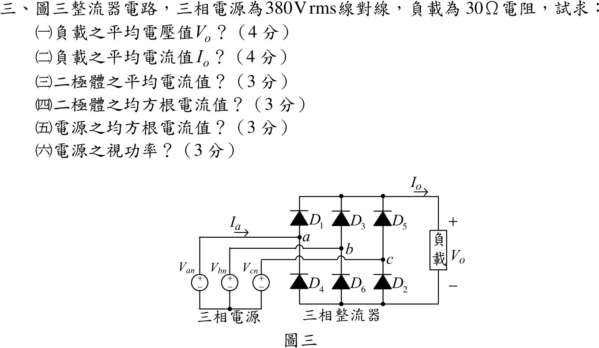

# 104 年電子學（含電力電子）第 3 題｜三相六脈波二極體整流器

## 已知與所求

三相電源 $380\text{ V}_{rms}$（線對線），圖中 $D_1,D_3,D_5$ 為上臂（陽極分別接 $a,b,c$），$D_4,D_6,D_2$ 為下臂，負載為 $30\ \Omega$ 純電阻，二極體視為理想。求（一）$V_o$（4 分）；（二）$I_o$（4 分）；（三）二極體平均電流（3 分）；（四）二極體 rms 電流（3 分）；（五）電源 rms 電流（3 分）；（六）電源視在功率（3 分）。

## 考場標準作答

令線對線電壓峰值 \(V_m=380\sqrt2=537.40\,\mathrm V\)。六脈波橋式整流器接純電阻負載時：

\[
\boxed{V_{o,\mathrm{avg}}=\frac{3V_m}{\pi}=513.18\,\mathrm V},
\qquad
\boxed{I_{o,\mathrm{avg}}=\frac{V_{o,\mathrm{avg}}}{30}=17.11\,\mathrm A}.
\]

每顆二極體導通 \(120^\circ\)，且純電阻負載電流隨脈波變化。令單一 60° 脈波 \(v_o=V_m\cos\phi\)，則
\[
I_{o,\mathrm{rms}}^2
=\frac{V_m^2}{R^2}\frac3\pi\int_{-\pi/6}^{\pi/6}\cos^2\phi\,d\phi
=\frac{V_m^2}{R^2}\frac3\pi\left(\frac\pi6+\frac{\sqrt3}{4}\right),
\]
故 \(I_{o,\mathrm{rms}}=17.121\,\mathrm A\)。三顆上橋二極體輪流承擔全部正向負載電流，故每顆的均方值是負載的 \(1/3\)；一條相線另有對稱的正、負兩段，均方值是負載的 \(2/3\)。因此

\[
\boxed{I_{D,\mathrm{avg}}=\frac{I_{o,\mathrm{avg}}}{3}=5.70\,\mathrm A},
\]

\[
\boxed{I_{D,\mathrm{rms}}=\frac{I_{o,\mathrm{rms}}}{\sqrt3}=9.885\,\mathrm A},
\]

\[
\boxed{I_{s,\mathrm{rms}}=I_{o,\mathrm{rms}}\sqrt{\frac23}=13.979\,\mathrm A},
\]

\[
\boxed{S=\sqrt3(380)(13.979)=9.20\,\mathrm{kVA}}.
\]

## 驗算

- 功率守恆：負載實功 $P=I_{o,\mathrm{rms}}^2R=17.121^2\times30=8794\,\mathrm W$，視在功率 $S=9201\,\mathrm{VA}$，功率因數 $P/S=0.9558$，恰等於 $\sqrt{\tfrac12+\tfrac{3\sqrt3}{4\pi}}=0.9558$（電阻負載的六脈波輸入功因），且 $\le1$。
- 以一週期取樣、依「最高相接上臂、最低相接下臂」的導通表直接計算，得 $V_o=513.18\,\mathrm V$、$I_{D,\mathrm{rms}}=9.885\,\mathrm A$、$I_{s,\mathrm{rms}}=13.979\,\mathrm A$；此處不能僅憑導通時間比例，把脈動電流當定值。

## 失分點

- 把 $380\,\mathrm V$ 當相電壓，或平均電壓公式誤用相電壓峰值。
- 直接令 $I_{o,\mathrm{rms}}=I_{o,\mathrm{avg}}$；本題是電阻負載，不是大電感平滑的定電流負載。
- 視在功率漏乘 $\sqrt3$，或把 VA 寫成 W。
