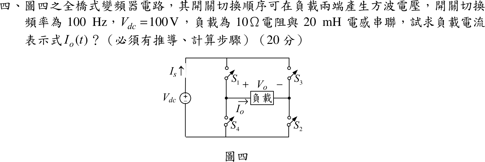

# 104 年電子學（含電力電子）第 4 題｜單相全橋逆變器 RL 負載電流

## 已知與所求

單相全橋變頻器（$S_1,S_2$ 與 $S_3,S_4$ 兩對輪流導通）在負載端產生方波 $v_o=\pm V_{dc}$；切換頻率 $100\text{ Hz}$、$V_{dc}=100\text{ V}$，負載為 $R=10\ \Omega$ 串聯 $L=20\text{ mH}$。求週期穩態負載電流 $i_o(t)$（20 分）。取 $0\le t<5\text{ ms}$ 為 $v_o=+V_{dc}$（起點定義，假設）。

## 考場標準作答

$T=10\text{ ms}$，半週期 $5\text{ ms}$；$\tau=L/R=2\text{ ms}$，$V_{dc}/R=10\text{ A}$。

正半週：$L\,\dfrac{di_o}{dt}+Ri_o=V_{dc}$，令起點電流 $i_o(0)=-I_{max}$：
$$
i_o(t)=10-(10+I_{max})e^{-500t}
$$
週期穩態（半波對稱）要求半週末 $i_o(5\text{ ms})=+I_{max}$：
$$
I_{max}=10-(10+I_{max})e^{-2.5}\ \Rightarrow\
I_{max}=10\cdot\frac{1-e^{-2.5}}{1+e^{-2.5}}=\boxed{8.483\text{ A}}
$$
$$
\boxed{i_o(t)=\begin{cases}
10-18.483\,e^{-500t}\ \text{A}, & 0\le t\le5\text{ ms}\\[2pt]
-10+18.483\,e^{-500(t-0.005)}\ \text{A}, & 5\text{ ms}\le t\le10\text{ ms}
\end{cases}}
$$
之後每週期重複。

## 驗算

對 $L\,di/dt=v_o-Ri$ 由 $i(0)=0$ 起以四階 Runge–Kutta 連續積分 60 個週期（遠大於 $\tau$），最後一週期的電流在 $-8.483\text{ A}\sim+8.483\text{ A}$ 之間，與上式的最大差異小於 $1\text{ mA}$；起點 $i_o(0)=-8.483\text{ A}$，半週末 $i_o(5\text{ ms})=10-18.483e^{-2.5}=+8.483\text{ A}$，且 $i_o(0^+)$ 連續（電感電流不能跳變）。

## 失分點

- 若從 $i_o(0)=0$ 起算只是暫態，不是週期穩態；必須用 $i_o(0)=-I_{max}$、$i_o(T/2)=+I_{max}$ 的對稱邊界條件。
- 負半週的指數時間原點要平移到 $t=5\text{ ms}$（$e^{-500(t-0.005)}$），否則末端電流錯。
