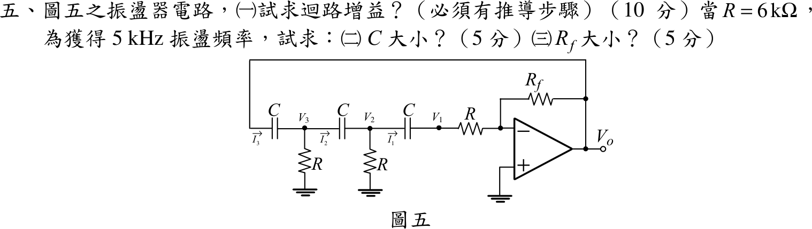

# 104 年電子學（含電力電子）第 5 題｜三階 RC 移相振盪器

## 已知與所求

理想運算放大器；輸出 $V_o\to C\to V_3\ (R\text{ 接地})\to C\to V_2\ (R\text{ 接地})\to C\to V_1\to R\to$ 反相端，$R_f$ 由輸出接回反相端，非反相端接地。求（一）迴路增益（10 分）；$R=6\text{ k}\Omega$、$f_0=5\text{ kHz}$ 時，（二）$C$（5 分）；（三）$R_f$（5 分）。

## 考場標準作答

### （一）迴路增益

反相端為虛接地，故最末一個 $R$ 等於第三個對地電阻，$V_1$ 以 $I_1=V_1/R$ 流入。節點方程式（$x=sRC$）：
$$
\begin{aligned}
V_3\,(2sC+G)-V_2\,sC&=V_o\,sC\\
-V_3\,sC+V_2\,(2sC+G)-V_1\,sC&=0\\
-V_2\,sC+V_1\,(sC+G)&=0
\end{aligned}\quad(G=1/R)
$$
解得網路轉移函數
$$
\beta(s)=\frac{V_1}{V_o}=\frac{x^3}{x^3+6x^2+5x+1}
$$
反相級 $A=-R_f/R$，迴路增益
$$
\boxed{L(s)=A\beta=-\frac{R_f}{R}\cdot\frac{s^3R^3C^3}{s^3R^3C^3+6s^2R^2C^2+5sRC+1}}
$$

### （二）振盪頻率與 $C$

令 $s=j\omega$、$a=\omega RC$，$\beta$ 須為實數（相移 $180^\circ$）：
$$
\beta^{-1}=1-\frac{5}{a^2}-j\left(\frac6a-\frac1{a^3}\right),\qquad
\operatorname{Im}\beta^{-1}=0\ \Rightarrow\ a^2=\frac16,\quad \omega_0=\frac{1}{\sqrt6\,RC}
$$
$$
\boxed{C=\frac{1}{2\pi\sqrt6\,Rf_0}=\frac{1}{2\pi\sqrt6(6000)(5000)}=2.166\text{ nF}}
$$

### （三）$R_f$

$a^2=1/6$ 代入實部 $1-5/a^2=-29$，即 $\beta(j\omega_0)=-\dfrac1{29}$，振盪條件 $L(j\omega_0)=1$：
$$
\frac{R_f}{R}\cdot\frac1{29}=1\ \Rightarrow\ \boxed{R_f=29R=174\text{ k}\Omega}
$$
（實務上取 $R_f$ 略大於 $29R$ 以確保起振。）

## 驗算

以符號節點解得 $\beta(j\omega_0)=-1/29$，$A\beta=+R_f/(29R)$ 為正實數，滿足 $L=1$ 的相位條件。數值：$\omega_0=1/(\sqrt6\times6000\times2.166\times10^{-9})=3.141\times10^4\text{ rad/s}$，$f_0=5.000\text{ kHz}$。

## 失分點

- $\beta$ 的分母係數是 $x^3+6x^2+5x+1$（$x^2$ 係數 6、$x$ 係數 5），對調會使 $\omega_0$ 與增益 29 都錯。
- 迴路增益含反相級的負號：$L=A\beta=-(R_f/R)\beta$；$\beta(j\omega_0)<0$ 才使 $L$ 為正，不是 $L=\beta R_f/R$ 單看大小。
- 最末的 $R$ 接在虛接地，等同第三個對地電阻，不可另把它當作放大器輸入阻抗忽略。
