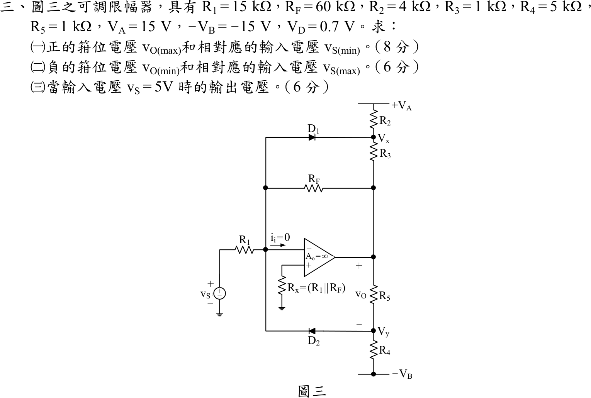

# 105 年電子學（含電力電子）第 3 題｜可調式雙向二極體限幅器

## 已知與所求

$R_1=15\text{ k}\Omega$、$R_F=60\text{ k}\Omega$、$R_2=4\text{ k}\Omega$、$R_3=1\text{ k}\Omega$、$R_4=5\text{ k}\Omega$、$R_5=1\text{ k}\Omega$、$V_A=15\text{ V}$、$-V_B=-15\text{ V}$、$V_D=0.7\text{ V}$，理想運算放大器。依圖：$D_1$ 陽極接反相端 $n$、陰極接 $V_x$（$R_2$ 接 $+V_A$，$R_3$ 接 $v_O$）；$D_2$ 陽極接 $V_y$（$R_5$ 接 $v_O$，$R_4$ 接 $-V_B$）、陰極接 $n$；$R_F$ 始終跨接 $n$ 與輸出。

求（一）$v_{O(max)}$ 與 $v_{S(min)}$（8 分）；（二）$v_{O(min)}$ 與 $v_{S(max)}$（6 分）；（三）$v_S=5\text{ V}$ 的 $v_O$（6 分）。

## 考場標準作答

### （一）正向限幅位準

兩二極體皆截止時 $v_O=-(R_F/R_1)v_S=-4v_S$。$v_O$ 上升到 $D_2$ 剛導通（$V_y=+V_D$，$n$ 為虛接地）：
$$
V_y=-15+(v_O+15)\frac{R_4}{R_4+R_5}=0.7\ \Rightarrow\ (v_O+15)\frac56=15.7
$$
$$
\boxed{v_{O(max)}=+3.84\text{ V}},\qquad \boxed{v_{S(min)}=\frac{3.84}{-4}=-0.96\text{ V}}
$$

### （二）負向限幅位準

$D_1$ 剛導通：$V_x=-V_D=-0.7\text{ V}$：
$$
V_x=15+(v_O-15)\frac{R_2}{R_2+R_3}=-0.7\ \Rightarrow\ (v_O-15)\frac45=-15.7
$$
$$
\boxed{v_{O(min)}=-4.625\text{ V}},\qquad \boxed{v_{S(max)}=\frac{-4.625}{-4}=+1.156\text{ V}}
$$

### （三）$v_S=5\text{ V}$

$5\text{ V}>v_{S(max)}$，$D_1$ 導通，$V_x=-0.7\text{ V}$ 固定，但 $R_F$ 仍跨在輸出與 $n$ 之間，輸出隨 $v_S$ 緩慢下降而非完全定值。$n$ 的 KCL（$D_1$ 電流 $i_1$ 流入 $V_x$）：
$$
\frac{v_S}{R_1}+\frac{v_O}{R_F}=i_1,\qquad
i_1=-\left[\frac{V_A+0.7}{R_2}+\frac{v_O+0.7}{R_3}\right]
$$
$$
v_O\left(\frac1{R_F}+\frac1{R_3}\right)=-\frac{v_S}{R_1}-\frac{15.7}{4\text{ k}}-\frac{0.7}{1\text{ k}}
\ \Rightarrow\
\boxed{v_O=\frac{-0.3333-3.925-0.7}{1.01667}=-4.877\text{ V}}
$$
限幅區斜率為 $-(R_F\parallel R_3)/R_1=-0.0656\text{ V/V}$，從膝點 $(1.156\text{ V},-4.625\text{ V})$ 起再往負走 $-0.0656\times(5-1.156)=-0.252\text{ V}$，得 $-4.877\text{ V}$。

## 驗算

以兩側電流對照 $D_1$ 電流（$v_O=-4.877\text{ V}$）：$n$ 端 $i_1=\dfrac{5}{15\text{ k}}+\dfrac{-4.877}{60\text{ k}}=0.3333-0.0813=0.2520\text{ mA}$；$V_x$ 端 $i_1=-\left[\dfrac{15.7}{4\text{ k}}+\dfrac{-4.877+0.7}{1\text{ k}}\right]=-[3.925-4.177]=0.2520\text{ mA}$，兩者相等且 $>0$，$D_1$ 確實導通。線性區 $v_S=0.5\text{ V}$ 得 $v_O=-2\text{ V}$ 且兩二極體皆截止，兩個膝點由「四種二極體組合逐一求解、取電流與偏壓皆合理者」的數值掃描得 $v_S=-0.96\text{ V}$、$+1.15625\text{ V}$，與（一）（二）相同。

## 失分點

- 把 $-4.625\text{ V}$ 當成 $v_S=5\text{ V}$ 的輸出：它是限幅開始的位準；$R_F$ 與分壓電阻仍在迴路中，$5\text{ V}$ 時輸出為 $-4.877\text{ V}$。
- 正向限幅的分壓是 $R_4/(R_4+R_5)=5/6$（下端接 $-V_B$），負向限幅是 $R_2/(R_2+R_3)=4/5$（上端接 $+V_A$），兩側不可互換。
- 虛接地使二極體導通時節點電壓為 $\pm V_D$，輸入端 $v_S$ 與輸出關係為反相：$v_{S(min)}$ 對應正限幅。

## 條件與疑義

註：若以硬箝位簡化，（三）會寫成 $v_{O(min)}=-4.625\text{ V}$（見（二））；本解保留 $R_F$ 在迴路中，答 $-4.877\text{ V}$。
