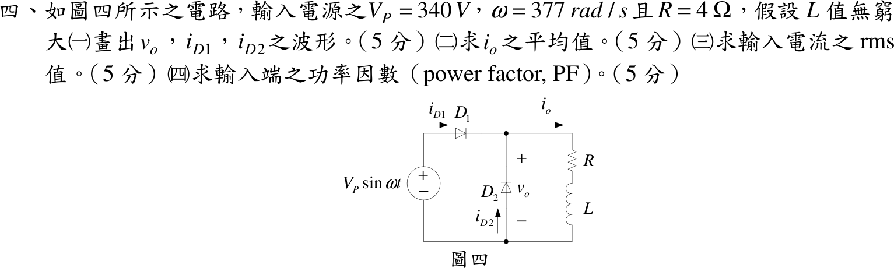
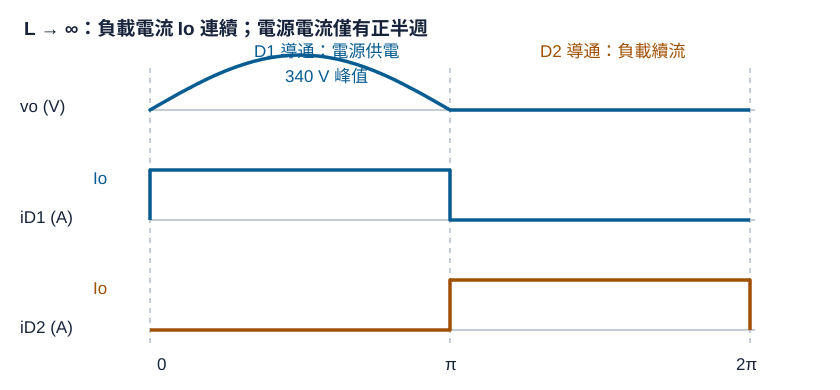

# 106 年電子學第 4 題｜單相半波整流器與續流二極體

## 已知與所求

$v_s=V_P\sin\omega t$，$V_P=340\,\mathrm V$、$\omega=377\,\mathrm{rad/s}$，$D_1$ 串在電源與負載之間，$D_2$ 跨在負載兩端（陰極接 $v_o$ 的 $+$ 端），負載 $R=4\,\Omega$ 串 $L\to\infty$。求（一）$v_o,i_{D1},i_{D2}$ 波形；（二）$i_o$ 平均值；（三）輸入電流 rms；（四）功率因數。

## 考場標準作答

### （一）波形

$L\to\infty$ 使負載電流為常數 $I_o$。正半週（$0<\theta<\pi$，$\theta=\omega t$）$D_1$ 導通、$D_2$ 截止；負半週 $D_1$ 截止，電感電流經 $D_2$ 續流：
\[
v_o=\begin{cases}340\sin\theta,&0<\theta<\pi\\0,&\pi<\theta<2\pi\end{cases},\quad
i_{D1}=\begin{cases}I_o,&0<\theta<\pi\\0,&\pi<\theta<2\pi\end{cases},\quad
i_{D2}=\begin{cases}0,&0<\theta<\pi\\I_o,&\pi<\theta<2\pi\end{cases}
\]
\[
\boxed{D_1:\ 0\sim\pi\ \text{導通},\qquad D_2:\ \pi\sim2\pi\ \text{續流}}
\]

### （二）平均值

穩態電感平均電壓為零，$V_{o,avg}=RI_o=V_P/\pi=108.23\ \mathrm V$：
\[
\boxed{I_o = \frac{V_{o,avg}}{R}=\frac{340/\pi}{4}=27.06\ \mathrm A}
\]

### （三）輸入電流 rms

輸入電流即 $i_{D1}$（正半週為 $I_o$，負半週為 0）：
\[
\boxed{I_{s,rms}=\sqrt{\frac1{2\pi}\int_0^\pi I_o^2\,d\theta}=\frac{I_o}{\sqrt2}=19.13\ \mathrm A}
\]

### （四）功率因數

\[
P=I_o^2R=2928\ \mathrm W,\quad S=\frac{V_P}{\sqrt2}\,I_{s,rms}=240.4\times19.13=4600\ \mathrm{VA}
\]
\[
\boxed{PF = \frac{2}{\pi}=0.6366}
\]
電流基本波與電壓同相，PF 偏低完全來自電流波形失真。

## 驗算

以傅立葉基本波檢查：輸入電流為 $0\sim\pi$ 的方波 $I_o$，基本波正弦分量振幅 $2I_o/\pi$、餘弦分量為 0，故基本波與電壓同相（位移因數 1），基本波 rms $=\sqrt2I_o/\pi$。畸變因數 $=\dfrac{\sqrt2I_o/\pi}{I_o/\sqrt2}=\dfrac2\pi$，PF $=1\times2/\pi$，與 $P/S$ 相同。電源實功率 $\frac1{2\pi}\int_0^\pi V_P\sin\theta\,I_o\,d\theta=V_PI_o/\pi=2928\ \mathrm W=RI_o^2$。

## 失分點

- 把輸入電流算成負載電流（$I_o$）或含 $D_2$ 續流段；$D_2$ 的電流不經電源，輸入 rms 只有 $I_o/\sqrt2$。
- 套用純電阻半波整流的 $I_{s,rms}=V_P/(2R)=42.5\ \mathrm A$；本題 $L\to\infty$ 使電流為定值 $27.06\ \mathrm A$。
- 把功率因數當成位移因數 $\cos\phi=1$；輸入電流是方波，畸變使 PF $=2/\pi$。
