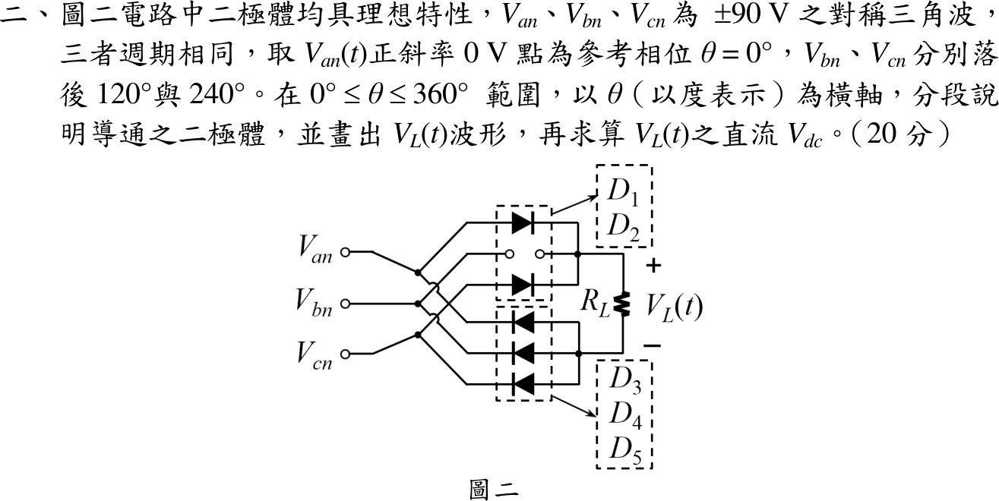

# 108 年電子學第 2 題｜三相三角波整流（五顆二極體）



## 已知與所求

$V_{an},V_{bn},V_{cn}$ 為 $\pm90\,\mathrm V$ 對稱三角波，$V_{an}$ 於 $\theta=0^\circ$ 以正斜率過零，$V_{bn},V_{cn}$ 落後 $120^\circ$、$240^\circ$；二極體理想。依圖逐線追蹤：

- 上臂（陰極接負載 $+$）：$D_1$ 接 $a$ 相、$D_2$ 接 $c$ 相；**$b$ 相上臂為斷開的缺口，沒有二極體**。
- 下臂（陽極接負載 $-$）：$D_3$ 接 $a$、$D_4$ 接 $b$、$D_5$ 接 $c$。

求 $0\le\theta\le360^\circ$ 各段導通二極體、$V_L(\theta)$ 波形與 $V_{dc}$。

## 考場標準作答

### 導通判斷

上節點電位取 $\max(V_{an},V_{cn})$，下節點取 $\min(V_{an},V_{bn},V_{cn})$：
\[
V_L(\theta)=\max(V_{an},V_{cn})-\min(V_{an},V_{bn},V_{cn})
\]
三角波斜率 $1\,\mathrm{V/deg}$；$a$ 的下降段 $V_{an}=180^\circ-\theta$（$90^\circ\sim270^\circ$），$c$ 的上升段 $V_{cn}=\theta-240^\circ$（$150^\circ\sim330^\circ$）。

| $\theta$ | 上臂 | 下臂 | $V_L$ |
|---|---|---|---|
| $0^\circ\sim30^\circ$ | $D_2$（$c$） | $D_4$（$b$） | $120\,\mathrm V$ |
| $30^\circ\sim90^\circ$ | $D_1$（$a$） | $D_4$（$b$） | $120\,\mathrm V$ |
| $90^\circ\sim150^\circ$ | $D_1$（$a$） | $D_5$（$c$） | $120\,\mathrm V$ |
| $150^\circ\sim210^\circ$ | $D_1$（$a$） | $D_5$（$c$） | $420-2\theta$（$\mathrm V$） |
| $210^\circ\sim270^\circ$ | $D_2$（$c$） | $D_3$（$a$） | $2\theta-420$（$\mathrm V$） |
| $270^\circ\sim330^\circ$ | $D_2$（$c$） | $D_3$（$a$） | $120\,\mathrm V$ |
| $330^\circ\sim360^\circ$ | $D_2$（$c$） | $D_4$（$b$） | $120\,\mathrm V$ |

$150^\circ\sim270^\circ$ 時 $b$ 相最高卻沒有上臂二極體，上節點只能取 $a$ 或 $c$，$V_L$ 在 $210^\circ$（$V_{an}=V_{cn}=-30\,\mathrm V$）降到 $0$。

### 波形

```
V_L (V)
120 ─────────────────╲            ╱──────────────
                      ╲          ╱
  0                    ╲________╱
   0   30   90  150  210  270  330  360  θ(°)
```

### 平均值

$V_L=120\,\mathrm V$ 的區間共 $240^\circ$，兩段斜坡各 $60^\circ$，每段面積 $\tfrac12(60^\circ)(120\,\mathrm V)$：
\[
\boxed{V_{dc}=\frac{1}{360^\circ}\left[120(240^\circ)+2\cdot\tfrac12(60^\circ)(120)\right]=\frac{28800+7200}{360}=100\ \mathrm V}
\]

## 驗算

用「缺臂扣除」法：若 $b$ 相也有上臂二極體，$V_L$ 全程為 $120\,\mathrm V$；缺少它造成 $150^\circ\sim270^\circ$ 的三角形凹陷，面積 $\tfrac12(120^\circ)(120\,\mathrm V)=7200\ \mathrm{V\cdot deg}$，平均少 $7200/360=20\,\mathrm V$，得 $120-20=100\,\mathrm V$。

## 失分點

- 把圖當成六顆二極體的標準橋式，得 $V_L\equiv120\,\mathrm V$、$V_{dc}=120\,\mathrm V$；本圖 $b$ 相上臂缺口使 $V_{dc}$ 只有 $100\,\mathrm V$。
- 只標最高相與最低相，忽略 $210^\circ$ 附近上臂只能在 $a$、$c$ 之間換相，漏畫 $V_L$ 降到 0 的凹陷。
- 套用正弦三相的 $1.35V_{LL}$；本題輸入是三角波，須逐段用直線方程式。
