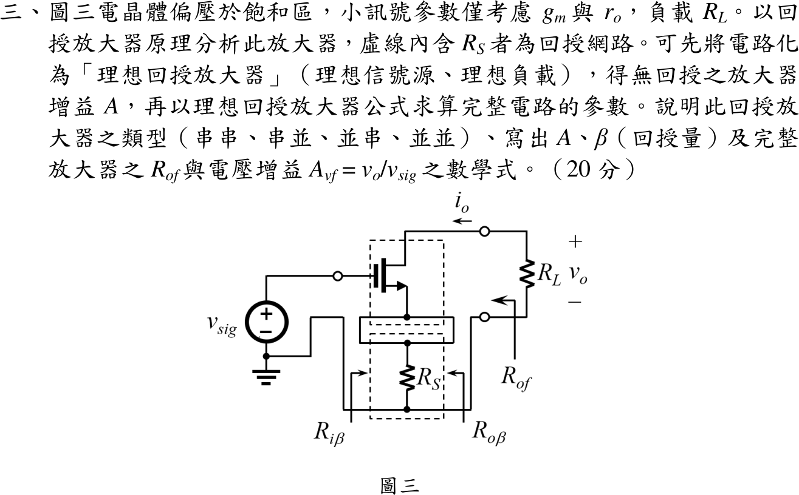

# 108 年電子學第 3 題｜MOSFET 串聯-串聯負回授

## 已知與所求

NMOS 偏壓於飽和區，小訊號只有 $g_m$、$r_o$；閘極接 $v_{sig}$，汲極接 $R_L$（$i_o$ 為汲極電流，$v_o$ 為 $R_L$ 上電壓），源極經 $R_S$ 接地；虛線內 $R_S$ 為回授網路。求回授型態、$A$、$\beta$、$R_{of}$、$A_{vf}=v_o/v_{sig}$。

## 考場標準作答

### 回授型態

$R_S$ 流過輸出（汲極）電流 $i_o$，取樣的是**電流**；產生的 $v_f=R_Si_o$ 與 $v_{sig}$ 在閘源迴路**串聯相減**（$v_{gs}=v_{sig}-v_f$）。故為**串聯-串聯（電流串聯）負回授**，基本放大器是互導放大器 $A=i_o/v_i$。

### $A$、$\beta$

回授網路對基本放大器的負載：輸入端閘極不取電流，$R_S$ 無負載效應；輸出迴路中 $R_S$ 與 $R_L$ 串聯於 $r_o$ 之後。令 $v_{gs}=v_i$：
\[
\boxed{A=\frac{i_o}{v_i}=\frac{g_mr_o}{r_o+R_L+R_S}},\qquad
\boxed{\beta=\frac{v_f}{i_o}=R_S}
\]
理想 $r_o\to\infty$ 時 $A=g_m$。

### 完整放大器

\[
A_f=\frac{i_o}{v_{sig}}=\frac{A}{1+A\beta}=\frac{g_mr_o}{r_o+R_L+R_S+g_mr_oR_S}
\]
$i_o$ 由 $R_L$ 的接地端流入汲極，故 $v_o=-i_oR_L$：
\[
\boxed{A_{vf}=\frac{v_o}{v_{sig}}=-\frac{g_mr_oR_L}{r_o+R_L+R_S+g_mr_oR_S}}
\]
輸出電阻（由 $R_L$ 端看入，不含 $R_L$）以 $R_L=0$ 的 $A_0=g_mr_o/(r_o+R_S)$、$R_o=r_o+R_S$：
\[
\boxed{R_{of}=R_o(1+A_0\beta)=r_o+R_S+g_mr_oR_S}
\]
輸入電阻 $R_{if}\to\infty$（閘極）。

## 驗算

直接對閘、汲、源節點寫小訊號 KCL（不用回授公式）：$v_o/R_L+i_d=0$、$i_d=v_s/R_S$，$i_d=g_m(v_{sig}-v_s)+(v_o-v_s)/r_o$，解得與上式相同。代入 $g_m=2\,\mathrm{mS}$、$r_o=50\,\mathrm{k\Omega}$、$R_L=5\,\mathrm{k\Omega}$、$R_S=1\,\mathrm{k\Omega}$：$A_{vf}=-3.205$，此時 $v_s=0.641\,\mathrm V$（$v_{sig}=1\,\mathrm V$），$g_m(1-0.641)-3.846/50\,\mathrm k=0.718-0.077=0.641\ \mathrm{mA}=v_s/R_S$，KCL 成立；$R_{of}=151\,\mathrm{k\Omega}$。極限：$R_S\to0$ 得 $-g_mr_oR_L/(r_o+R_L)$（無退化共源級）；$r_o\to\infty$ 得 $-g_mR_L/(1+g_mR_S)$。

## 失分點

- 把電流取樣誤判為並聯取樣而寫成串並或並串；$R_S$ 串在源極、取樣的是汲極電流。
- 忘記 $v_o=-i_oR_L$ 的反相號，把 $A_{vf}$ 寫成正值。
- 取 $A=g_m$ 卻同時保留 $r_o$：有限 $r_o$ 時基本放大器要用 $g_mr_o/(r_o+R_L+R_S)$，否則分母少了 $R_L+R_S$。
