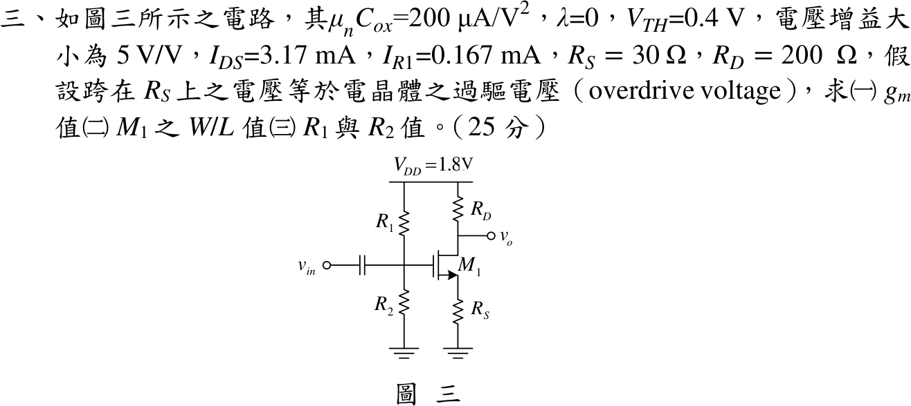

# 111 年電子學第 3 題｜MOSFET 源極退化放大器

## 已知與所求

$\mu_nC_{ox}=200\,\mu\mathrm{A/V^2}$、$\lambda=0$、$V_{TH}=0.4\,\mathrm V$、$|A_v|=5\,\mathrm{V/V}$、$I_{DS}=3.17\,\mathrm{mA}$、$I_{R1}=0.167\,\mathrm{mA}$、$R_S=30\,\Omega$、$R_D=200\,\Omega$、$V_{DD}=1.8\,\mathrm V$；$R_1$–$R_2$ 閘極分壓，輸入經電容耦合；跨 $R_S$ 電壓等於過驅電壓。求（一）$g_m$；（二）$W/L$；（三）$R_1,R_2$。

題面資料互相矛盾：$V_{OV}=I_DR_S$ 加上平方律必得 $g_m=2I_D/V_{OV}=2/R_S$，與指定增益 5 不相容，故 $g_m$、$W/L$ 以雙分支作答。

## 考場標準作答

### 偏壓量

\[
V_{OV}=V_S=I_DR_S=3.17\,\mathrm{mA}\times30\,\Omega=0.0951\ \mathrm V,\qquad
V_G=V_{TH}+V_{OV}+V_S=0.5902\ \mathrm V
\]
$V_{DS}=1.8-3.17\,\mathrm{mA}\times230\,\Omega=1.0709\,\mathrm V>V_{OV}$，飽和成立。

### （一）$g_m$

增益分支（以題給 $|A_v|=5$ 為準）：
\[
\frac{g_mR_D}{1+g_mR_S}=5\Rightarrow g_m=\frac{5}{R_D-5R_S}=\frac{5}{50}
\Rightarrow\boxed{g_m=0.1\ \mathrm S}
\]
平方律分支（以 $I_D$ 與 $V_{OV}$ 為準）：
\[
\boxed{g_m=\frac{2I_D}{V_{OV}}=\frac{2}{R_S}=0.0666667\ \mathrm S},\qquad |A_v|=\frac{0.0666667\times200}{1+0.0666667\times30}=4.444444\neq5
\]

### （二）$W/L$

由 $g_m=\mu_nC_{ox}(W/L)V_{OV}$，$\mu_nC_{ox}V_{OV}=1.902\times10^{-5}\,\mathrm{A/V^2}$：
\[
\text{增益分支：}\boxed{\frac WL=\frac{0.1}{1.902\times10^{-5}}=5257.624},\qquad
\text{平方律分支：}\boxed{\frac WL=\frac{2I_D}{\mu_nC_{ox}V_{OV}^2}=3505.082}
\]

### （三）$R_1,R_2$

閘極無直流電流，$I_{R2}=I_{R1}=0.167\,\mathrm{mA}$，兩分支相同：
\[
\boxed{R_1=\frac{1.8-0.5902}{0.167\,\mathrm{mA}}=7.244\ \mathrm{k}\Omega},\qquad
\boxed{R_2=\frac{0.5902}{0.167\,\mathrm{mA}}=3.534\ \mathrm{k}\Omega}
\]

## 驗算

- 增益分支回代：$\frac{0.1\times200}{1+0.1\times30}=\frac{20}{4}=5$。
- 平方律分支以另一式 $g_m=\sqrt{2\mu_nC_{ox}(W/L)I_D}=\sqrt{2(200\,\mu)(3505.082)(3.17\,\mathrm m)}=0.0666667\,\mathrm S$，與 $2I_D/V_{OV}$ 一致。
- KVL：$0.167\,\mathrm{mA}\times(7.244+3.534)\,\mathrm{k}\Omega=1.800\,\mathrm V=V_{DD}$。

## 失分點

- $V_G$ 要加兩次 $V_{OV}$（$V_{GS}=V_{TH}+V_{OV}$ 再加 $V_S=V_{OV}$），只加一次會得 $R_2=2.964\,\mathrm{k}\Omega$。
- 源極未旁路，增益分母必有 $1+g_mR_S$；寫成 $g_mR_D=5$ 會得 $g_m=25\,\mathrm{mS}$。
- 只寫其中一個 $g_m$ 而不說明另一條件不成立，會被視為忽略題給數據。

## 條件與疑義

**雙分支來源。**參考書主解列 $g_m=1\,\mathrm{mS}$、$W/L=3522.2$、$R_2=3.3185\,\mathrm{k}\Omega$、$R_1=7.459\,\mathrm{k}\Omega$；但 $g_m=1\,\mathrm{mS}$ 代入其增益式只得 $\frac{200}{1030}=0.1942$，應為排印或計算錯誤，且其 $R_1,R_2$ 來自把 $V_{GS}=0.4951\,\mathrm V$ 誤排為 $0.4591\,\mathrm V$。

**最小更正候選。**矛盾無法靠改 $I_D$ 消除（$g_m=2/R_S$ 與 $I_D$ 無關），只有兩種單點更正：

- 增益改為 $4.444444$：即上方平方律分支。
- 保留 $|A_v|=5$、改 $R_S$：$5=\frac{(2/R_S)R_D}{3}\Rightarrow R_S=26.666667\,\Omega$、$g_m=0.075\,\mathrm S$、$V_{OV}=0.0845333\,\mathrm V$、$W/L=4436.120$，$R_1=7.370858\,\mathrm{k}\Omega$、$R_2=3.407585\,\mathrm{k}\Omega$。
