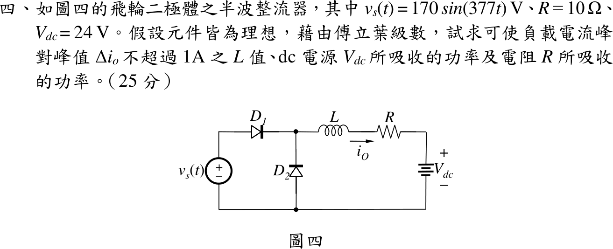

# 112 年電子學第 4 題｜飛輪二極體半波整流的平滑電感

## 已知與所求

$v_s=170\sin(377t)\,\mathrm V$，$D_1$ 串聯、$D_2$ 為飛輪二極體，負載 $L$–$R$–$V_{dc}$ 串聯，$R=10\,\Omega$、$V_{dc}=24\,\mathrm V$，元件理想。以傅立葉級數求使 $\Delta i_o\le1\,\mathrm A$ 的 $L$、$V_{dc}$ 吸收功率、$R$ 吸收功率。

## 考場標準作答

### 負載電壓的傅立葉級數

電流連續時（下方驗證），負載端電壓為半波正弦，$V_m=170\,\mathrm V$、$\omega=377\,\mathrm{rad/s}$：
\[
v_o(t)=\frac{V_m}{\pi}+\frac{V_m}{2}\sin\omega t-\sum_{k=1}^{\infty}\frac{2V_m}{\pi(4k^2-1)}\cos 2k\omega t
\]
\[
I_0=\frac{V_m/\pi-V_{dc}}{R}=\frac{54.113-24}{10}=3.011268\,\mathrm A
\]
各次諧波電流 $I_n=V_n/|R+jn\omega L|$：$V_1=85\,\mathrm V$、$V_2=36.08\,\mathrm V$、$V_4=7.22\,\mathrm V$…

### 電感值

基頻主導，$\Delta i_o\approx2I_1$ 先估 $L$：$2\times85/\sqrt{10^2+(377L)^2}=1\Rightarrow L\approx0.450\,\mathrm H$。但此時 2 次諧波（$I_2\approx0.106\,\mathrm A$）使實際峰對峰約 $1.10\,\mathrm A$，超過限制。將各次諧波相量疊加求 $\max i_o-\min i_o=1\,\mathrm A$：
\[
\boxed{L=0.4962\,\mathrm H}
\]
此時 $I_1=0.4538\,\mathrm A$、$I_2=0.0964\,\mathrm A$、$I_4=0.0096\,\mathrm A$，$i_o$ 在約 $2.52\sim3.52\,\mathrm A$ 之間，恆正，電流連續。

### 功率

直流源只吸收平均電流的功率：
\[
\boxed{P_{V_{dc}}=V_{dc}I_0=24(3.011268)=72.2704\,\mathrm W}
\]
電阻依 Parseval：
\[
I_{rms}^2=I_0^2+\sum_n\frac{I_n^2}{2}=9.06774+0.10295+0.00465+0.00005=9.17538\,\mathrm A^2
\]
\[
\boxed{P_R=RI_{rms}^2=91.7538\,\mathrm W}
\]

## 驗算

- 時域：以 $L\,di/dt+Ri=v_o(t)-V_{dc}$ 逐段精確積分至週期穩態，得峰對峰 $1.0000\,\mathrm A$、平均 $3.0113\,\mathrm A$、$R\overline{i^2}=91.75\,\mathrm W$，與級數一致。
- 功率守恆：理想電感與二極體不耗能，電源送出平均功率 $=72.27+91.75=164.02\,\mathrm W$。

## 失分點

- 只用基頻得 $L\approx0.45\,\mathrm H$ 是常見教科書作法，但嚴格峰對峰約 $1.10\,\mathrm A$；考場寫 0.45 H 時應註明 2 次諧波使 $L$ 需略增（約 0.50 H）。
- $P_{V_{dc}}$ 用 $V_{dc}I_{rms}$；直流源只與平均電流作功。
- $P_R$ 只算 $I_0^2R=90.68\,\mathrm W$，漏掉諧波電流的功率。
