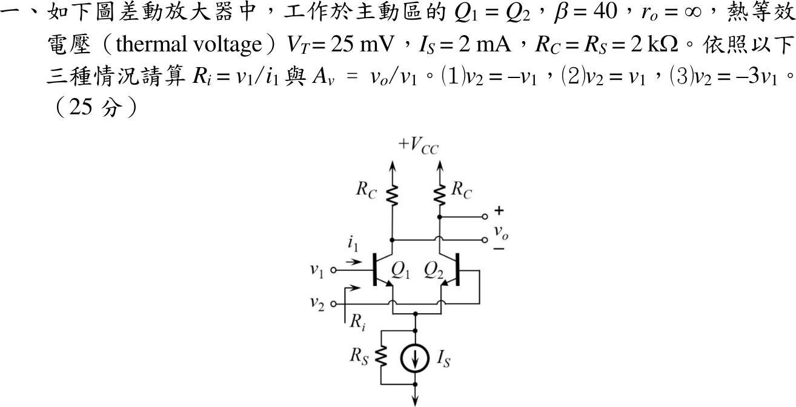

# 114 年電子學第 1 題｜BJT 差動放大器

## 已知與所求

$Q_1=Q_2$ 工作於主動區，$\beta=40$、$r_o=\infty$、$V_T=25\,\mathrm{mV}$；尾端為 $I_S=2\,\mathrm{mA}$ 電流源並聯 $R_S=2\,\mathrm{k}\Omega$，$R_C=2\,\mathrm{k}\Omega$。$Q_1$ 基極接 $v_1$、$Q_2$ 基極接 $v_2$，$v_o$ 正端在 $Q_2$ 集極、負端在 $Q_1$ 集極。求 $v_2=-v_1,\ v_1,\ -3v_1$ 三種情況的 $R_i=v_1/i_1$ 與 $A_v=v_o/v_1$。

**數值答案的偏壓前提：**題圖沒有負電源、基極直流電位或 $V_{BE}$，若 $R_S$ 在直流還有分流，就無法唯一求出 $I_C$。本解取 $I_S$ 為總尾射極電流、$R_S$ 只代表尾源的小訊號並聯電阻，每支 $I_E=1\,\mathrm{mA}$；若 $R_S$ 確有未知直流分流，下列數字都不是唯一精確答案。

## 考場標準作答

### 小訊號參數

\[
\alpha=\frac{40}{41},\quad I_C=\alpha I_E=0.975610\,\mathrm{mA},\quad g_m=\frac{I_C}{V_T}=0.0390244\,\mathrm S,\quad r_e=\frac{V_T}{I_E}=25\,\Omega,\quad r_\pi=(\beta+1)r_e=1025\,\Omega
\]

### 射極節點與通式

令 $v_2=kv_1$。射極節點 KCL（T 模型）：
\[
\frac{v_1-v_e}{r_e}+\frac{v_2-v_e}{r_e}=\frac{v_e}{R_S}
\Rightarrow v_e=\frac{(1+k)v_1}{2+r_e/R_S}=\frac{1+k}{2.0125}v_1
\]
\[
R_i=\frac{v_1}{i_1}=\frac{r_\pi v_1}{v_1-v_e},\qquad
v_o=v_{c2}-v_{c1}=\alpha R_C\frac{(v_1-v_e)-(v_2-v_e)}{r_e}=g_mR_C(1-k)v_1
\]
其中 $g_mR_C=78.0488$，射極電壓在差動輸出中相消。

### （1）$v_2=-v_1$

$v_e=0$（交流虛地）：
\[
\boxed{R_i=r_\pi=1025\,\Omega},\qquad \boxed{A_v=2g_mR_C=156.098\ \mathrm{V/V}}
\]

### （2）$v_2=v_1$

$v_1-v_e=v_1\,(0.0125/2.0125)$：
\[
\boxed{R_i=(\beta+1)(r_e+2R_S)=165.025\,\mathrm{k}\Omega},\qquad \boxed{A_v=0}
\]

### （3）$v_2=-3v_1$

$v_e=-0.993789v_1$，$v_1-v_e=1.993789v_1$：
\[
\boxed{R_i=\frac{1025}{1.993789}=514.097\,\Omega},\qquad \boxed{A_v=4g_mR_C=312.195\ \mathrm{V/V}}
\]

## 驗算

- 共模（2）用半電路：每側射極電阻為 $2R_S$，$R_i=(\beta+1)(r_e+2R_S)=41(4025)=165025\,\Omega$，與通式一致；理想差動輸出完全抑制共模，$A_v=0$。
- （3）分解為差模 $v_d=v_1-v_2=4v_1$ 與共模 $v_{cm}=-v_1$：差動輸出只看 $v_d$，$A_v=g_mR_C\cdot4=312.195$；射極 KCL 代回 $\frac{(1.993789)+(-2.006211)}{25}=-4.969\times10^{-4}=v_e/R_S$ 成立。

## 失分點

- 把尾電流 $2\,\mathrm{mA}$ 整個當成單管 $I_C$，會得 $g_m=0.08\,\mathrm S$、增益加倍。
- 共模時把 $v_e=v_1$ 視為精確而得 $R_i=\infty$；$R_S$ 有限，$R_i=165.025\,\mathrm{k}\Omega$。
- $v_o$ 正端在 $Q_2$ 集極；若取 $v_{c1}-v_{c2}$，三個增益全部變號。

## 條件與疑義

- 若改採 $I_C\approx I_E=1\,\mathrm{mA}$ 的考場近似（$g_m=0.04\,\mathrm S$、$r_\pi=1\,\mathrm{k}\Omega$），三組 $(R_i,A_v)$ 為 $(1.000\,\mathrm{k}\Omega,160)$、$(165.0\,\mathrm{k}\Omega,0)$、$(501.52\,\Omega,320)$，與上列差約 2.5%。
