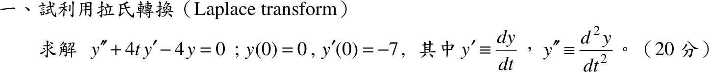
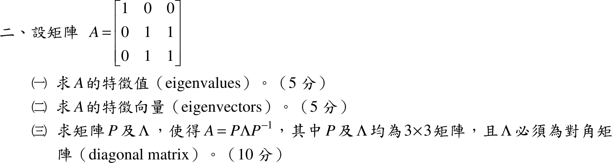
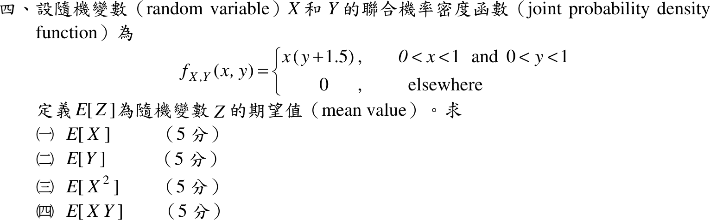
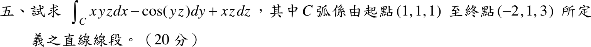

# 104 年電機工程技師｜工程數學逐題詳解

> 本頁由題級 canonical 筆記組合；每題保留 QID、官方裁切、校驗狀態與完整得分型解答。

## 題目導覽
- [[#104 年第 1 題｜以拉氏轉換解變係數 ODE|第 1 題：以拉氏轉換解變係數 ODE]]
- [[#104 年第 2 題｜特徵值、特徵向量與對角化|第 2 題：特徵值、特徵向量與對角化]]
- [[#104 年第 3 題｜實軸極點的廣義積分（主值）|第 3 題：實軸極點的廣義積分（主值）]]
- [[#104 年第 4 題｜二維聯合機率密度的期望值|第 4 題：二維聯合機率密度的期望值]]
- [[#104 年第 5 題｜直線段線積分|第 5 題：直線段線積分]]

---

## 104 年第 1 題｜以拉氏轉換解變係數 ODE

> 題級識別：`EE-104-03-1`
> canonical 來源：`canonical/EE-104-03-1.md`
> 題級校驗狀態：`verified`

![[01_原始試題/依考科/03_工程數學/images/questions/PE_104年_工程數學_Q01.png]]

> 官方裁切來源：`01_原始試題/依考科/03_工程數學/images/questions/PE_104年_工程數學_Q01.png`

### 已知與所求

\(y''+4t\,y'-4y=0\)，\(y(0)=0\)，\(y'(0)=-7\)（20 分），以拉氏轉換求 \(y(t)\)。係數 \(4t\) 含 \(t\)，不是常係數。

### 考場標準作答

令 \(Y(s)=\mathcal L\{y\}\)。
\[
\mathcal L\{y''\}=s^2Y-sy(0)-y'(0)=s^2Y+7,\qquad
\mathcal L\{t\,y'\}=-\frac{d}{ds}\bigl(sY-y(0)\bigr)=-Y-sY'
\]
代入：
\[
s^2Y+7+4(-Y-sY')-4Y=0\ \Rightarrow\ Y'-\left(\frac s4-\frac2s\right)Y=\frac7{4s}
\]
齊次解 \(Y_h=C\,\dfrac{e^{s^2/8}}{s^2}\)；觀察得特解 \(Y_p=-\dfrac7{s^2}\)（代入：\(\tfrac{14}{s^3}-\left(\tfrac s4-\tfrac2s\right)\left(-\tfrac7{s^2}\right)=\tfrac7{4s}\)）。
拉氏轉換須在 \(s\to\infty\) 趨於 \(0\)，而 \(e^{s^2/8}\) 發散，故 \(C=0\)：
\[
Y(s)=-\frac7{s^2}\ \Rightarrow\ \boxed{y(t)=-7t}
\]

### 驗算

回代：\(y''=0\)，\(4t\,y'=-28t\)，\(-4y=28t\)，三項和為 \(0\)；\(y(0)=0\)、\(y'(0)=-7\)。數值積分該 IVP 得 \(y(2)=-14\)，吻合。

### 失分點

- \(\mathcal L\{t\,y'\}=-\dfrac{d}{ds}\bigl(sY-y(0)\bigr)\)，是對 \(sY\) 整體微分，且帶負號；漏掉 \(-Y\) 項會得錯的 \(Y'\) 方程。
- 轉換後是 \(Y\) 的一階 ODE，通解含 \(Ce^{s^2/8}/s^2\)，必須以 \(s\to\infty\) 趨零（轉換條件）捨去。

---

## 104 年第 2 題｜特徵值、特徵向量與對角化

> 題級識別：`EE-104-03-2`
> canonical 來源：`canonical/EE-104-03-2.md`
> 題級校驗狀態：`verified`

![[01_原始試題/依考科/03_工程數學/images/questions/PE_104年_工程數學_Q02.png]]

> 官方裁切來源：`01_原始試題/依考科/03_工程數學/images/questions/PE_104年_工程數學_Q02.png`

### 已知與所求

\(A=\begin{bmatrix}1&0&0\\0&1&1\\0&1&1\end{bmatrix}\)。求（一）特徵值（5 分）；（二）特徵向量（5 分）；（三）\(P,\Lambda\) 使 \(A=P\Lambda P^{-1}\)（10 分）。

### 考場標準作答

#### （一）特徵值

\[
\det(A-\lambda I)=(1-\lambda)\bigl[(1-\lambda)^2-1\bigr]=-(\lambda-1)\,\lambda\,(\lambda-2)
\]
\[
\boxed{\lambda=0,\ 1,\ 2}
\]

#### （二）特徵向量

- \(\lambda=0\)：\(Av=0\Rightarrow v_1=0,\ v_2+v_3=0\)，\(\boxed{v_0=(0,1,-1)^T}\)。
- \(\lambda=1\)：\((A-I)v=0\Rightarrow v_2=v_3=0\)，\(\boxed{v_1=(1,0,0)^T}\)。
- \(\lambda=2\)：\((A-2I)v=0\Rightarrow v_1=0,\ v_2=v_3\)，\(\boxed{v_2=(0,1,1)^T}\)。

（皆可乘任意非零常數。）

#### （三）對角化

三個相異特徵值對應的特徵向量線性獨立，取欄為 \(v_0,v_1,v_2\)：
\[
\boxed{P=\begin{bmatrix}0&1&0\\1&0&1\\-1&0&1\end{bmatrix},\quad \Lambda=\begin{bmatrix}0&0&0\\0&1&0\\0&0&2\end{bmatrix}}
\]
\(\det P=-2\ne0\)，\(P\) 可逆，\(A=P\Lambda P^{-1}\)。

### 驗算

\(\operatorname{tr}A=3=0+1+2\)；\(\det A=0=0\cdot1\cdot2\)；\(AP=P\Lambda\) 逐欄成立（\(Av_0=0,\ Av_1=v_1,\ Av_2=2v_2\)）。

### 失分點

- \(P\) 的欄順序必須與 \(\Lambda\) 對角元順序一致；換欄時 \(\Lambda\) 也要換。
- \(\lambda=0\) 的特徵向量是 \((0,1,-1)^T\)，不是 \((0,1,1)^T\)（那是 \(\lambda=2\)）。

---

## 104 年第 3 題｜實軸極點的廣義積分（主值）

> 題級識別：`EE-104-03-3`
> canonical 來源：`canonical/EE-104-03-3.md`
> 題級校驗狀態：`needs_manual_review`

![[01_原始試題/依考科/03_工程數學/images/questions/PE_104年_工程數學_Q03.png]]

> 官方裁切來源：`01_原始試題/依考科/03_工程數學/images/questions/PE_104年_工程數學_Q03.png`

### 已知與所求

\[
I=\int_{-\infty}^{\infty}\frac{3x+2}{x(x-4)(x^2+9)}\,dx\quad(20\text{ 分})
\]

被積函數在 \(x=0\) 與 \(x=4\) 有實軸一階極點。

### 考場標準作答

先判斷收斂性：在 \(x=0\) 附近 \(f\approx-\dfrac1{18x}\)，在 \(x=4\) 附近 \(f\approx\dfrac7{50(x-4)}\)，皆非可積，故普通廣義積分不存在（發散）。若依工程數學留數題慣例取 Cauchy 主值（題目未標示 PV，見「條件與疑義」），則：

部分分式：
\[
\frac{3x+2}{x(x-4)(x^2+9)}=-\frac1{18x}+\frac7{50(x-4)}-\frac{19x+126}{225(x^2+9)}
\]
對稱主值下 \(\operatorname{PV}\!\int\dfrac{dx}{x}=0\)、\(\operatorname{PV}\!\int\dfrac{dx}{x-4}=0\)（上下限 \(\pm R\) 時為 \(\ln\frac{R-4}{R+4}\to0\)），\(\dfrac{x}{x^2+9}\) 為奇函數，只剩
\[
-\frac{126}{225}\int_{-\infty}^{\infty}\frac{dx}{x^2+9}=-\frac{14}{25}\cdot\frac\pi3
\]
\[
\boxed{\operatorname{PV}I=-\frac{14\pi}{75}\approx-0.5864}
\]

### 驗算

留數法：\(\operatorname{PV}I=\pi i\bigl(\operatorname{Res}_0+\operatorname{Res}_4\bigr)+2\pi i\operatorname{Res}_{3i}\)，\(\operatorname{Res}_0=-\tfrac1{18}\)，\(\operatorname{Res}_4=\tfrac7{50}\)，\(\operatorname{Res}_{3i}=\dfrac{3(3i)+2}{3i(3i-4)(6i)}\)。計算得 \(\operatorname{PV}I=-\dfrac{14\pi}{75}\)；另以數值積分（在 \(0\)、\(4\) 兩側各挖去 \(10^{-9}\) 對稱小區間）得 \(-0.586431\)，與 \(-14\pi/75=-0.586431\) 吻合。

### 失分點

- \(\displaystyle\int_{-\infty}^{\infty}\frac{dx}{x^2+9}=\frac\pi3\)，係數 \(-\tfrac{126}{225}\) 約分為 \(-\tfrac{14}{25}\)，乘 \(\tfrac\pi3\) 得分母 \(75\)，不是 \(225\)。
- 實軸極點在上半圓繞行時各貢獻 \(\pi i\operatorname{Res}\)（半留數），不是 \(2\pi i\operatorname{Res}\)。

### 條件與疑義

官方題幹未標示 Cauchy 主值（PV）。若按普通廣義積分，因 \(x=0,4\) 的單極點，積分發散；上列 \(-14\pi/75\) 僅為採對稱主值的條件答案，作答時宜先寫「普通廣義積分不存在」再給主值。

---

## 104 年第 4 題｜二維聯合機率密度的期望值

> 題級識別：`EE-104-03-4`
> canonical 來源：`canonical/EE-104-03-4.md`
> 題級校驗狀態：`verified`

![[01_原始試題/依考科/03_工程數學/images/questions/PE_104年_工程數學_Q04.png]]

> 官方裁切來源：`01_原始試題/依考科/03_工程數學/images/questions/PE_104年_工程數學_Q04.png`

### 已知與所求

\(f_{X,Y}(x,y)=x\left(y+\tfrac32\right)\)（\(0<x<1,\ 0<y<1\)），其他為 \(0\)。求（一）\(E[X]\)、（二）\(E[Y]\)、（三）\(E[X^2]\)、（四）\(E[XY]\)，各 5 分。

### 考場標準作答

先求邊際密度（先驗證正規化 \(\int_0^1x\,dx\cdot\int_0^1\left(y+\tfrac32\right)dy=\tfrac12\cdot2=1\)）：
\[
f_X(x)=\int_0^1x\left(y+\frac32\right)dy=2x,\qquad
f_Y(y)=\int_0^1x\left(y+\frac32\right)dx=\frac12\left(y+\frac32\right)
\]
以上分別適用於 \(0<x<1\)、\(0<y<1\)，區間外為零。因在原支持集上 \(f_{X,Y}=f_Xf_Y\)，故 \(X,Y\) 獨立。

\[
\boxed{E[X]=\int_0^12x^2\,dx=\frac23},\qquad
\boxed{E[Y]=\int_0^1\frac y2\left(y+\frac32\right)dy=\frac{13}{24}}
\]
\[
\boxed{E[X^2]=\int_0^12x^3\,dx=\frac12},\qquad
\boxed{E[XY]=E[X]E[Y]=\frac{13}{36}}
\]

### 驗算

不用獨立性，直接由原聯合密度核對交叉動差：
\[
E[XY]=\int_0^1\!\!\int_0^1x^2y\left(y+\frac32\right)dy\,dx=\frac13\left(\frac13+\frac34\right)=\frac{13}{36}
\]
另有 \(\operatorname{Var}(X)=E[X^2]-E[X]^2=\tfrac12-\tfrac49=1/18>0\)，二階動差大於平均值平方，量級合理。

### 失分點

- \(E[X^2]\) 的被積式是 \(x^2f_X(x)\)，答案 \(\tfrac12\)，不是 \(E[X]^2=\tfrac49\)。
- 獨立性要先由 \(f_{X,Y}=f_Xf_Y\) 驗證才能用 \(E[XY]=E[X]E[Y]\)；本題的 \(\tfrac32\) 常數使邊際 \(f_Y\) 的係數為 \(\tfrac12\)，不是 \(1\)。

---

## 104 年第 5 題｜直線段線積分

> 題級識別：`EE-104-03-5`
> canonical 來源：`canonical/EE-104-03-5.md`
> 題級校驗狀態：`verified`

![[01_原始試題/依考科/03_工程數學/images/questions/PE_104年_工程數學_Q05.png]]

> 官方裁切來源：`01_原始試題/依考科/03_工程數學/images/questions/PE_104年_工程數學_Q05.png`

### 考場標準作答

\(\displaystyle I=\int_Cxyz\,dx-\cos(yz)\,dy+xz\,dz\)，\(C\) 為 \((1,1,1)\) 至 \((-2,1,3)\) 的直線段。參數化 \(\mathbf r(u)=(1-3u,\ 1,\ 1+2u)\)，\(0\le u\le1\)，\(dx=-3\,du\)、\(dy=0\)、\(dz=2\,du\)。因 \(dy=0\)，第二項為零；\(y=1\)：
\[
I=\int_0^1\bigl[-3(1-3u)(1+2u)+2(1-3u)(1+2u)\bigr]du=-\int_0^1(1-u-6u^2)\,du=-\left(1-\tfrac12-2\right)
\]
\[
\boxed{I=\frac32}
\]

### 驗算

\(xyz\,dx+xz\,dz\) 在 \(y=1\) 時為 \(xz\,(dx+dz)=xz\,d(x+z)\)，而 \(x+z=2-u\)，\(d(x+z)=-du\)，與 \(-\int_0^1xz\,du\) 一致；\(\int_0^1(1-3u)(1+2u)du=-\tfrac32\)，故 \(I=\tfrac32\)。
