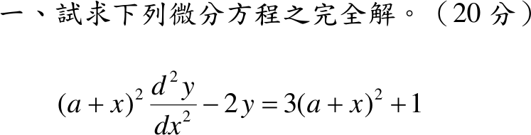
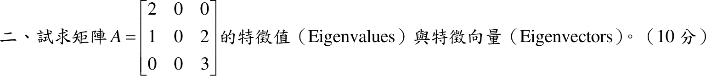
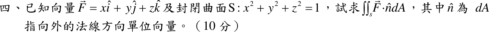
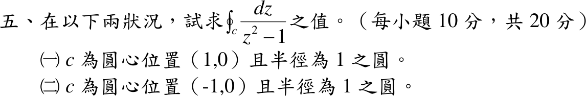
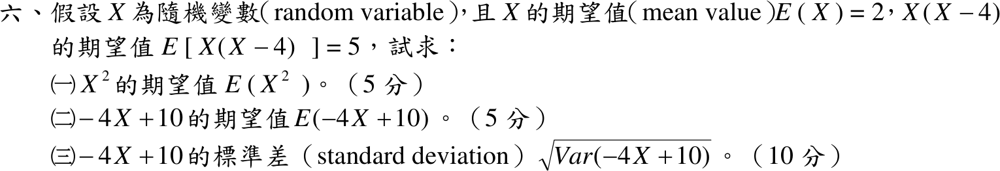

# 📝 108 年電機工程技師｜工程數學逐題詳解

> 本頁由題級 canonical 筆記組合；每題保留 QID、官方裁切、校驗狀態與完整得分型解答。

## 題目導覽
- [[#108 年第 1 題｜Euler 型方程|第 1 題：Euler 型方程]]
- [[#108 年第 2 題｜特徵值與特徵向量|第 2 題：特徵值與特徵向量]]
- [[#108 年第 3 題｜梯度與方向導數|第 3 題：梯度與方向導數]]
- [[#108 年第 4 題｜球面通量|第 4 題：球面通量]]
- [[#108 年第 5 題｜兩個圓周的留數積分|第 5 題：兩個圓周的留數積分]]
- [[#108 年第 6 題｜期望值與線性變換的變異數|第 6 題：期望值與線性變換的變異數]]

---

## 108 年第 1 題｜Euler 型方程

> 題級識別：`EE-108-03-1`
> canonical 來源：`canonical/EE-108-03-1.md`
> 題級校驗狀態：`verified`

![[01_原始試題/依考科/03_工程數學/images/questions/PE_108年_工程數學_Q01.png]]

> 官方裁切來源：`01_原始試題/依考科/03_工程數學/images/questions/PE_108年_工程數學_Q01.png`

### 已知與所求

\((a+x)^2y''-2y=3(a+x)^2+1\)（20 分），\(a\) 為常數，求完全解（通解）。

### 考場標準作答

令 \(u=a+x\)（\(dx=du\)，導數不變），方程化為 Euler 型
\[
u^2y''-2y=3u^2+1,\qquad u\ne0 .
\]

**齊次解**：試 \(y=u^m\)，\(m(m-1)-2=0\Rightarrow m=2,\,-1\)，故 \(y_h=C_1u^2+C_2u^{-1}\)。

**特解**（逐項處理右側）：

- 右側 \(1\)：設 \(y=B\)，\(-2B=1\Rightarrow B=-\tfrac12\)。
- 右側 \(3u^2\)：\(u^2\) 是齊次解（共振），改設 \(y=Au^2\ln u\)，\(y''=A(2\ln u+3)\)，\(u^2y''-2y=3Au^2\Rightarrow A=1\)。

\[
\boxed{y=C_1(a+x)^2+\frac{C_2}{a+x}+(a+x)^2\ln|a+x|-\frac12},\qquad x\ne-a
\]

### 驗算

改用變數變易法：\(y_1=u^2,\ y_2=u^{-1}\)，\(W=y_1y_2'-y_2y_1'=-3\)；標準式 \(y''-\tfrac{2}{u^2}y=g\)，\(g=3+u^{-2}\)。
\[
y_p=-y_1\!\int\!\frac{y_2g}{W}du+y_2\!\int\!\frac{y_1g}{W}du
=\frac{u^2}{3}\Bigl(3\ln u-\frac1{2u^2}\Bigr)-\frac{u^3+u}{3u}
=u^2\ln u-\frac{u^2}{3}-\frac12 ,
\]
多出的 \(-u^2/3\) 併入 \(C_1u^2\)，與上式一致。

### 失分點

- 右側 \(3u^2\) 與齊次解 \(u^2\) 共振，直接設 \(y=Au^2\) 會得 \(0=3u^2\) 而無解，必須乘 \(\ln u\)。
- 右側 \(1\) 的特解是 \(-\tfrac12\)（\(-2B=1\)），常漏負號。
- 沒換成 \(u=a+x\) 就試 \(x^m\) 會失敗；結果要用 \(\ln|a+x|\)，標明 \(x\ne-a\)。

---

## 108 年第 2 題｜特徵值與特徵向量

> 題級識別：`EE-108-03-2`
> canonical 來源：`canonical/EE-108-03-2.md`
> 題級校驗狀態：`verified`

![[01_原始試題/依考科/03_工程數學/images/questions/PE_108年_工程數學_Q02.png]]

> 官方裁切來源：`01_原始試題/依考科/03_工程數學/images/questions/PE_108年_工程數學_Q02.png`

### 考場標準作答

\(A=\begin{bmatrix}2&0&0\\1&0&2\\0&0&3\end{bmatrix}\)，第 2 行全為 \(0\)，沿第 2 行展開：
\[
\det(A-\lambda I)=(-\lambda)(2-\lambda)(3-\lambda)
\Rightarrow \boxed{\lambda=0,\ 2,\ 3}
\]

解 \((A-\lambda I)v=0\)：

- \(\lambda=0\)：\(2v_1=0,\ v_1+2v_3=0,\ 3v_3=0\Rightarrow v_1=v_3=0\)，\(\boxed{v_0=(0,1,0)^T}\)。
- \(\lambda=2\)：\(v_3=0,\ v_1-2v_2=0\)，\(\boxed{v_2=(2,1,0)^T}\)。
- \(\lambda=3\)：\(v_1=0,\ -3v_2+2v_3=0\)，\(\boxed{v_3=(0,2,3)^T}\)。

（特徵向量可乘任意非零倍數。）

### 驗算

\(\operatorname{tr}A=5=0+2+3\)，\(\det A=0=0\cdot2\cdot3\)。直接回代：\(A(2,1,0)^T=(4,2,0)^T=2(2,1,0)^T\)，\(A(0,2,3)^T=(0,6,9)^T=3(0,2,3)^T\)，\(A(0,1,0)^T=\mathbf 0\)。

### 失分點

- 第 2 行全為 \(0\)，所以 \(\lambda=0\) 是特徵值（\(A\) 不可逆），不可漏掉。
- \(\lambda=3\) 的特徵向量 \((0,2,3)^T\) 需同時滿足第 2 列 \(-3v_2+2v_3=0\)，不是 \((0,0,1)^T\)。

---

## 108 年第 3 題｜梯度與方向導數

> 題級識別：`EE-108-03-3`
> canonical 來源：`canonical/EE-108-03-3.md`
> 題級校驗狀態：`verified`

![[01_原始試題/依考科/03_工程數學/images/questions/PE_108年_工程數學_Q03.png]]

> 官方裁切來源：`01_原始試題/依考科/03_工程數學/images/questions/PE_108年_工程數學_Q03.png`

### 已知與所求

\(T=xy+yz+zx\)（每小題 10 分）。求（一）\((1,1,1)\) 處的梯度 \(\nabla T\)；（二）該點沿 \(3\hat i-4\hat k\) 方向的方向導數。

### 考場標準作答

#### （一）梯度

\(T=xy+yz+zx\)：\(\nabla T=(y+z,\ x+z,\ x+y)\)，在 \((1,1,1)\)：
\[
\boxed{\nabla T(1,1,1)=(2,2,2)=2\hat i+2\hat j+2\hat k}
\]

#### （二）方向導數

方向 \(3\hat i-4\hat k\) 的單位向量為 \(\hat u=\tfrac15(3,0,-4)\)：
\[
D_{\hat u}T=\nabla T\cdot\hat u=\frac{2\cdot3+2\cdot0+2\cdot(-4)}{5}=\boxed{-\frac25}
\]
（沿該方向溫度遞減。）

### 驗算

沿直線 \((x,y,z)=(1+\tfrac35s,\ 1,\ 1-\tfrac45s)\) 以鏈鎖律直接微分：\(T=x+z+xz\)，
\(\dfrac{dT}{ds}\Big|_{0}=\tfrac35-\tfrac45+\tfrac35\cdot1+1\cdot\bigl(-\tfrac45\bigr)=-\tfrac25\)。

### 失分點

- 方向 \(3\hat i-4\hat k\) 的長度是 \(5\)，未化為單位向量會得 \(-2\)。
- 方向中沒有 \(\hat j\) 分量，\(\hat u\) 的 \(y\) 分量是 \(0\)，不要把 \(-4\hat k\) 當成 \(-4\hat j\)。

---

## 108 年第 4 題｜球面通量

> 題級識別：`EE-108-03-4`
> canonical 來源：`canonical/EE-108-03-4.md`
> 題級校驗狀態：`verified`

![[01_原始試題/依考科/03_工程數學/images/questions/PE_108年_工程數學_Q04.png]]

> 官方裁切來源：`01_原始試題/依考科/03_工程數學/images/questions/PE_108年_工程數學_Q04.png`

### 考場標準作答

\(\vec F=(x,y,z)\)，\(\nabla\cdot\vec F=1+1+1=3\)；\(S\) 為單位球面（封閉，外法向），散度定理：
\[
\iint_S\vec F\cdot\hat n\,dA=\iiint_V3\,dV=3\cdot\frac43\pi(1)^3=\boxed{4\pi}
\]

### 驗算

直接做面積分：單位球面上外法向 \(\hat n=(x,y,z)\)，\(\vec F\cdot\hat n=x^2+y^2+z^2=1\)，故通量 \(=1\times S\text{ 的面積}=4\pi(1)^2=4\pi\)。

### 失分點

- 散度定理只適用封閉曲面，通量取外法向；單位球體積是 \(\tfrac43\pi r^3\)，不是 \(\pi r^2\) 或 \(4\pi r^2\)。
- 通量是純量；\(\vec F\cdot\hat n=x^2+y^2+z^2\) 在 \(r=1\) 的球面上恆為 1，別把它當成還要積分的函數。

---

## 108 年第 5 題｜兩個圓周的留數積分

> 題級識別：`EE-108-03-5`
> canonical 來源：`canonical/EE-108-03-5.md`
> 題級校驗狀態：`verified`

![[01_原始試題/依考科/03_工程數學/images/questions/PE_108年_工程數學_Q05.png]]

> 官方裁切來源：`01_原始試題/依考科/03_工程數學/images/questions/PE_108年_工程數學_Q05.png`

### 已知與所求

求 \(\oint_C\dfrac{dz}{z^2-1}\)（每小題 10 分）：（一）\(C\) 為圓心 \((1,0)\)、半徑 \(1\) 的圓；（二）\(C\) 為圓心 \((-1,0)\)、半徑 \(1\) 的圓。

### 考場標準作答

\(\dfrac1{z^2-1}=\dfrac1{(z-1)(z+1)}\) 在 \(z=\pm1\) 各有一階極點，留數
\(\operatorname{Res}_{z=1}=\tfrac1{z+1}\big|_1=\tfrac12\)，\(\operatorname{Res}_{z=-1}=\tfrac1{z-1}\big|_{-1}=-\tfrac12\)。取正向（逆時針）：

1. 圓心 \((1,0)\)、半徑 \(1\)：只含 \(z=1\)（到 \(z=-1\) 的距離為 \(2\)），
\[
\boxed{I_1=2\pi i\left(\frac12\right)=\pi i}
\]
2. 圓心 \((-1,0)\)、半徑 \(1\)：只含 \(z=-1\)，
\[
\boxed{I_2=2\pi i\left(-\frac12\right)=-\pi i}
\]

### 驗算

部分分式 \(\dfrac1{z^2-1}=\dfrac12\Bigl(\dfrac1{z-1}-\dfrac1{z+1}\Bigr)\)，而 \(\oint\dfrac{dz}{z-z_0}=2\pi i\)（\(z_0\) 在圓內）或 \(0\)（圓外），得到同樣的 \(\pm\pi i\)。

### 失分點

- 圓心在 \(1\) 不表示 \(-1\) 也在圓內；兩圓各只含一個極點。
- 順時針走向時兩個答案同時變號。

---

## 108 年第 6 題｜期望值與線性變換的變異數

> 題級識別：`EE-108-03-6`
> canonical 來源：`canonical/EE-108-03-6.md`
> 題級校驗狀態：`verified`

![[01_原始試題/依考科/03_工程數學/images/questions/PE_108年_工程數學_Q06.png]]

> 官方裁切來源：`01_原始試題/依考科/03_工程數學/images/questions/PE_108年_工程數學_Q06.png`

### 已知與所求

\(E(X)=2\)，\(E[X(X-4)]=5\)（5／5／10 分）。求（一）\(E(X^2)\)；（二）\(E(-4X+10)\)；（三）\(-4X+10\) 的標準差。

### 考場標準作答

**（一）** \(E[X^2]-4E[X]=5\Rightarrow\boxed{E[X^2]=13}\)。

**（二）** \(\boxed{E[-4X+10]=-4(2)+10=2}\)。

**（三）** \(\operatorname{Var}(X)=13-2^2=9\)，
\[
\operatorname{Var}(-4X+10)=(-4)^2\operatorname{Var}(X)=144,\qquad
\boxed{\sigma=\sqrt{144}=12}
\]

### 驗算

令 \(Y=-4X+10\)：\(E[Y^2]=16E[X^2]-80E[X]+100=208-160+100=148\)，\(\operatorname{Var}(Y)=148-2^2=144\)，與縮放公式一致。

### 失分點

- 第（三）小題問的是標準差，\(144\) 是變異數，最後要開根號得 \(12\)。
- \(E[X^2]\ne[E(X)]^2=4\)；兩者差正是 \(\operatorname{Var}(X)=9\)。
