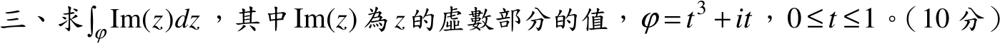

# 105 年第 3 題｜複變線積分

## 考場標準作答

路徑 \(z(t)=t^3+it\)，\(0\le t\le1\)，故 \(\operatorname{Im}z=t\)，\(dz=(3t^2+i)\,dt\)：
\[
\int_C\operatorname{Im}(z)\,dz=\int_0^1t(3t^2+i)\,dt=\left[\frac34t^4+\frac i2t^2\right]_0^1
\]
\[
\boxed{\int_C\operatorname{Im}(z)\,dz=\frac34+\frac i2}
\]

## 驗算

\(\operatorname{Im}z\) 不解析，不能用原函數；改拆實虛部：\(\int_0^1 3t^3dt=\tfrac34\)、\(\int_0^1t\,dt=\tfrac12\)，與上式一致。

## 失分點

- \(\operatorname{Im}(z)=t\) 是實數，不是 \(it\)；否則虛部多乘 \(i\) 而符號錯。
- \(dz\) 要用 \(z'(t)dt=(3t^2+i)dt\)，不可只寫 \(dt\)。
