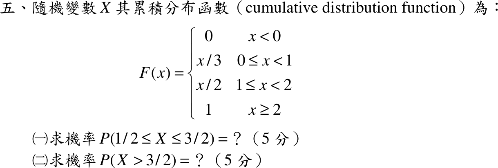

# 105 年第 5 題｜由 CDF 求區間機率

## 已知與所求

\(F(x)=0\ (x<0)\)；\(x/3\ (0\le x<1)\)；\(x/2\ (1\le x<2)\)；\(1\ (x\ge2)\)。求（一）\(P(1/2\le X\le3/2)\)（5 分）；（二）\(P(X>3/2)\)（5 分）。

## 考場標準作答

\(F\) 在 \(x=1\) 由 \(F(1^-)=\tfrac13\) 跳到 \(F(1)=\tfrac12\)，所以 \(P(X=1)=\tfrac16\)；在 \(x=1/2\) 與 \(x=2\) 連續，無質量點。

### （一）

\[
P\left(\tfrac12\le X\le\tfrac32\right)=F\left(\tfrac32\right)-F\left(\tfrac12^-\right)=\frac34-\frac16=\boxed{\frac7{12}}
\]

### （二）

\[
P\left(X>\tfrac32\right)=1-F\left(\tfrac32\right)=\boxed{\frac14}
\]

## 驗算

不同方法：拆成連續部分加質量點。\(\left(\tfrac12,1\right)\) 密度 \(\tfrac13\)：\(\tfrac16\)；\(X=1\)：\(\tfrac16\)；\(\left(1,\tfrac32\right)\) 密度 \(\tfrac12\)：\(\tfrac14\)；合計 \(\tfrac16+\tfrac16+\tfrac14=\tfrac7{12}\)。總質量 \(\tfrac13+\tfrac16+\tfrac12=1\)。

## 失分點

- 區間含端點 \(1\)，要把 \(x=1\) 的跳躍 \(1/6\) 算進去；若各段單獨用密度積分而漏掉質量點，會得 \(\tfrac5{12}\) 而非 \(\tfrac7{12}\)。
- 用 \(F(3/2)\) 時取 \(x/2\)（\(1\le x<2\)）\(=3/4\)，不是 \(x/3\)。
