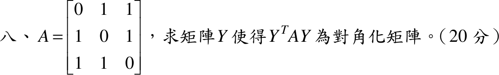

# 105 年第 8 題｜實對稱矩陣的對角化

## 已知與所求

\(A=\begin{bmatrix}0&1&1\\1&0&1\\1&1&0\end{bmatrix}\)，求 \(Y\) 使 \(Y^TAY\) 為對角矩陣（20 分）。取 \(Y\) 為正交矩陣（\(Y^T=Y^{-1}\)），則 \(Y^TAY\) 即相似對角化。

## 考場標準作答

\(A=J-I\)（\(J\) 為全 1 矩陣）。特徵多項式 \(\det(A-\lambda I)=-(\lambda-2)(\lambda+1)^2\)，故 \(\lambda=2\)（單根）、\(\lambda=-1\)（二重）。

- \(\lambda=2\)：\((A-2I)v=0\Rightarrow v=(1,1,1)^T\)。
- \(\lambda=-1\)：\((A+I)v=0\Rightarrow v_1+v_2+v_3=0\)，取 \((1,-1,0)^T\)，再取與其正交者 \((1,1,-2)^T\)。

三向量互相正交（實對稱矩陣的相異特徵值特徵向量必正交，二重根的空間內自行取正交），單位化：
\[
Y=\begin{bmatrix}\tfrac1{\sqrt3}&\tfrac1{\sqrt2}&\tfrac1{\sqrt6}\\\tfrac1{\sqrt3}&-\tfrac1{\sqrt2}&\tfrac1{\sqrt6}\\\tfrac1{\sqrt3}&0&-\tfrac2{\sqrt6}\end{bmatrix},\qquad
\boxed{Y^TAY=\begin{bmatrix}2&0&0\\0&-1&0\\0&0&-1\end{bmatrix}}
\]
\(Y\) 不唯一：二重特徵空間可取任意正交基底，欄的順序也可更換（對角元順序隨之改變）。

## 驗算

\(\operatorname{tr}A=0=2-1-1\)，\(\det A=2=2\cdot(-1)(-1)\)；數值 \(\texttt{eigh}\) 得特徵值 \(-1,-1,2\)，且 \(Y^TY=I\)。

## 失分點

- 二重根 \(\lambda=-1\) 的兩個特徵向量需彼此正交；\((1,-1,0)\) 與 \((1,0,-1)\) 不正交，須再正交化。
- 單位化漏掉 \(\sqrt6\)（\((1,1,-2)\) 長度為 \(\sqrt6\)）會使 \(Y^TY\ne I\)。
