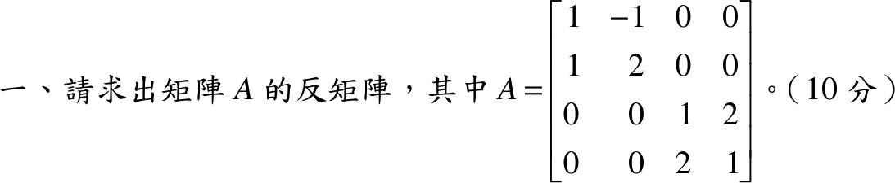

# 106 年第 1 題｜求矩陣反矩陣

## 考場標準作答

\(A=\begin{bmatrix}1&-1&0&0\\1&2&0&0\\0&0&1&2\\0&0&2&1\end{bmatrix}\) 為分塊對角矩陣，\(A^{-1}\) 為兩個 \(2\times2\) 區塊各自的反矩陣。

- \(B_1=\begin{bmatrix}1&-1\\1&2\end{bmatrix}\)，\(\det B_1=3\)，\(B_1^{-1}=\dfrac13\begin{bmatrix}2&1\\-1&1\end{bmatrix}\)。
- \(B_2=\begin{bmatrix}1&2\\2&1\end{bmatrix}\)，\(\det B_2=-3\)，\(B_2^{-1}=\dfrac1{-3}\begin{bmatrix}1&-2\\-2&1\end{bmatrix}=\dfrac13\begin{bmatrix}-1&2\\2&-1\end{bmatrix}\)。

\[
\boxed{A^{-1}=\frac13\begin{bmatrix}2&1&0&0\\-1&1&0&0\\0&0&-1&2\\0&0&2&-1\end{bmatrix}}
\]

## 驗算

\(B_1B_1^{-1}=\tfrac13\begin{bmatrix}2-(-1)&1-1\\2-2&1+2\end{bmatrix}=I\)，\(B_2B_2^{-1}=\tfrac13\begin{bmatrix}-1+4&2-2\\-2+2&4-1\end{bmatrix}=I\)；且 \(\det A=3\cdot(-3)=-9\neq0\)，\(A\) 可逆。

## 失分點

- \(B_2\) 的行列式是 \(1-4=-3\)（負值），伴隨矩陣的符號隨之翻轉，常誤取 \(+3\)。
