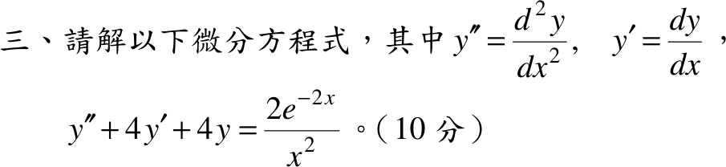

# 106 年第 3 題｜重根非齊次 ODE

## 考場標準作答

\(y''+4y'+4y=\dfrac{2e^{-2x}}{x^2}\)，特徵式 \((r+2)^2=0\)，重根 \(r=-2\)，\(y_h=(C_1+C_2x)e^{-2x}\)。

令 \(y=e^{-2x}v\)，則 \(y''+4y'+4y=e^{-2x}v''\)，原式化為 \(v''=\dfrac2{x^2}\)，兩次積分：\(v'=-\dfrac2x+C_2\)，\(v=-2\ln x+C_2x+C_1\)。
\[
\boxed{y=e^{-2x}\bigl(C_1+C_2x-2\ln x\bigr)},\qquad x>0
\]

## 驗算

變數變易法：\(y_1=e^{-2x}\)，\(y_2=xe^{-2x}\)，\(W=e^{-4x}\)，\(g=2e^{-2x}/x^2\)。
\(u_1'=-\dfrac{y_2g}{W}=-\dfrac2x\)，\(u_2'=\dfrac{y_1g}{W}=\dfrac2{x^2}\)，故 \(u_1=-2\ln x,\ u_2=-\dfrac2x\)，
\(y_p=-2e^{-2x}\ln x-2e^{-2x}\)；其中 \(-2e^{-2x}\) 併入 \(C_1e^{-2x}\)，與上式一致。

## 失分點

- 右側含 \(1/x^2\)，無法用待定係數法，必須用變數變易法或降階法。
- 解只在 \(x>0\)（或寫 \(\ln|x|\) 並避開 \(x=0\)）成立。
