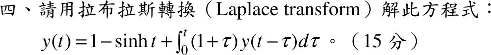

# 106 年第 4 題｜積分方程

## 已知與所求

\(y(t)=1-\sinh t+\int_0^t(1+\tau)\,y(t-\tau)\,d\tau\)（15 分），以拉氏轉換求 \(y(t)\)。

## 考場標準作答

積分項 \(\int_0^t(1+\tau)y(t-\tau)d\tau\) 是 \((1+t)*y\)，取拉氏轉換（\(\mathcal L\{1+t\}=\tfrac1s+\tfrac1{s^2}\)）：
\[
Y=\frac1s-\frac1{s^2-1}+\Bigl(\frac1s+\frac1{s^2}\Bigr)Y
\]
\[
Y\cdot\frac{s^2-s-1}{s^2}=\frac{s^2-s-1}{s(s^2-1)}
\;\Longrightarrow\;
Y=\frac{s}{s^2-1}
\;\Longrightarrow\;
\boxed{y(t)=\cosh t}
\]

## 驗算

回代時域：\(\int_0^t\cosh(t-\tau)d\tau=\sinh t\)，\(\int_0^t\tau\cosh(t-\tau)d\tau=\cosh t-1\)，所以右側 \(=1-\sinh t+\sinh t+\cosh t-1=\cosh t\)，等於左側。

## 失分點

- 卷積核是 \(1+\tau\)（拉氏轉換 \(\tfrac1s+\tfrac1{s^2}\)），若只取 \(\tfrac1s\) 會少掉 \(\tau\) 項而得錯誤解。
- \(\mathcal L\{\sinh t\}=\dfrac1{s^2-1}\)，符號前有負號，通分時別與 \(\tfrac1s\) 相消。
