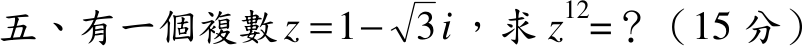

# 106 年第 5 題｜複數高次方

## 考場標準作答

\(z=1-\sqrt3\,i\)：\(|z|=\sqrt{1+3}=2\)，第四象限，\(\arg z=-\dfrac\pi3\)，即 \(z=2e^{-i\pi/3}\)。De Moivre：
\[
z^{12}=2^{12}e^{-i\cdot12\pi/3}=4096\,e^{-4\pi i}=\boxed{4096}
\]

## 驗算

直接相乘：\(z^2=-2-2\sqrt3\,i\)，\(z^3=z^2\cdot z=-2-6=-8\)，\(z^{12}=(z^3)^4=(-8)^4=4096\)。

## 失分點

- 誤取 \(\arg z=+\pi/3\)（把 \(z\) 當成第一象限）寫出 \(z=2e^{i\pi/3}\)，極式錯誤會被扣過程分，雖然 \(12\) 次方的最終值恰好相同。
- 模長 \(2\) 的 \(12\) 次方是 \(2^{12}=4096\)，不是 \(2\cdot12\)。
