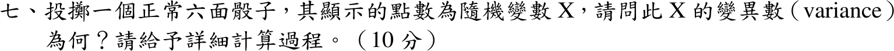

# 106 年第 7 題｜公平六面骰子的變異數

## 考場標準作答

\(P(X=k)=\tfrac16\)，\(k=1,\dots,6\)。

\[
E[X]=\frac{1+2+\cdots+6}{6}=\frac72,\qquad
E[X^2]=\frac{1+4+9+16+25+36}{6}=\frac{91}{6}
\]
\[
\operatorname{Var}(X)=E[X^2]-(E[X])^2=\frac{91}{6}-\frac{49}{4}=\boxed{\frac{35}{12}\approx2.917}
\]

## 驗算

用定義：與平均 \(3.5\) 的偏差為 \(\pm\tfrac12,\pm\tfrac32,\pm\tfrac52\)，
\(\operatorname{Var}=\tfrac16\cdot2\bigl(\tfrac14+\tfrac94+\tfrac{25}4\bigr)=\tfrac16\cdot\tfrac{35}2=\tfrac{35}{12}\)。

## 失分點

- \(E[X^2]=91/6\) 不是 \((E[X])^2=49/4\)；直接用後者會得 \(0\)。
