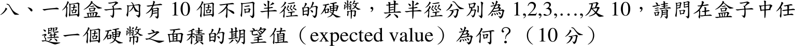

# 106 年第 8 題｜硬幣面積期望值

## 考場標準作答

\[
E[\pi R^2]=\frac{\pi}{10}\sum_{r=1}^{10}r^2=\frac{\pi}{10}\cdot\frac{10\cdot11\cdot21}{6}
=\boxed{\frac{77\pi}{2}\approx120.95\ \text{平方單位}}
\]

## 驗算

\(E[R^2]=\operatorname{Var}(R)+E[R]^2=\frac{10^2-1}{12}+\left(\frac{11}{2}\right)^2=\frac{33}{4}+\frac{121}{4}=\frac{77}{2}\)，乘以 \(\pi\) 相同。

## 失分點

- 以 \(\pi(E[R])^2=30.25\pi\) 代替 \(\pi E[R^2]\)，少了 \(\pi\operatorname{Var}(R)=8.25\pi\)。
